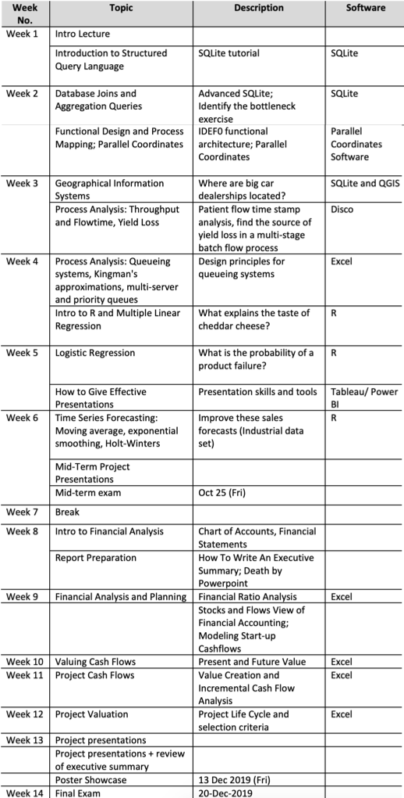

# Data and Business Analytics 

Instructors: Ying Xu, Douglas Rolph

## Class Timetable

| Day      | Mode   | Time         | Remarks |
| -------- | ------ | ------------ | ------- |
| Tuesday  | cohort | 10am to 12nn |         |
| Thursday | cohort | 12nn to 2pm  |         |

## Course Timetable

## Grading Breakdown

| Component             | Weightage (%) |
| --------------------- | ------------- |
| Class attendance      | 5             |
| Industrial attendance | 3             |
| Homework              | 10            |
| Mid-term              | 20            |
| Group project         | 40            |
| Final Exam            | 20            |
| Evaluation            | 2             |

For industrial attendance, you need to attend three out of four talks in school.

### Project Details

Project ID | Project Description| 
-|-|-
1 | Study of Current Customers’ Profiles and Optimisation of Targeted Marketing | CarClub 
2 | Analysis on Fuel Efficiency and User Behaviour | CarClub 
3 | HR Management Dashboard | SIA 
4 | Short-, Medium- and Long-term Effects of Real Estate Prices from Global and Local Macroeconomic Factors | SRX 
5 | **Population Densities Prediction Based on Aggregated Subscriber Counts Per Area** | Teralytics 
6 | Usage Logs Analysis And Visualisation | JobTech 
7 | Entity Normalisation Modelling | JobTech 
8 | Analysis of OPS Projects | OPS 
9 | Text Classification using Graph Neutral Network from News Sources | Infineon 
10 | Building a Robust Quality Indicator for Asian Public Equities Market        | AXA IM     
 11 | Building a Robust Low Volatility Indicator for China Public Equities Market | AXA IM 
 12 | Building a Visual Model of AXA Rosenberg Proprietary Valuation Model        | AXA IM  
 13 | Study of Current Customers’ Profiles and Optimisation of Targeted Marketing      | CarClub 
 14 | Merchandise Mix Optimisation                                                | EY                                              
 15 | Improve the Relevance of Document in Search Results                         | EY                       
 16 | Intelligent Matching of Standard Skills with Training Courses               | EY             
 17 | Using Quantitative Data to Support Risk Profiling of SMRT Permanent Way (PWay)   | SMRT 
 18 | Using Quantitative Data to Support Risk Profiling of SMRT Rolling Stock (RS)     | SMRT 
 19 | Operational Deliveries Data Analytics                                       | TSH Group                            
 20 | Freshness Policy and Its Impact on Lost Sales and Wastage in Supermarkets    | IDSC 
 21 | Pricing and Replenishment of Beverage Dispensers                             | unk                          
 22 | Predictive Modelling for Carpark Revenue                                     | unk                                  
 23 | Maximising Revenue and Utilisation for Pay-Per-Use Facilities                | unk             
 24 | Analysis of OPS Projects                                                     | unk                                                

No two DDP students are assigned to the same group. The top project gets a cash prize of $5000, sponsored by EY.

| Week | Task                                        | Content                                                      |
| ---- | ------------------------------------------- | ------------------------------------------------------------ |
| 1    | Groundwork                                  | Get to know your partners and advisor; Appoint group leader, liaison with advisor and liaison with company; Sign SUTO Undertaking and NDA |
| 2    | Kickoff meeting                             | Attend the first meeting with the company with the advisor (with your signed NDAs); Understand the project: objective,requirement, what data to be collected, what results/solution to be delivered Arrange for next meeting in the next 2-3 weeks; |
| 3    | Project modelling                           | Use IDEFO (functional modelling) learned in class to model your  project |
| 4-5  | Data collection and preliminary analysis    | Collect data by the end of week 5; Import data into data base and visualize the data; Learn how to give effective presentation; (Note: you should have at least met the company once in week 3-5) |
| 6    | **Mid-term project presentation**           | Introduce the problem; Show data visualization; Discuss methods and project schedule; (Note:you should have at least met the company twice before mid-term presentation) |
| 7    | Break                                       |                                                              |
| 8-9  | Data Analysis                               | Analyze your data; Discuss with the company about the results as well as the assumptions |
| 10   | Result summary                              | Summarize your results; Design the poster and send it to the company for review |
| 11   | **Poster Finalization**                     | Finalize the poster with the company and your advisor; Learn how to prepare a project report; Submit poster for printing |
| 12   | **Report and presentation preparation**     |                                                              |
| 13   | **Oral presentations; Poster presentation** | Give oral presentation to instructors; Give poster presentation to visitors; Submit written report; Submit peer evaluation form |

The first meeting with the client will be attended with your professor. Arrange kickoff meeting as soon as possible.

**Project deadlines and weightage breakdown**

Component | Deadline | Grade Percentage 
-|-|-
Mid-term project presentation | Oct. 24 | 5% 
Poster (Submission for printing) | Dec. 2 (6am) | 13% 
Final Presentation | Dec. 12 | 5% 
Executive Summary | Dec. 16 | 3% 
Written Report excl ExSum | Dec. 16 | 12% 
Peer Evaluation | Dec. 18 | 2% 
Total | | 40%

