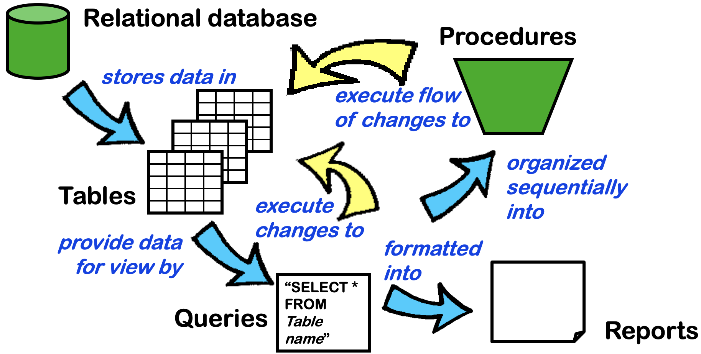

Here I compile the essential commands for SQL.

The following should require no explaination.

```SQL
  SELECT * 
    FROM Invoice 
   WHERE BillingCity = 'London' 
ORDER BY Total DESC
   LIMIT 2
```

##### One table only

When you are interested in total amount of bills from each city.

```sql
  SELECT BillingCity, SUM(Total) AS CityTotal 
    FROM Invoice 
GROUP BY BillingCity
```

Use of `CASE WHEN ... THEN ... ELSE ... END`

```sql
SELECT InvoiceId, 
       CustomerId, 
       InvoiceDate, 
       Total, 
       CASE WHEN Total >= 10 THEN "High" 
            WHEN Total >= 5 THEN "Medium" 
            ELSE "Low" 
            END AS RevenueClass
  FROM Invoice
```

Use of `DATETIME`. `CURRENT_TIMESTAMP` is current time.

```sql
  SELECT InvoiceId, CustomerId, InvoiceDate from Q030HighRevenue
   WHERE InvoiceDate >= DATETIME("2013-01-01 00:00:00") 
ORDER BY InvoiceDate DESC
```

Use of `IFNULL`. The column 'CompanyNew' contains is the column 'Company' but the missing values replaced with 'Missing Name'. 

```sql
SELECT *,
       IFNULL(Company, "Missing Name") AS CompanyNew
  FROM Customer
```

##### Multiple tables

This filters all the combination that fulfils the where condition. (This may be inefficient?)

```SQL
SELECT * 
  FROM Album, 
       Artist 
 WHERE Album.ArtistId = Artist.ArtistId
```

`INNER JOIN` is used together with `ON` to merge tables. Entries in 'Album' with null values in `ArtistId` is excluded.

```SQL
SELECT * 
  FROM Album 
       INNER JOIN 
       Artist ON Album.ArtistId = Artist.ArtistId
```

There are two types of join `INNER JOIN` and `LEFT JOIN`.
`RIGHT JOIN` and `FULL OUTER JOIN` not supported.

**Try to understand the following queries.**

Which employee serves the most number of customers?

```SQL
  SELECT Employee.FirstName, 
         Employee.LastName,
         COUNT(Customer.CustomerId) AS CustomerNo
    FROM Employee INNER JOIN Customer
      ON Employee.EmployeeId = Customer.SupportRepId
GROUP BY Employee.EmployeeId
ORDER BY CustomerNo DESC
```

Which artist has the greatest sales?

```SQL
SELECT Artist.Name,
       SUM(InvoiceLine.UnitPrice * InvoiceLine.Quantity) AS ArtistSales
  FROM (
           (
               InvoiceLine
               INNER JOIN
               Track ON InvoiceLine.TrackId = Track.TrackId
           )
           INNER JOIN
           Album ON Track.AlbumId = Album.AlbumId
       )
       INNER JOIN
       Artist ON Album.ArtistId = Artist.ArtistId
 GROUP BY Artist.Name
 ORDER BY ArtistSales DESC;
```

**Common errors**
Forgetting a comma in the middle of an array.
Please create a new table first, if you want to modify data.