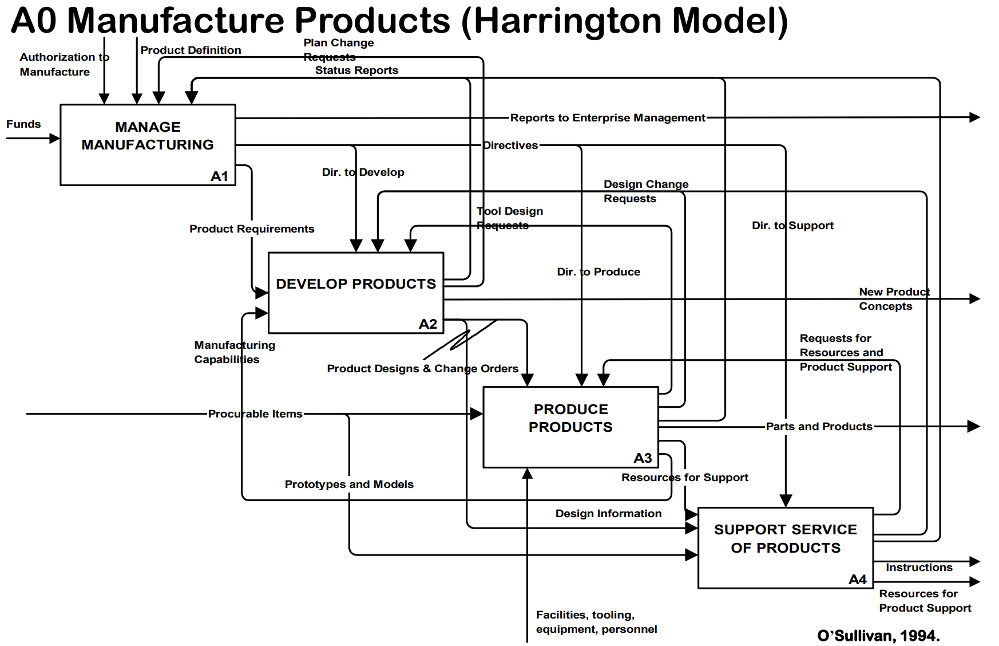
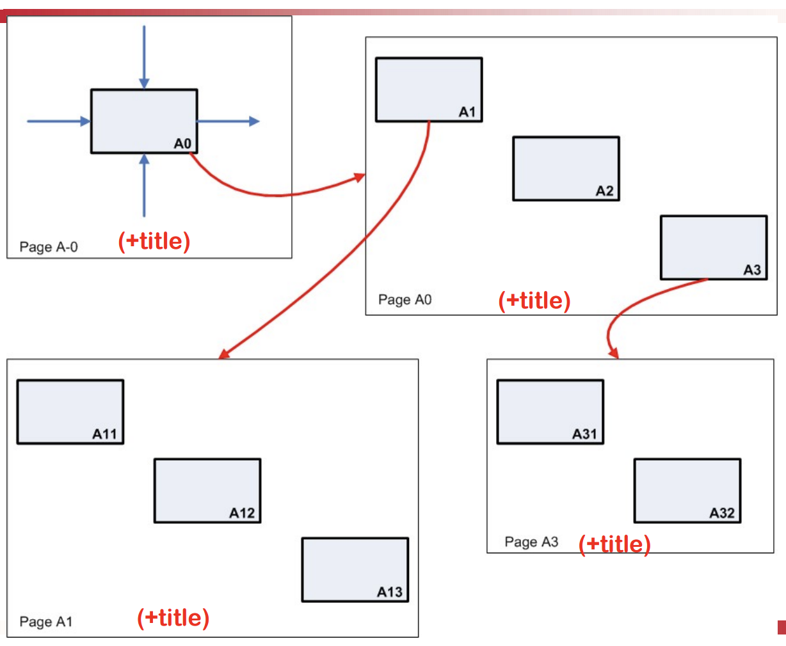

# Functional modelling
(and parallel co-ordinates)

Delivered by Peter Jackson

## Parallel co-ordinates

Follow the instructions get the parallel coordinates plot. The visualisation is written with d3.js.

Use the brushing co-ordinates to filter.
- To select a random sample, choose a selection of IDs. 
  - This assumes that the IDs is random.
- Sometimes two variables when combined provides a strong outcome
- Any way to automate the search process?

## IDEF0 - Function Modeling

Functional modelling 
- functional modelling vs. behavioural modelling
  - what is being done vs. how it is being done
  - not really focused on sequence and timing

Example of the model

ICOR - Input/Control/Output/Resource

Function needs to be a **verb phrase** expressing capability the system must process. A function is in a box.

Every arrow needs to be labelled with a **noun phrase**.

Classification of ICOR
- "input" vs "control".
- "resource" vs "output" 

Examples
- You will take X as an "input".
- You will "control" Y
- You will "use" an algorithm - resource/mechanism.

Formatting rules (also what Prof PJ likes)

- flowchart lines with rounded corners
- line segments must be vertical or horizontal
- closed arrowheads
- no more than six functions per page
- arrange in a waterfall (not necessarily a waterfall process?)
- each page contains a diagram and a title

Tested in examinations.

Top level page is labelled X-0. Each function can be expanded into a page.

Flowcharts can be drawn with draw.io.

**Case study.** IDEF0 Helped the project clarify 

- the roles between the different stakeholders
  - the control the parties have, as well
- the additional inputs necessary
  - what needs to be clarified
- the scope of work, and classify work that belongs to the next phase

This can also serve as the primary documentation.

