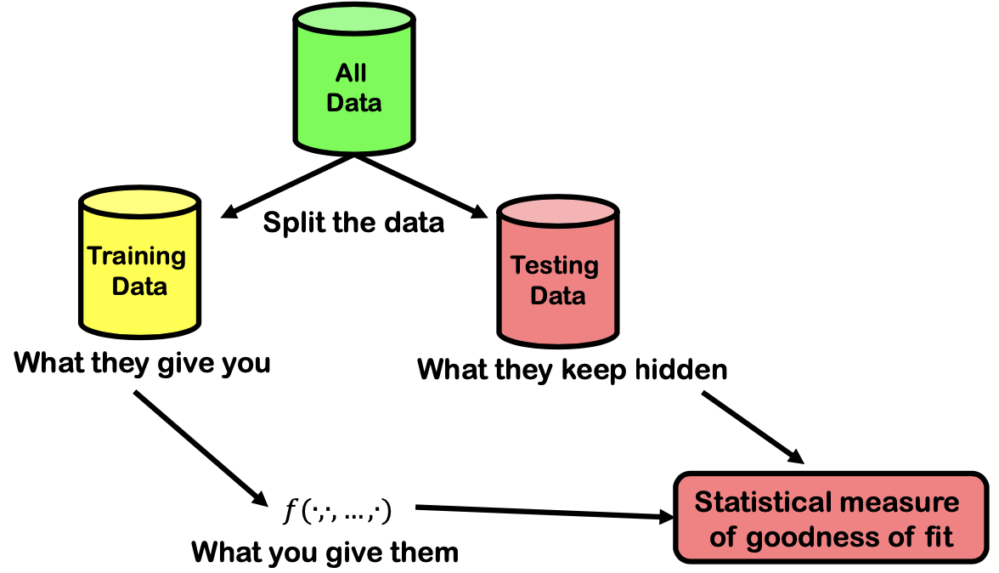

# Statistics

(This is more of a revision, I am taking only some more important points.)

Objective of minimise least squares (sum of squared errors)

$$
SSE 
= \Sigma_{i=1}^n \epsilon_i^2 
= \Sigma_{i=1}^n (y_i - \hat{y}_i)^2
$$

Coefficient of determination (R-squared).

$$
R^2 = 1 - \frac{SSE}{SST}
$$

A function $f$ should be **parsimonious**: it should fit the data well using as few explanatory variables as possible.

**Adjusted R-squared**
$$
R_{adj}^2 = R^2 
            - \left(\frac{p}{n-p-1}\right)(1-R^2)
$$
Residuals plot - should be idependently and randomly distributed.

Linear functions

This can be be a linear function

$$
f(x_1,x_2, ... ,x_p) 
= \beta_0 
  + \beta_1 x_1^2 
  + \beta_2 x_1 x_2 
  + ... 
  + \beta_4 e^{x^4}
$$

This is not a linear function

$$
f(x_1, x_2)
= e^{\beta_0 + \beta_1 x_1}
$$

This is a probability model
$$
y = \beta_0 
  + \beta_1 x_1^2 
  + \beta_2 x_1 x_2 
  + ... 
  + \beta_4 e^{x^4}
  + \epsilon_i
$$

How do we drop terms to get the most combination with the best adjusted adjusted-R-squared?

**Akaike Information Criterion**

- Suppose that we have a statistical model of some data. Let $L$ be the maximum value of the likelihood function for the model; let $k$ be the number of estimated parameters in the model. Then the AIC value of the model is the following.
$$
AIC = 2k - 2ln(L)
$$
- Given a set of candidate models for the data, the preferred model is the one with the minimum AIC value. Hence AIC rewards goodness of fit (as assessed by the likelihood function), but it also includes a penalty that is an increasing function of the number of estimated parameters. The penalty discourages overfitting (increasing the number of parameters in the model almost always improves the goodness of the fit).