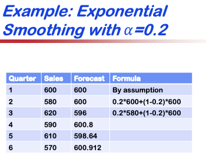
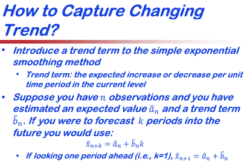
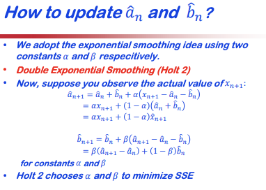
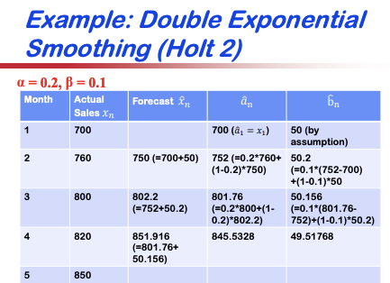

### Exponential Smoothing
The weights need to add up to one and can be defined as unequal. We should consider weighting more recent months more strongly. Each exponential smoothing is defined with an $\alpha$. You can use the previous value in the computation.

### Double Exponential Smoothing
Double exponential smoothing captures the changing trend.

