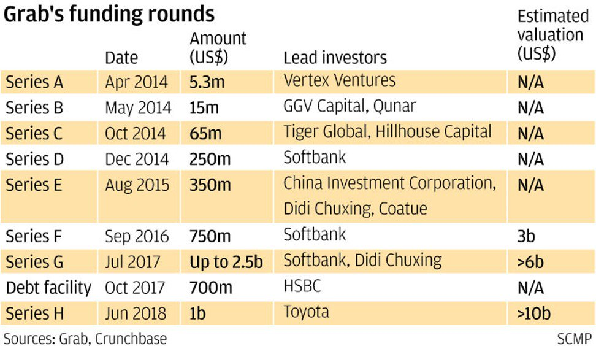

# Venture Capital

Startups often have little collateral and operation history - difficult to access bank loans and public capitals.

Investors invest in your private equity.

**Venture Capitalists**

The exchange between VCs and your business.

The VCs offers
- money
- mentorship
- network

You offer

- portion of the equity
- right to decision

**Angel investors**

- Often make quick decisions
- Not deal sensitive
- **Convertible note** - a loan that converts to equity when the startup raises Series A capital. Reduce the risk on the investor's side - because the valuation of the startup at such an early stage is not meaningful.
  - The founders are liable to return the loan to the investor.

**(What is the difference between Venture Capitalists and Angel Investors?)**

**Accelerators (mix between Angel Investors and VCs)**

- Short-term camps
- Advice and mentorship
- Seed capital
- Minimial control provisions
- (However, the application process is competitive)

Credit card can be a source of capital? (Lower cost of capital.)

Professional VCs

- credibility
- can write larger checks
- (typically longer decision process)
- (control provisions)

**Series A capital**

Capital investment after seed capital, whe  firm has been generating revenue from its business.

Series B, C, D etc - when the company reaches a certain **milestone**

(and so on until the companies go IPO)

Didi sent engineers to help Grab with the codebase.

Series E **post-money** valuation is \$1.5B, 50% of **annual growth rate** to \$2.3B in Series F **pre-money**.

**When to raise VC?**

- Well-rounded founding team and advisors
- Evidence of execution and customers
- Clear plan growth and use of capital
- About to hit the milestones (reason)
- (Worst time to raise money - when you are desperate)

You need to understand how **VC firms** work.

General partners

- Choose startups to invest, hold board seats and advise portfolio companies
- Charges 2%-3% management fees for annual return of ?%
- Collectively make the choice of startups to invest
- Supervise the portfolio companies

Limited partners

- Has no voice in the selection of the companies

Venture capitalists expect a more-than-10-times (58%) return of capital over five years, or a 20% average rate-of-return. **The cost of capital is high** at 60%, because founders cannot get any other capital. **Investors are important stakeholders.**

How do they manage risk 
- portfolio diversification-
- co-investment
- deal structure
  - downside protection
    - priority to assets at dissolution
  - upside protection
    - right to put additional money at predetermined share price

CB Insights - information source regarding VC activity.

Criteria on selecting startup
- Ethical and capable **people**
  - Qualified (skills and resources)
  - Aligned vision with the investor
    - Can you **get along with** the founder?
    - (Can the founder get along with you?)
  - Reputation and track record (preferably in a prior IPO)
    - When more people chase you, more people will chase you.
- Industries with high growth potential
- **IPO-able**

VCs spend more time in monitoring portfolio companies.

VCs pay little or no heed to the content or document of a business plan. (Business is more for internal learning)

VCs have too little time to examine a full set of forecast financials (which is wishful imagination anyway).

VCs rely on instinct and make decisions very quickly.

**Prepare a 150-word elevator pitch.**

