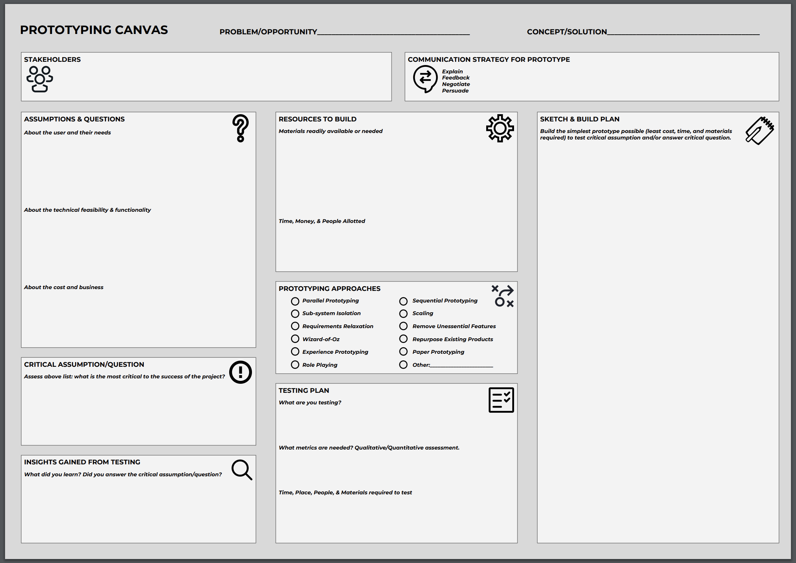

# Prototyping lecture

Design innovation fellow. Studied prototyping process.

## FIrst session

**Overview of sharing**

- Value of prototypes 
- Prototyping strategies in case study examples
- Application to Entrepreneurship module.

**Prototyping mindsets and best practices**

- non-attachment (iterate and evolve)
- bias towards action - stop talking and start doing
- finding the quickest path to experience
- reframing failure as learning opportunity

(shown video: prototyping Google Glass)
Experience allow understanding of the user experience

- egronomics of gesuters
- how socially awkward is it to gesture

So that you can have **deeper conversations**.

A **prototype** is a physical or digital representation of critical aspects of your intended concept.

Examples of low-fi prototypes given. The advantage of the low-fi prototype can invite more honest feedback from the user. 

Helps to elict unknown unknowns, helps to make big and small decisions.

Question: How to pretotype services?

**Prototyping strategies**

- **Mockups** 
  paper mockups (UI), physical mockups (device), movement simulation (fast food kitchen), service mockups (airplane service)

- **Wizard of Oz **
  fake the functionality to test the market - Google Glass, Dropbox, fake self-driving car to study interactions with people, Aardvark using interns to rapidly Google solutions. **Pretotype**

- **Storyboarding and role-playng**
  To understand the user experience of the product. AirBnB storyboards.

**Prototyping canvas**

Source: https://www.dimodules.com/prototypingcanvas

Feasible, viable, desirability. 

**Business model canvas**

**Challenges to product development at startups, and remedies**

Uncertainty - getting information, flexibility
Lack of resources - bootstrapping

**The scope of minimum viable product**

Empirically test key hypotheses behind idea ASAP, with minimal efforts
- only include core features that allow the key assumptions to be tested, and no more
- be deployed to early adopters, who are forgving and more likely to give feedbacks

Ensure that customers want to buy your product before investing large amount of time and money, i.e. reducing waste in product development process

Accelerate validated learning

**Pretotyping**

Examples. 
- IBM Speech-to-text but someone is writing it.
- Kiwicampus.com - Cambodians controlling the robots

Pretotype question - **should we use it?** 
Prototype question - can we use it?

What matters - user engagements

**Please begin campaign preparation**

Evangelize in the circle of friend and family.

Evangelize online, FB group, Twitter, Instragram, social media, support community

Find editorials that need contoent to the public

Curate an email list of supporters 

Acccumulate evidence of the voice of customers 

**Miscellaneous** 

**Key idea of today - get out and talk to people**

Examples of vanity metrics - Facebook likes

## Second session

Key challenges faced in entrepreneurship - resource constraint and uncertainty.

**Flexibility to address uncertainty**
Increase the number of options to explore and capture value, limit potential. 

However options has a price. You need to build coherence between options - for example the mechanical parts.

Potential platform (made up of low-uncertainty compontent) and product family. Different combinations of components create many options (?).

Consider the difference between iOS and Andriod. Closed platform and small product family vs open platform and large product family.

The capability of a product to be redesigned 

Determinants of whether a design is flexible enough for future evolution.
- how components are connected with each other
- the interface between them
- the form of the components themselves

Guidelines to increase modularity (to allow alternative designs, it is modular when there is a one-to-one mapping between function elements to component)
- use separate modules to carry out function that are not closely related
- confine functions to single modules
- confine functions to as few unique components as possible
- divide modules to multiple smaller identical modules
- collect parts which are not anticipated

Guidelines to decouple features (you might want to do that when everything is facing uncertainty)
- ???

Guidelines to reduces parts
- use repeating parts (e.g. Dell blade servers for rapid response)

Guidelines for spatial consideration
- create room