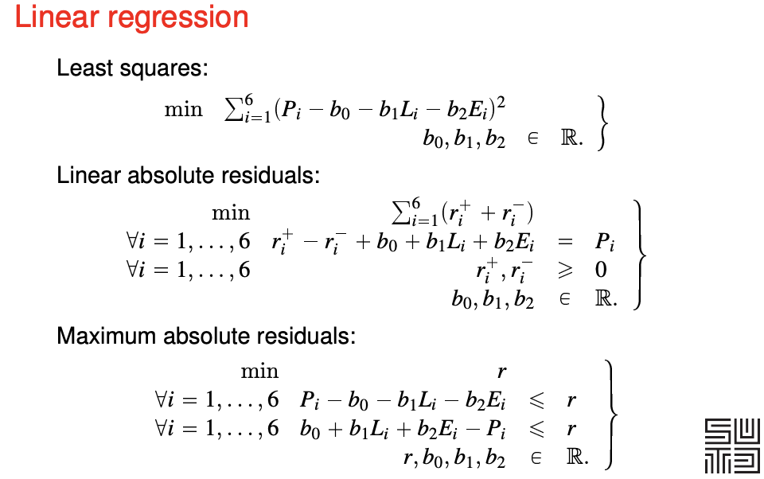
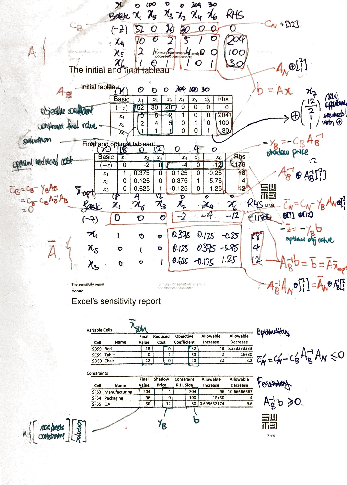

# Quiz 1 revision notes

Procedure of solving a problem with linear programming

**1) Transform the problem into a linear program.**

- This is a step highly dependent on the circumstances. Some examples are given in - **[A]** converting linear residuals into a linear program.

**2) Transform the linear program into a standard linear program.**

- This can always be done, by adding slack variables **[B]**.

**3) Ensure the standard linear program has linearly independent rows.**

- If the rows are not linearly independent, there are redundant constraints. You may remove them.

**4) Obtain a canonical form of the linear program.**

- Simplex I algorithm **[C]**. This can always be done unless there is no feasible solution.

**5) Obtain the optimal solution of the linear program.**

- Simplex II algorithm **[D]**. You might have many solutions - then you need to present all of them.

**6) Conduct sensitivity analysis**

- Interpret the matrices **[E]**, and calculate the allowable change **[F]**.

## [0] Definitions

"**General**" linear program (one if the objective function is linear and the constraints are linear equalities or inequalities). 
$$
\begin{align*}
max/min &\quad \vec{c}^T\vec{x} \\
s.t. &\quad \vec{a}_i^T\vec{x} \enspace \geq / =/\leq \enspace b_i \quad \forall i \\
\end{align*}
$$
Note that all inequalities **<u>are non-strict.</u>** Please transform all strict inequalities to non-strict inequalities.

**Standard** form of a linear program
$$
\begin{align*}
max \quad \vec{c}^T \vec{x} \\
s.t. \quad A\vec{x} &= \vec{b} \geq \vec{0} \\
\vec{x} &\geq 0
\end{align*}
$$
**Canonical** form of a linear program - variables and constraints of $x$ can permuted to represented in this way
$$
\begin{array}{r@{}cl}
max \quad c_N x_N   \\
\quad x_B + A_N x_N &=& b \\
\quad x_B, x_N &\geq& 0
\end{array}
$$

## [A] Converting linear residuals into a linear program

Please note that a linear program **does not allow strict inequalities**.

**Least squares - cannot be converted into a linear program.**

This includes the least-squares best-fit line.

**Converting linear absolute residuals into a linear program.** 

The problem: minimize $\Sigma_{i=1}^6 |\epsilon_i|$, where $\epsilon$ is a linear expression of decision variables (in this case, the intercept and slope of two variables).

**Solution 1**
Minimise $\Sigma_{i=1}^6 r_i^-, + r_i^+$

where 
$$
\epsilon = r_i^- - r_i^+
$$
with
$$
r_i^-, r_i^+ \geq 0
$$

(The optimal solution will minimise such that $r_i^-$ and/or $r_i^+$ is zero.)

**Solution 2**
Minimise $\Sigma_{i=1}^6 z_i$
with 
$$
\begin{align}
\epsilon_i &\leq z_i \\
-\epsilon_i &\leq z_i
\end{align}
$$

(I still don't understand how this works.)

**Converting maximum absolute residual into a linear program**.

The problem: minimize $max(|\epsilon_i| \enspace \forall i)$

**Solution**

Minimise $r$. 

For all $i$,
$$
\begin{align}
r &\geq \epsilon_i \\
r &\geq -\epsilon_i
\end{align}
$$

From the slides (notice that $\epsilon_i$ is an expression).

The linear program finds the optimal values of $b_0$, $b_1$, $b_2$ and $r$(s) that optimises the objective function. $L_i$ and $E_i$ are constants given by the data.

 

## [B] Converting a linear program into a standard linear program

**All linear programs can be transformed into a standard linear program.** Please transform according to these steps.

- If the objective function is to minimise, filp all the coefficients $\vec{c}$ to get a maximising objective function instead.

- If the constant of the equality or inequality is negative - please flip all the cofficients of the inequality:

  $$a_1 x_1 + ... a_n x_n \leq b < 0 \enspace \rarr \enspace -a_1 x_1 ... - a_n x_n \geq b' > 0$$

- If the condition is a $\geq$ inequality, for the inequality add a nonnegative slack variable:

  $$a_1 x_1 + ... a_n x_n \geq b \enspace \rarr \enspace a_1 x_1 ... + a_n x_n + s_g = b \enspace \text{and} \enspace s_g \geq 0$$

- If the condition is a $\leq$ inequality, for the inequality add a nonnegative slack variable:

  $$a_1 x_1 + ... a_n x_n \leq b \enspace \rarr \enspace a_1 x_1 ... + a_n x_n - s_l = b \enspace \text{and} \enspace s_l \geq 0$$

- If there are free variables like $x_f$, you have to create **two** slack variables which are greater-or-equal-to zero

  $$x_f \rarr x_f^+ - x_f^-$$ for all appearance of $x_f$ in the all the equality constraints and objective function
  Also, add the inequality $x_f^+, x_f^- \geq 0$

 

## [C] Simplex Phase I

**PHASE I** - Transforming the **standard form** to the **canonical form**
$$
max\left\{ cx | A\vec{x} = \vec{b} \geq \vec{0}, \vec{x} \geq 0 \right\}
$$
$A$ is made up of $n$ linearly independent rows.

First, we add nonnegative $n$ **slack** variables to create a **<u>different</u> LP problem** with a different objective function. 

- We can add less than $n$ if there are variables that can serve as basis variables). 

Begin with a canonical form of the new LP problem by managing the objective function. Carry out the Simplex Phase II iteration. Results:

- The Phase I objective function value is nonzero: the initial problem has **no feasible solution**. We can stop.
- The Phase I objective function value is zero and no artificial variable is in the basis: **we have a basic feasible solution** for the initial problem. Proceed.
- The Phase I objective function value is zero and some artificial variables are in the basis.
  - We try to pivot them out (there may be many solutions).
  - If we cannot, then **there are redundant constraints** that we can drop. After this, we drop the artificial variables to obtain the initial simplex tableau for Phase II. (Is it possible to have no feasible solutions?)
    - This will not happen if the rows of $A$ were linearly independent.

Remove the slack variables, and continue Phase II with the original objective function from the standard form.

 

## [D] Simplex Phase II

**PHASE II** - Obtaining the **optimal solution** from the **canonical form**

We start with the **canonical form**.

- You can read off a **basic feasible solution **(BFS). 
  - The non-basis variables are zero
  - The basis variables is equal to the RHS.
  - The objective value is the RHS of $z$.

We choose an **entering basis variable** (which is currently a non-basis variable).

- the non-basis variable has **positive reduced cost** (all basis variables have zero reduced cost)
- if there are multiple non-basis variables, choose the variable the **smallest index** (Bland's rule 1)

We also choose an **leaving basis variable** (which will be a non-basis variable).

- constraint coefficient of the nonbasic variable is **nonnegative** 
- among those above, choose the variable with the **smallest ratio** (of RHS over constraint coefficients)
  - The ratio will definitely be nonnegative. (QUESTION: what if the smallest is infinite?) 
  - Intuition - if you do not use a minimum ratio, you will end up with a negative RHS, the form is no longer canonical and a BFS cannot be read off.
- if the ratio is a tie, choose the variable will a **smaller index** (Bland's rule 2 - Bland's rules help to prevent cycling, it does not change the problem and prevent degeneracy.)

Then we pivot the basis variables. The LP problem should remain the same, and still in canonical form after every pivot. Then we iterate until we reach either one of the following conditions 

- All non-basis variable have **negative** reduced costs: the current basic feasible solution is **the** optimal. We can stop.
- All non-basis variables have **nonpositive** reduced costs, the current basic feasible solution is **an** optimal. We may stop.
  - We may pivot to obtain other optimal basic feasible solutions.
  - To obtain the set of optimal solutions, take the convex combination of optimal basic feasible solutions.
    - $\lambda_1 v_1 + \lambda_2 v_2 + ... \quad \forall \enspace  \lambda_1 + \lambda_2 + ... = 1$
- There exists one non-basis variable with **positive** reduced cost that appears with **all nonpositive coefficients** in the constraints: the problem is unbounded, we can stop.
  - You can increase the non-basis variable indefinitely while satisfying the constraint.
    - For each constraint - as the non-basis variable increase, the corresponding decrease of its term in the constraint LHS can be balanced by increasing the value of the basis variable.

 

## [E] Interpretation of matrices

## [F] Calculate allowable change

Todo