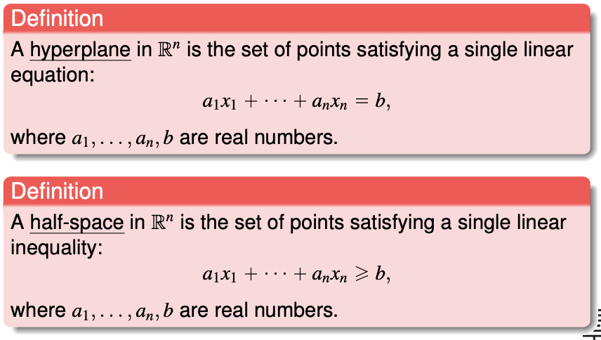
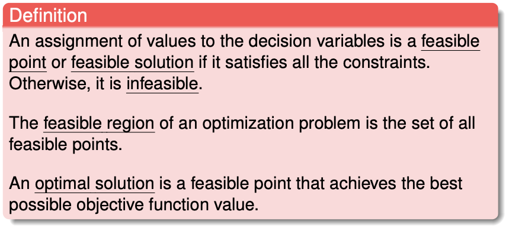
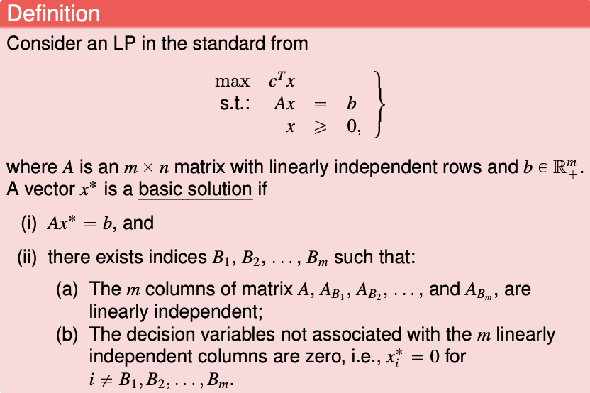
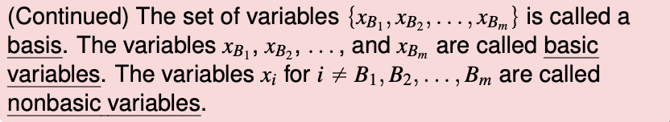
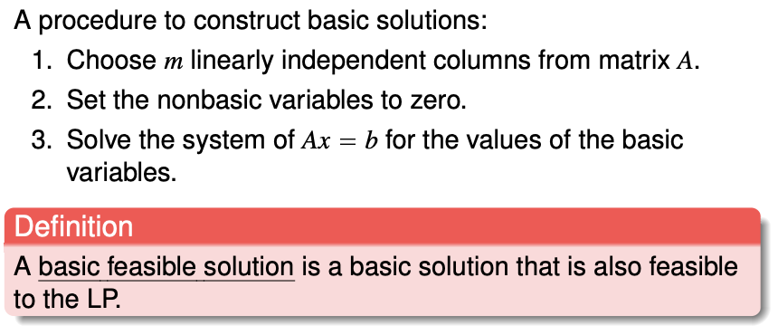
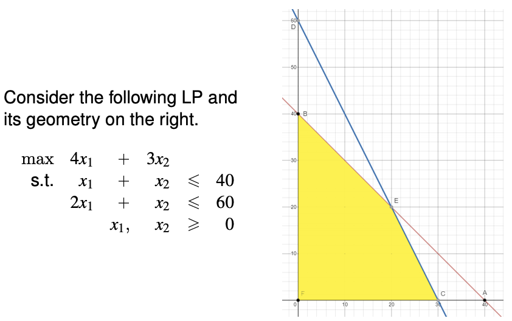
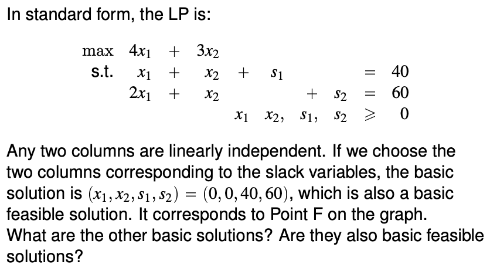
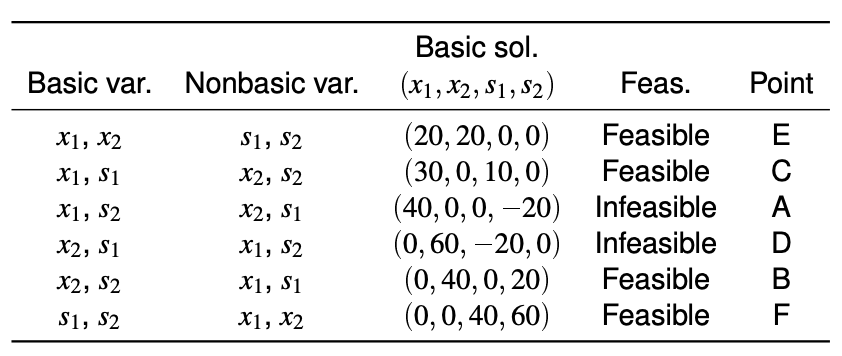

# Introduction to Optimisation

Reference: http://web.mit.edu/15.053/www/AMP-Chapter-01.pdf

You need to know how to transform a **linear program** into **a standard linear program** (and understand what are they, as well). 

You also need to know how to obtain the linear program from less obvious formulations.

- Linear constraints, with "linear absolute residuals" or "maximum absolute residual" the objective function is still a linear program.
- Other variations (see nurse scheduling problem)

### Optimisation Paradigm

1) **Decision Variables.** The elements under the control of the decision maker.

2) **A (single) objective function.** A function of the decision variables that we want to maximize or minimize, corresponding to a measure of performance.

3) **Constraints.** Restrictions that define which values of the decision variables are allowed.

4) **Paramters.** The data of the problem.

Example: Please review a 2D linear programming problem covered in freshmore classes. In this course we will learn how the linear programming problem is solved.

### Taxonomy of Optimization Problems

Grouping | Example
-|-
Number of objectives | **Single objective**, Multiple objectives 
Type of the objective function | **Linear**, Quadratic, Convex, Nonlinear 
Type of constraints | **Linear**, Quadratic, Convex, Nonlinear (Advanced: Conic, Semidefinite, Semi-infinite, etc.) 
Type of variables | **Continuous**, **Discrete (Integer)**, Mixed (Special case: **Network models**) 
Uncertainty in data | **Deterministic**, Stochastic, Robust, Parametric, Black-box/simulation 

In bold is the optimisation problems covered in the syallabus.

### Some definitions

The hyperplane splits another non-parallel hyperplane into half-space.

Definition

  
  

Types of optimisation problem based on solution types

- Infeasible (no feasible region)
- Feasible and bounded
- Feasible and unbounded (e.g. maximise x without constraint)

Definitions

  
  

### Types of Linear Program

"General" **linear program** (one if the objective function is linear and the constraints are linear equalities or inequalities)

$$
\begin{align*}
max/min &\quad \vec{c}^T\vec{x} \\
s.t. &\quad \vec{a}_i^T\vec{x} \enspace \geq / =/\leq \enspace b_i \quad \forall i \\
\end{align*}
$$

Note that all inequalities **<u>are non-strict.</u>** Please transform all strict inequalities to non-strict inequalities.

**Standard** form of a linear program
$$
\begin{align*}
max \quad \vec{c}^T \vec{x} \\
s.t. \quad A\vec{x} &= \vec{b} \geq \vec{0} \\
\vec{x} &\geq 0
\end{align*}
$$

$\vec{b}$ is a **nonnegative** vector.

**All linear programs can be transformed to a standard linear program.** Please transform according to these steps.

- If the objective function is to minimise, filp all the coefficients $\vec{c}$.

- If the constant of the equality or inequality is negative - please flip all the cofficients of the inequality:

  $$a_1 x_1 + ... a_n x_n \leq b < 0 \enspace \rarr \enspace -a_1 x_1 ... - a_n x_n \geq b' > 0$$

- If the condition is a $\geq$ inequality, for the inequality add a nonnegative slack variable:
  
  $$a_1 x_1 + ... a_n x_n \geq b \enspace \rarr \enspace a_1 x_1 ... + a_n x_n + s_g = b \enspace \text{and} \enspace s_g \geq 0$$
  
- If the condition is a $\leq$ inequality, for the inequality add a nonnegative slack variable:
  
  $$a_1 x_1 + ... a_n x_n \leq b \enspace \rarr \enspace a_1 x_1 ... + a_n x_n - s_l = b \enspace \text{and} \enspace s_l \geq 0$$
  
- If there are free variables like $x_f$, you have to create **two** slack variables which are greater-or-equal-to zero

  $$x_f \rarr x_f^+ - x_f^-$$ for all appearance of $x_f$ in the all the equality constraints and objective function
  Also, add the inequality $x_f^+, x_f^- \geq 0$

**Canonical** form of a Linear Program 
(not elaborated in week 1, explained later here)

An LP is in canonical form if: 
- It is in standard form. 
- The constraint matrix contains (a permutation of) the identity matrix as a submatrix. 
- The variables with a "+1" coefficient in the identity matrix appear with a zero coefficient in the objective function

### Example: Nurse scheduling problem

Basic formulation

- There is a require number of nurses for every day in a week.
- Each nurse works for five consecutive days with two rest days.

Minimise the number of nurses that needs to be employed (objective)
for different formulation of the problem:

- Each day require a certain minimum number of nurses
- Each day require a certain minimum number of nurses, and wages for different schedules is different
- Each day require a certain minimum number of nurses, and constraint on how two adjacent schedule differ (you need to split the inequality into two)

Minimise overstaffing and understaffing (objective)

- Allows overstaffing and understaffing, with a quadratic penalty (greater for overstaffing) to be minimised - this program is no longer linear

On overstaffing and understaffing penalties. 
$$x_1 + x_4 + x_5 + x_6 + x_7 + d + e = 17$$ where $d$ and $e$ is deficit and excess. Do we need to write a constraint that either $d$ or $e$ is zero? Not actually, because as the objective function minimise the sum of squares of $d$ and $e$, we do not need such a constaint as the result will fulfil the constraint. Moreover, writing a constraint like $d \cdot e = 0$ makes the program complicated. You also cannot use if-else in a linear program like what you do in Excel.

### Converting linear residuals into a linear program

**Least squares - cannot be converted into a linear program.**

This includes the least squares best-fit line.

**Converting linear absolute residuals into a linear program.** 

The problem: minimize $\Sigma_{i=1}^6 |\epsilon_i|$, where $\epsilon$ is a linear expression of decision variables (in this case, the intercept and slope of two variables).

**Solution 1**
Minimise $\Sigma_{i=1}^6 r_i^-, + r_i^+$

where 
$$
\epsilon = r_i^- - r_i^+
$$
with
$$
r_i^-, r_i^+ \geq 0
$$

(The optimal solution will minimise such that $r_i^-$ and/or $r_i^+$ is zero.)

**Solution 2**
Minimise $\Sigma_{i=1}^6 z_i$
with 
$$
\begin{align}
\epsilon_i &\leq z_i \\
-\epsilon_i &\leq z_i
\end{align}
$$

(I still don't understand how this works.)

**Converting maximum absolute residual into a linear program**.

The problem: minimize $max(|\epsilon_i| \enspace \forall i)$

**Solution**

Minimise $r$. 

For all $i$,
$$
\begin{align}
r &\geq \epsilon_i \\
r &\geq -\epsilon_i
\end{align}
$$

From the slides (notice that $\epsilon_i$ is an an expression).

The linear program finds the optimal values of $b_0$, $b_1$, $b_2$ and $r$(s) that optimises the objective function. $L_i$ and $E_i$ are constants given by the data.

### Basic and feasible solutions

Feasible solutions are solutions that are feasible (duh?) - the solution satisfies all the constrains in the question. It may not be basic.

(Intuitively), basic solutions are a solution where two constraints intercept. It may not need to be feasible.

(Quite understand the following, but need to do homework to confirm.)

