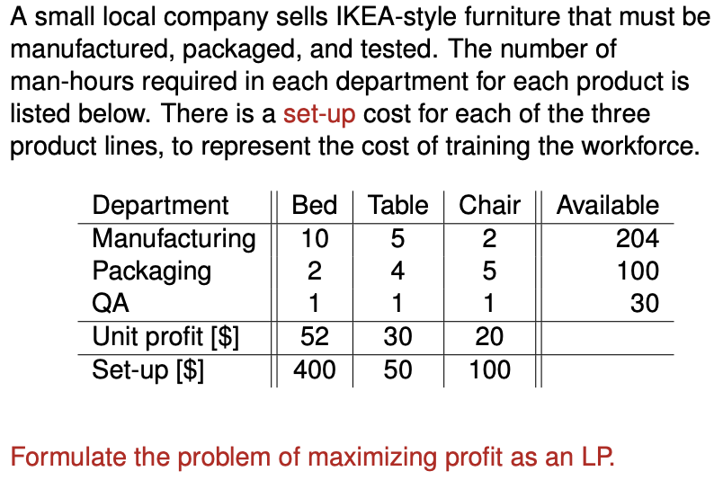
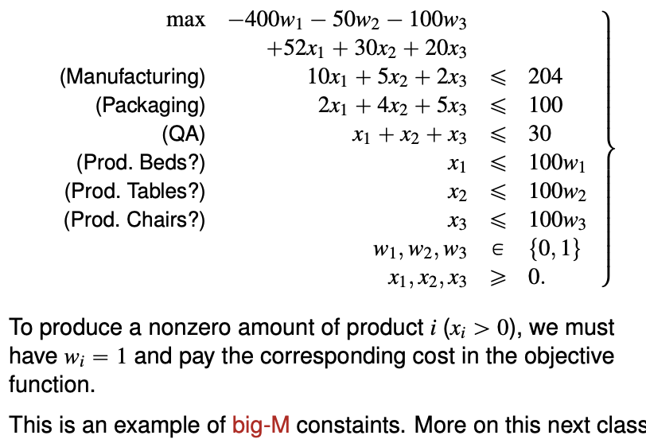
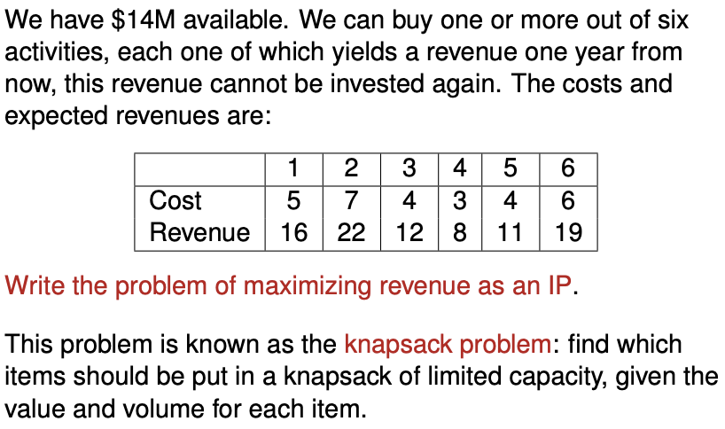

# Integer programming

Please recall Freshmore math for the definition.

You need some experience and creativity to formulate the linear program.


Example - flipping the board of five. Takeaways

- How to constrain a linear expression to **odd and even**
- Use of dummy variables outside the grid to **simplify expressions**
- **Minimising an integer variable** also constrains the variable to take only **binary** values.


Example - IKEA with setup costs. Takeaways

- Use of a **big-M** constraints to add "**setup cost**" variable and constraint.

  $x \leq My$ 
  - when $y$ is zero, $x$ is constrained to be **zero** 
  - when $y$ is one, no constraints is placed on $x$






**Knapsack problem**

- Consider logical constraints
- You cannot use strict inequalities in any linear program.




```python
from functools import lru_cache

def knapsack(items, maxweight):
    # items is an array of (value, weight)
    @lru_cache(maxsize=None)
    def bestvalue(i, j):
        # Return the value of the most valuable 
        # subsequence of the first i elements in 
        # items whose weights sum to no more than j.
        if j < 0:
            return float('-inf')
        if i == 0:
            return 0
        value, weight, idx = items[i - 1]
        return max(bestvalue(i - 1, j), bestvalue(i - 1, j - weight) + value)

    j = maxweight
    result = []
    for i in reversed(range(len(items))):
        if bestvalue(i + 1, j) != bestvalue(i, j):
            result.append(items[i])
            j -= items[i][1]
    result.reverse()
    return bestvalue(len(items), maxweight), result

arr = [(a,b,c) for a,b,c in zip([16,22,12,8,11,19],
                                [5,7,4,3,4,6],
                                range(6))]
knapsack(arr, 15)
```


**Miscellaneous**

Integer theorem - integer coefficient integer solution - for which problems only?

