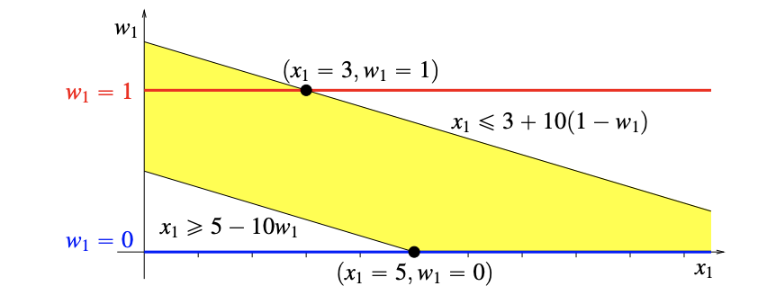
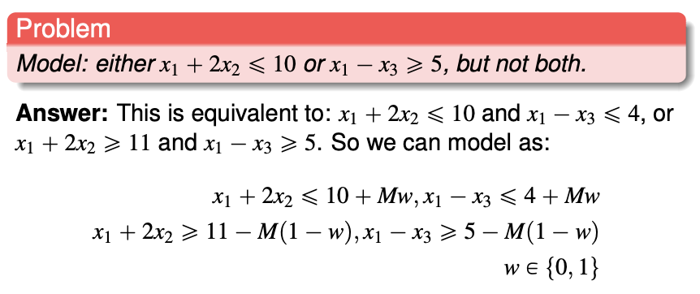
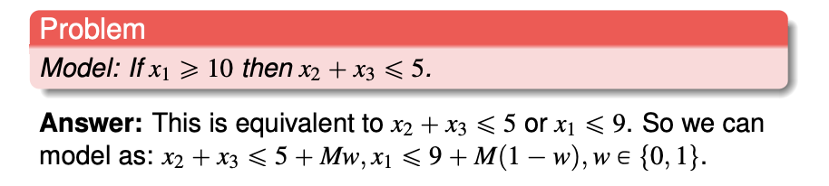
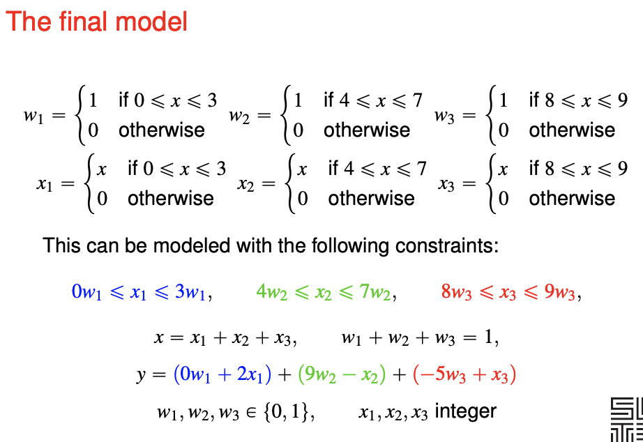

# Integer programming

You need some experience and creativity to formulate the linear program from the problem.

Example - flipping the board of five. Takeaways

- How to constrain a linear expression to **odd and even** (use $2k + 1$, $k$ integer)
- Use of dummy variables outside the grid to **simplify expressions**
- **Minimising an integer variable** also constrains the variable to take only **binary** values.

Example - IKEA with setup costs. Takeaways

- Use of a **big-M** constraints to add "**setup cost**" variable and constraint.

  $x \leq My$ 
  - when $y$ is zero, $x$ is constrained to be **zero** 
  - when $y$ is one, no constraints is placed on $x$

**Knapsack problem**

- Consider logical constraints

## Modelling ILP problem

Linear programming can only solve convex problems, with inclusive boundaries, and you cannot multiply variables.

Strategy - transform the problem into ORs and ANDs.

**Modelling less-than-or-greater-than (non-convex) inequality**
$$
x\leq2 
\quad \text{or} \quad 
x \geq 6
$$
You can turn off either constraint by adding a binary variable $w_i$ with a big $M$.
$$
x \leq 2 + M w 
\quad \text{and} \quad 
x \geq 6 - M (1-w)
\quad \text{and} \quad 
w \text{ binary}
$$

Consider the geometry of the formulation.

The yellow region is convex.

**Modelling with complement constraint**

One and only one of the constraint and its complement can be fulfilled. 

If the variables and coefficient are integers, we can formulate a complement. For the constraint $x_1 + 2x_2 \leq 10$, the violation is $x_1 + 2x_2 \geq 11$. (We cannot use strict inequalities for linear programming).

**Implication statement into logical constraint**

If $P \implies Q$,  $\overline{P} \or Q$ must be true. $\overline{P}$ is the complement of $P$.

**Piecewise linear functions**

This is more for objective function, though it is possible for the constraint.

$x$ is replicated into three parts.
$x_i$ will be set to zero if we are not using the i-th piece. 
$w_i$ indicates whether are we using the i-th piece.