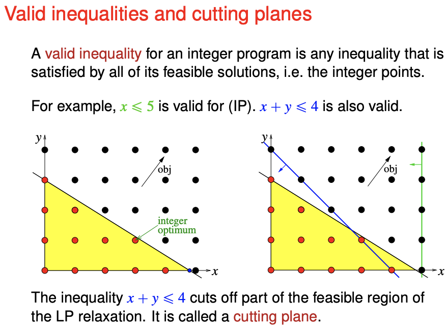
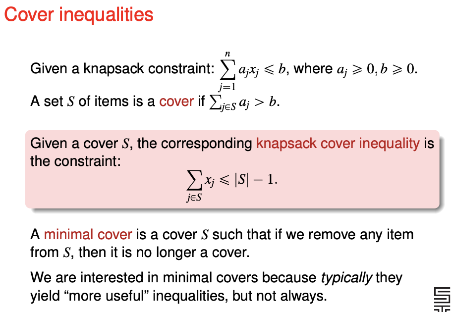
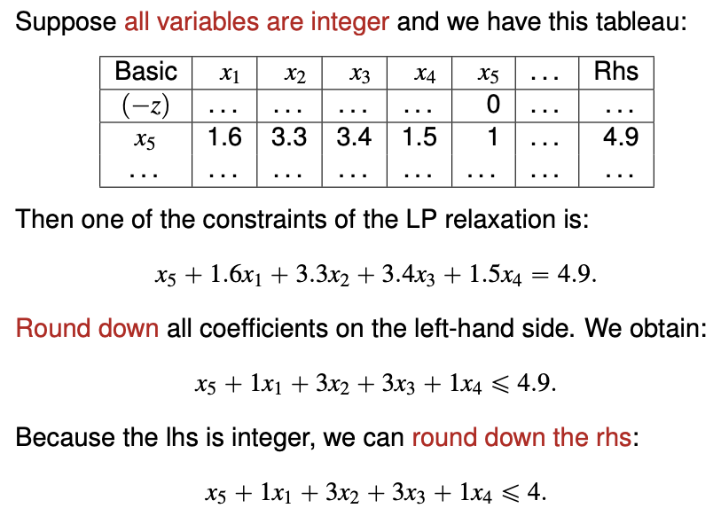
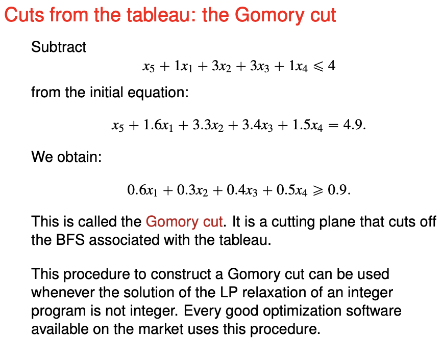
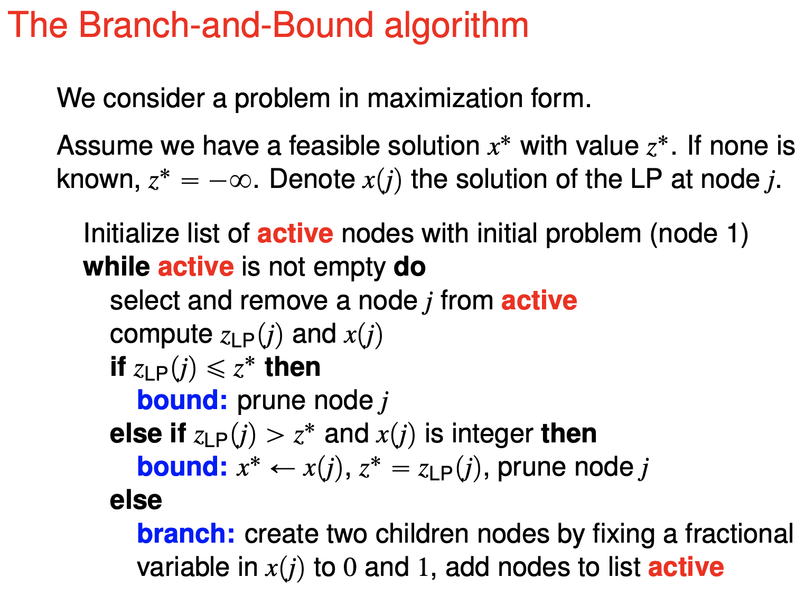
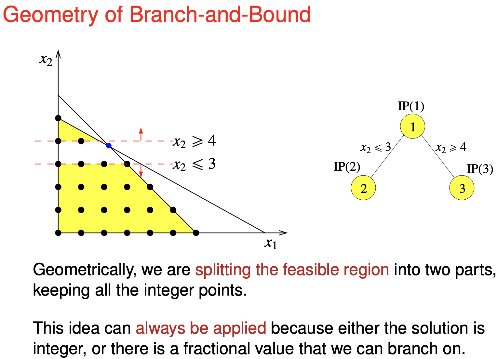
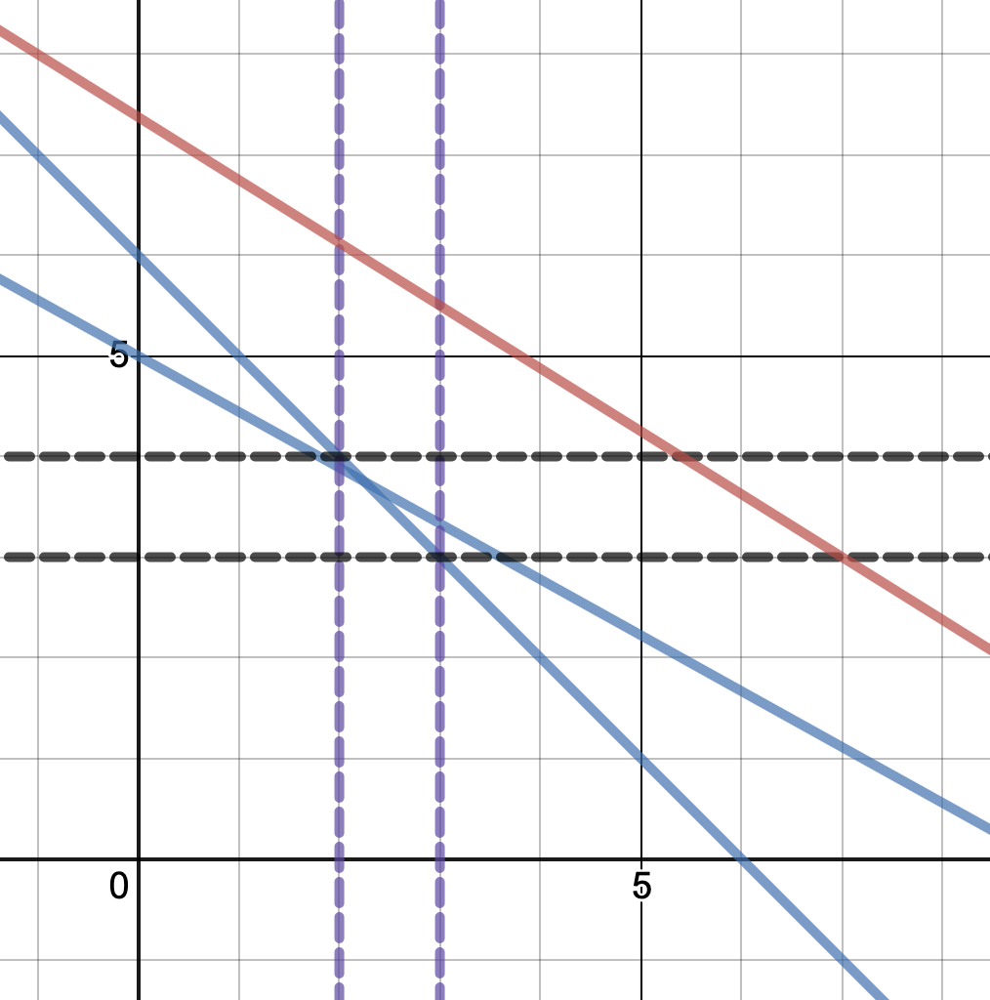

# Solving integer programs

If $z_{IP}$ is the optimal value of the maximising IP, and the $z_{LP}$ is the optimal value of its LP **relaxation**. Then $z_{IP} \leq z_{LP}$. If the optimal solution to the LP relaxation has integer variables, it is also the optimal solution to the IP.

Strategy - make corner points integers.

You find **valid inequalities** to make the corner points integer. A valid inequality for an integer program is any inequality that is satisfied by all of its feasible solutions.

You do not need to make all corners integer, as long as the optimal solution is all integers you can stop.

Knapsack example - there are subsets that definitely will not be in the solution because including the subset will definitely make you exceed the limit.

### Gomory cuts

Use revised simplex to solve this.

# Branch-and-Bound for binary variables

For a (maxismising) **binary program** with $n$ variables, the brute-force or full enumeration takes $2^n$ computations. We do not want to do all of them.

Notations
**IP** is the integer program which is the binary program. 
**LP** is the linear program **relaxation** of the IP. 
**LP solution** refers to the optimal solution of the LP.
**LP optimum** refers to the objective value of the optimal solution of the LP.

Key idea - prune the tree by computing bounds.

- Any integer solution produced is considered for the lower bound of the IP.
- Any optimal solution to the subproblem is the upper bound of the subproblem.

Compute an optimal solution LP

- An optimal solution LP can easily be computed by taking the ratios of the objective coefficient to constraint and sort them.
- The solution should only have up to one fractional variable.
  - If the solution is all integer - it is the optimal solution to the IP

Compute a feasible integer solution with reasonable effort
- This will form the lower bound $z^*$
- You may need to conduct depth-first search to obtain one.

You keep track of the current optimal solution $z^*$ and its corresponding solution $x^*$.

For each node there are three scenarios
- The LP optimum is less than the current optimal solution $z^*$
  - The node and its children will not produce the optimal solution.
  - You can prune the node.
- The LP optimum is better than the current optimal solution $z^*$ and its solution is an integer.
  - Update the lower bound $z^*$ and its corresponding solution $x^*$.
  - You can prune the node.
- Otherwise (the LP optimum is better than the current optimal solution and its solution is not all integer)
  - Create two children nodes by fixing a fractional variable in $x(j)$ to 0 and 1, and add the children note to the list of active node.

On the tracking of the upper bound.

- Not tracked in the algorithm.
- If the demands merely require you to get n% within the optimal value, comparing the lower bound to the upper bound guarantee that you are in the range.

# Branch-and-Bound for integer variables

If the integer variable has a fractional solution in the LP solution, we will branch it  on create two children nodes.
$$
x_j \leq \lfloor f_j \rfloor \qquad x_j \geq \lceil f_j \rceil
$$
https://www.desmos.com/calculator/rwj4qdxo8e

AMPLE is a software that solves linear program.

