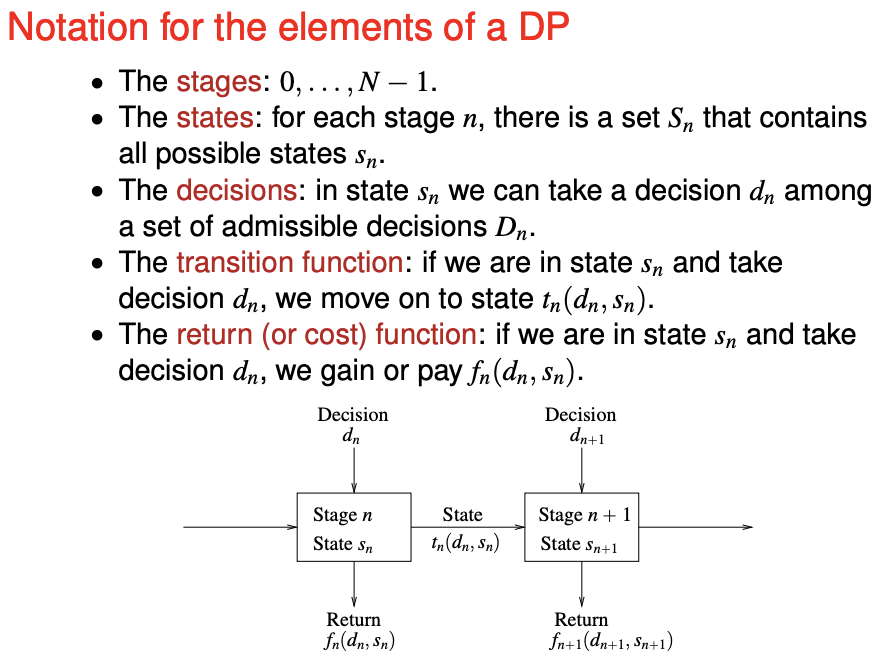
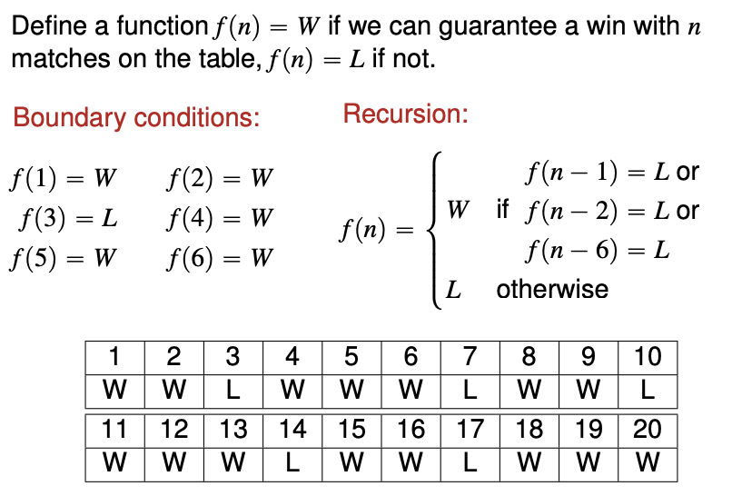
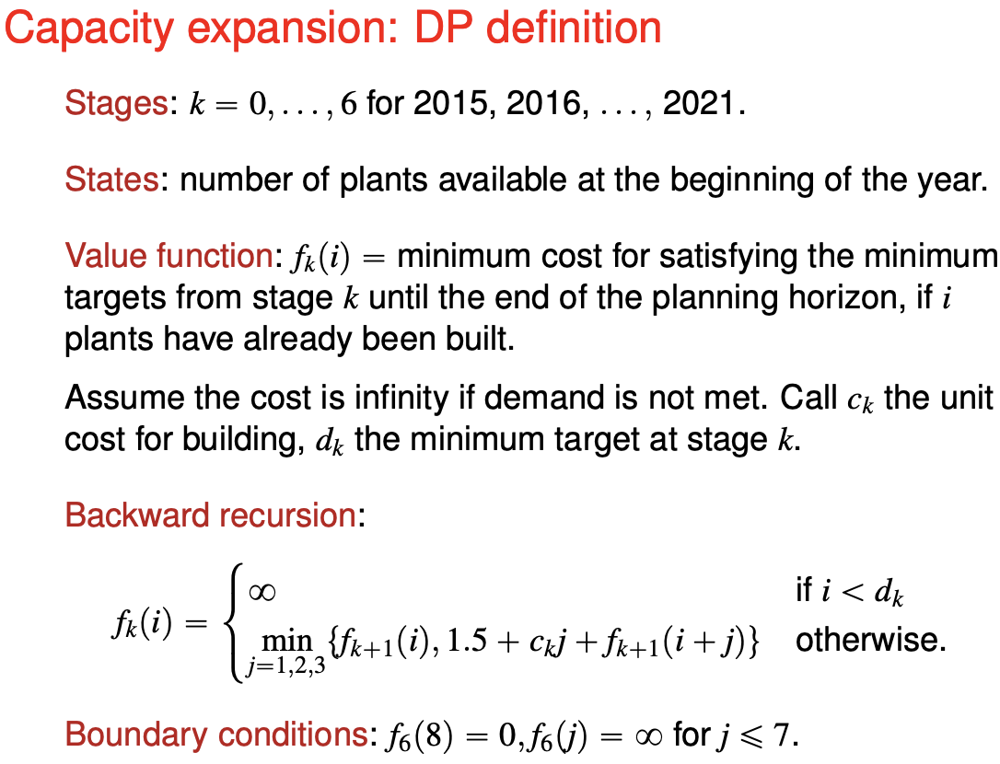
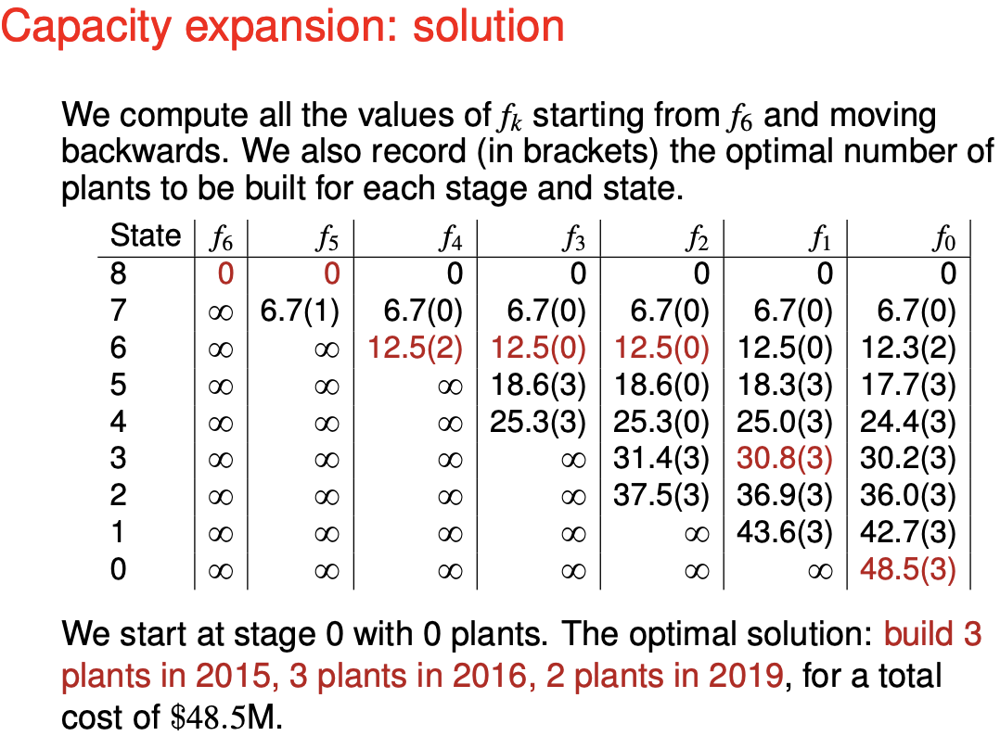
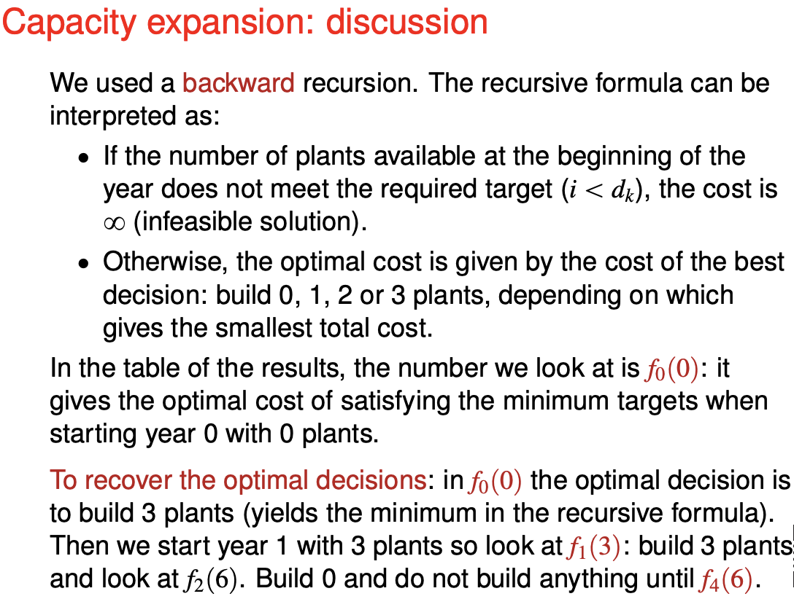

# Dynamic programming

**Elements** of a Dynamic Program

- **Stages.** the decision to be optimized are taken sequentially over a number of stages, that typically represent time periods.

- **States.** at each stage, all the information required to take future decisions can be represented by a state, regardless of how we reached the current state.

- **Decisions.** at each stage and state, we have a set of decisions or actions available, which bring us to some state in the subsequent stage.

- **Principle of optimality.** any optimal sequence of decisions has the property that, whatever the current stage, state and decision, the remaining decisions must be optimal with regard to the stage and state resulting from the current decision. (Is this the optimal substructure?)

Essentially, you need to be able to calculate for all the states in one direction until you get your required answer.

**Construction**

You need to define the **stages** and the **states**. This breaks down the problem into subproblems.

Each stage consists of all the states. Each stage may only have one state (for example 1-2-6 match game). You use the past stage(s) to compute the next stage.

## The match game

There are $n$ matchtes, and the person who picks up the last match wins. You alternate with your friend taking turn. At each turn, each of you can pick up 1, 2 or 6 matches.

Solution - If you can force your opponent into a losing position, you win. Otherwise, you lose.

## Shortest paths

Solution idea. Each stage is maximum number of arcs allowed to each the node, and each state is the node ended. The value function is the cost of the path from the starting node to the node ended.

**Additional information**

Stopping condition - when two stages are the same.

Negative cycles - if the stages are not the same by stage $2n$, there is a negative cycle (proof needed).

**Preflight checklist**

Please provide the **mathematical expression** to compute the next stage.

Please remember to define the boundary conditions of **all the nodes** (not just the starting node).

**This is not Dijkstra**

Yes, the boundary condition is same as Dijkstra.

Why did Djistrka not work for negative edge values - when the node is dropped from the list, the path to the node may not be the optimal as there may be a cheaper path that lead to that node. (Better explaination needed)

## Optimal capacity expansion

Concept highlighted - backward recursion.

**My comments**

I do not understand why forward recursion (computing stages forward in time) is difficult.

You need to understand clearly whether the state refer to (when was the plant built and when is the state recorded - beginning of the year or end of the year?). 

## Miscellaneous

Did not understand the second problem of the lecture. Please ask for help.