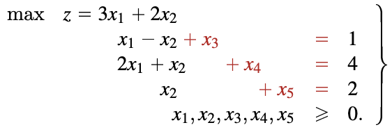
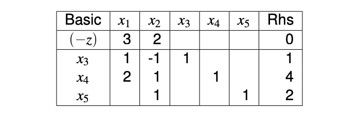
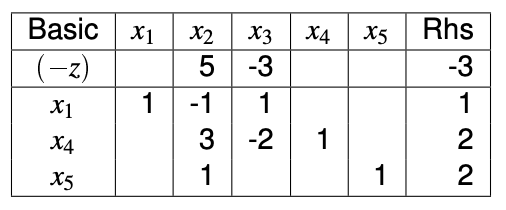
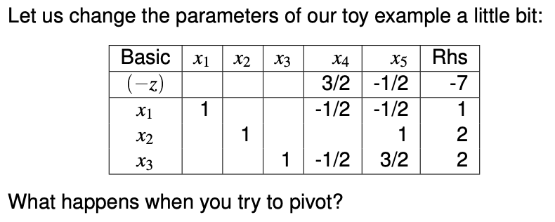
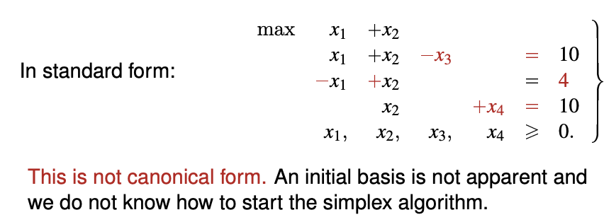
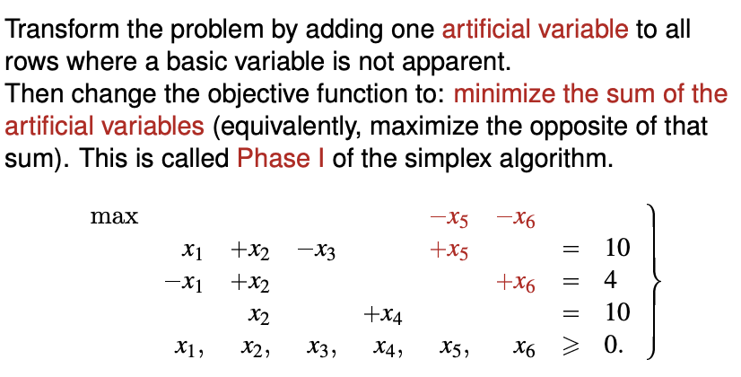
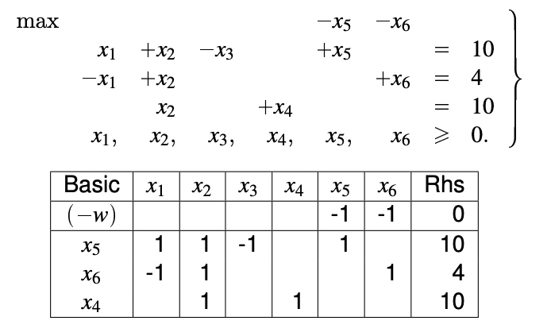
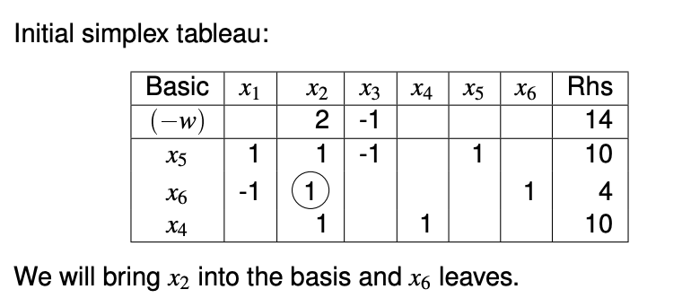
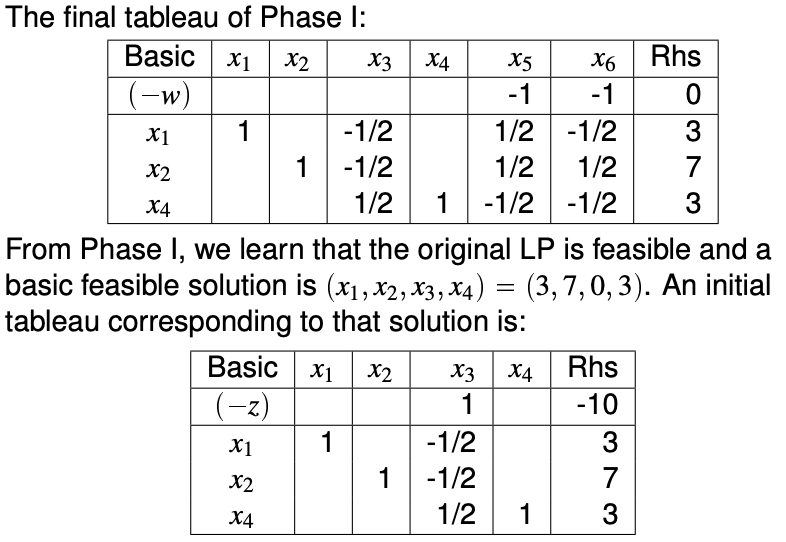

# Simplex Algorithm

There are two phases of the simplex algorithm. Phase I requires the use of Phase II algorithm.

TODO - code algorithm for Simplex?

**PHASE I** - Transforming the standard form to the **canonical form**

  - First, we add nonnegative artificial variables to create a **different LP problem**. However, this problem is in canonical form. 
    - We may use matrices to do this. However, this requires $A$ to be made up on linearly independent rows.

> Standard form of the linear program with $A$ that has linearly independent rows.

$$
max\left\{ cx | A\vec{x} = \vec{b} \geq \vec{0}, \vec{x} \geq 0 \right\}
$$

> Some variables are chosen to be basis variables such that $A_B$ is invertible.

$$
\begin{array}{r@{}cl}
max \quad c_B x_B + c_N x_N   \\
\quad A_B x_B + A_N x_N &=& b \\
\quad x_B, x_N &\geq& 0
\end{array}
$$

> Now your standard LP can be expressed in canonical form:

$$
\begin{array}{r@{}cl}
max \quad \left( c_N - c_B A_B^{-1} A_N \right) x_N + c_B A_B^{-1} b &=& \bar{c}_N x_N + \bar{z} & \\

I x_B + A_B^{-1} A_N x_N = A_B^{-1} b &=& x_B + \bar{A}_N x_N &=& \bar{b} \\

&& x_B, x_N &\geq& 0 
\end{array}
$$

  - We optimise the canonical form using the **Phase II algorithm**.
  - We know the nonnegative artificial variables are zero. We **remove** the nonnegative artificial variables and obtain a canonical form of the solution. (QUESTION - correct?)

**PHASE II** - Obtaining the **optimal solution** from the canonical form

  - We start with the canonical form, which has a certain number of basis variables.
  
  - We choose an **incoming basis variable** (which is currently a non-basis variable)
  
    - the non-basis variable has **positive reduced cost** (all basis variables have zero reduced cost)
    - if there are multiple non-basis variable choose the variable the **smallest index**
    
    
  We also choose an **incoming basis variable** (which will be a non-basis variable)
    
    - the constraint coefficient of the nonbasic variable is **nonnegative** 
    - among those above, choose the variable with the **smallest ratio** of RHS to constraint coefficient (QUESTION can be zero, right?) 
  - if the ratio is a tie, choose the variable will a **smaller index**
      
  
  Then we pivot the basis variables, and then **iterate**.
  
  - Then we reach either one of the following conditions
  
    - All variables have nonpositive reduced costs: the current basic feasible solution is optimal, we can stop.
    - There exists one variable with positive reduced cost that appears with all nonpositive coefficients in the constraints: the problem is unbounded, we can stop.
    - (QUESTION: How about the case of where an edge is an optimum?)

## Canonical form of a linear program

Here we elaborate on the three conditions for a Linear Program to be considered a canonical form.

1) It is in standard form
$$
\begin{align*}
max \quad \vec{c}^T \vec{x} \\
s.t. \quad A\vec{x} &= \vec{b} \geq \vec{0} \\
\vec{x} &\geq 0
\end{align*}
$$

2) The constraint matrix (of size $m \times n$) contains (a permutation of) the identity matrix as a submatrix (of size $n \times n$). 

A **permutation** of a identity matrix refers to a square matrix that can form the identity matrix by rearrangings its rows (or columns, the same).
$$
\begin{bmatrix}
    1 & 0 & 0 \\
    0 & 1 & 0 \\
    0 & 0 & 1
\end{bmatrix},
\begin{bmatrix}
    0 & 0 & 1 \\
    0 & 1 & 0 \\
    1 & 0 & 0
\end{bmatrix},
\begin{bmatrix}
    0 & 1 & 0 \\
    1 & 0 & 0 \\
    0 & 0 & 1
\end{bmatrix},
\begin{bmatrix}
    1 & 0 & 0 \\
    0 & 1 & 0 \\
    0 & 0 & 1
\end{bmatrix}
$$
You can see that the following matrices contains a permutation of the indentity matrix as a submatrix.
$$
A = 
\begin{bmatrix}
    0 &  1 &  1 &  0 \\
    1 & -3 &  0 &  1
\end{bmatrix}
$$

$$
A =
\begin{bmatrix}
    0 &  -4 &  1 &  0 \\
    1 &   1 &  0 &  0 \\
    0 &  -7 &  0 &  1 \\
\end{bmatrix}
$$
3) The variables with a "+1" coefficient in the identity matrix appear **with a zero coefficient** in the objective function.

You see that objective function is independent of the variables in the objective function.

All linear programs that can be represented as a canonical form has a solution. In the above example, let $x_3 = 1$, $x_4 = 4$, $x_5 = 5$ and you have a solution $x_1 = x_2 = 0$ with the value of the objective function as zero.

# Phase II of Simplex Algorithm

We assume that we have obtained the canonical form of a linear program. Now we solve for the second phase. 

We will represent the equation with the table form.

You can read off a **basic feasible solution** here. One that has $x_1$ and $x_2$ that is equal to zero. However, this is not the optimal solution.

Now we pivot the basic variable until the coefficient of the objective function (reduced cost) is all nonpositive.

We choose an outgoing basis variable

- the reduced cost of the outgoing basis variable has to be postive
- we will choose the smaller index, which is $x_1$

Then we choose an incoming basis variable with **the ratio test**

- the constraint coefficient of the incoming basis variable has to be **postive**. (CAN IT BE NON-NEGATIVE?)

- pivot in a constraint that gives the **minimum ratio** of righthand-side coefficient to corresponding coefficient.

Ratio for $x_4$ is $\frac{4}{1} = 4$, ratio for $x_2$ is $\frac{2}{1} = 2$.
Ratio for $x_3$ not considered because coefficient of $x_3$ is negative.

We have thus chosen $x_4$ to replace $x_3$ as the basis variable.

This is still a canonical form, with basis variables $x_1$, $x_4$ and $x_5$.

Do until all the reduced cost is negative.

This is the completed solution.

|Basic| $x_1$ | $x_2$ | $x_3$ | $x_4$ | $x_5$ | RHS   |
|-| ---- | ---- | ---- | ----- | ----- | ----- |
|$-z$|  |  |  | -1.5 | -0.5 | $-\frac{20}{3}$ |
|| 1    |  |  | 0.5  | -0.5 | $\frac{4}{3}$ |
||      | 1    |  |   | 1  | $\frac{4}{3}$ |
||      |  | 1 |   |   | $\frac{2}{3}$ |

Letting the non-basis variables be zero, the optimal solution is $[\frac{4}{3}, \frac{4}{3}, \frac{2}{3}, 0, 0]$ with objective function value $\frac{20}{3}$

If there are $m$ constraints and $n$ variables, there are $^mC_n$ bases, and if no basic variables ever repeats, then the simplex algorithm should terminate after a finite number of iteration.

## Bad cases for Phase II

There exists one variable with positive reduced cost that appears with all nonpositive coefficients in the constraints: the problem is unbounded, we can stop.

In essense you can increase $x_4$ and RHS infinitely. (Why? QUESTION)

(QUESTION) How about parallel case? Anywhere along an edge of the boundary it is optimum. This will cycle. Will use simple method to stop this cycling.

## Phase I of Simplex algorithm

Given a standard form, obtain a canonical form (if there is).

Firstly, add artifical variables. (We do not need to add $x_7$ because the $x_4$ provided can be part of the matrix already.)

**The objective function is changed.**

Simple substituiton to obtain this.

Conduct Phase II Simplex algorithm to obtain the following result.

The new variables $x_5$ and $x_6$ can be eliminated, because we know that they are zero.

## Bad Cases for Phase I

At the end of Phase I, we are in one of the following cases:
- The Phase I objective function value is nonzero: the initial problem has **no feasible solution**. We can stop.
  - (QUESTION) Will this case still be possible if the rows of $A$ is linearly independent?
- The Phase I objective function value is zero and no artificial variable is in the basis: **we have a basic feasible solution** for the initial problem. We drop the artificial variables to obtain the initial simplex tableau for Phase II. 
- The Phase I objective function value is zero and some artificial variables are in the basis: we pivot them out, if we cannot, then **there are redundant constraints** that we can drop. After this, we drop the artificial variables to obtain the initial simplex tableau for Phase II.
  - This will not be the case if the rows of $A$ is linearly independent.

## Degeneracy and cycling rule

Degenracy may cause cycling if you don't choose the pivot rule properly.

One of the rules to prevent cycling - Bland’s rule
- Among variables with positive reduced cost, choose the one with the smallest index as the entering variable. (There is no need to choose the largest reduced cost). 
- If there is a tie in the min ratio test, choose the one with the smallest index as the leaving variable.

Given a Linear Program, if we apply any anticycling rule (such as Bland’s rule) the simplex algorithm terminates in a finite number of iterations, showing one of the following:
- The problem is infeasible.
- The problem is unbounded.
- The problem has an optimal solution.
If a Linear Program has an optimal solution, it has an optimal solution that is a BFS, which corresponds to a corner point.

## Phase I represented as matrices

Standard form of the linear program
$$
max\left\{ cx | A\vec{x} = \vec{b} \geq \vec{0}, \vec{x} \geq 0 \right\}
$$
If $A$ is $m \times n$ matrix with linearly independent rows.

Which can be written into this form
$$
\begin{array}{r@{}cl}
max \quad c_B x_B + c_N x_N   \\
\quad A_B x_B + A_N x_N &=& b \\
\quad x_B, x_N &\geq& 0
\end{array}
$$
Where $x_B$ are the variables and and $x_N$ are the non-basic variables. (If $x_N$ is empty, it is a system of linear equations with only one solution.)

You have to choose basis variables such that $A_B$ is a nonsingular matrix. You cannot choose a nonsingular matrix of $A$ does not have linearly independent rows.

We can express the basis variables to become identity variables.
$$
\begin{array}{r@{}cl}
max \quad c_B x_B + c_N x_N \\
I x_B + A_B^{-1} A_N x_N &=& A_B^{-1} b \\
x_B, x_N &\geq& 0
\end{array}
$$
However, in the objective function, the coefficient of the basis variable should be zero, therefore
$$
\begin{array}{r@{}cl}
max \quad \left( c_N - c_B A_B^{-1} A_N \right) x_N + c_B A_B^{-1} b \\
I x_B + A_B^{-1} A_N x_N &=& A_B^{-1} b \\
x_B, x_N &\geq& 0 
\end{array}
$$
With respect to a basis with matrix AB, we define:
- The simplex multipliers: $y_B = c_B A_B^{-1}$
- The reduced costs of $x_N$: $\bar{c}_N = c_N - c_B A_B^{-1} A_N = c_N - y_B A_N$
- The reduced costs of $x_B$: $\bar{c}_B = 0$
- The objective function value $\bar{z} = c_B A_B^{-1}b = y_B b$
- $\bar{A}_N = A_B^{-1} A_N$
- The values of the basic variables: $\bar{b}=A_B^{-1}b$

Now your LP is expressed as follows
$$
\begin{array}{r@{}cl}
max \quad \left( c_N - c_B A_B^{-1} A_N \right) x_N + c_B A_B^{-1} b &=& \bar{c}_N x_N + \bar{z} & \\

I x_B + A_B^{-1} A_N x_N = A_B^{-1} b &=& x_B + \bar{A}_N x_N &=& \bar{b} \\

&& x_B, x_N &\geq& 0 
\end{array}
$$

