# Sensitivity Analysis

For this, it is better to refer to the drawn diagram.

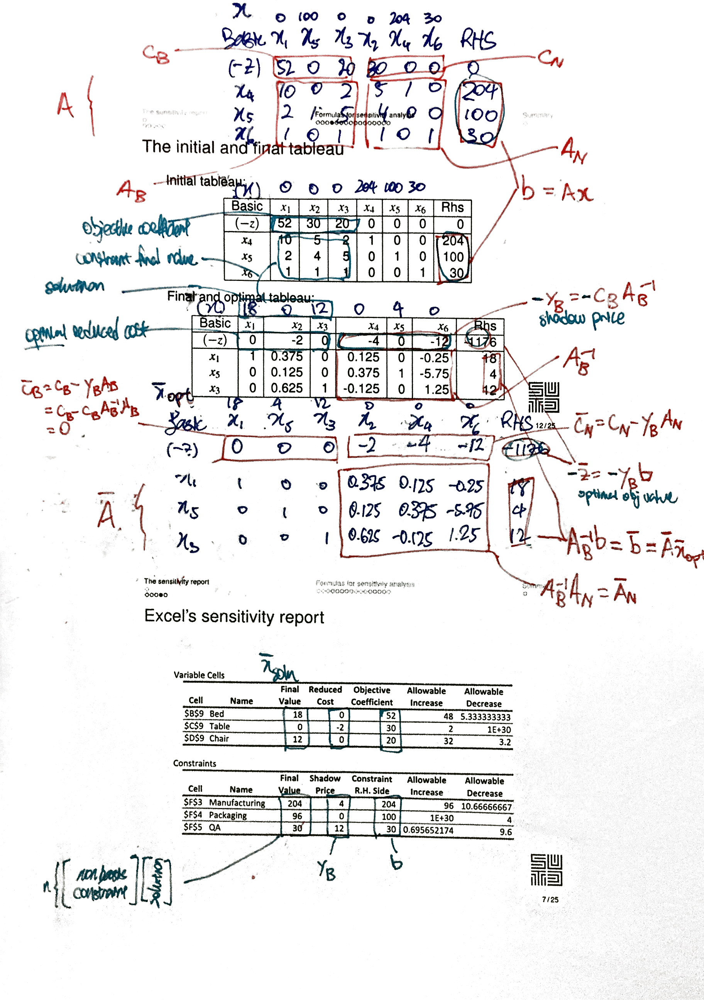

Actually learn how to read the sentivity report from the LP. And understand how it is derived.

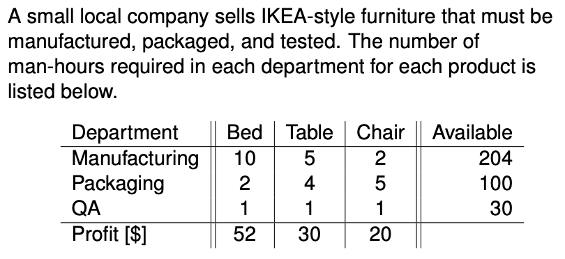

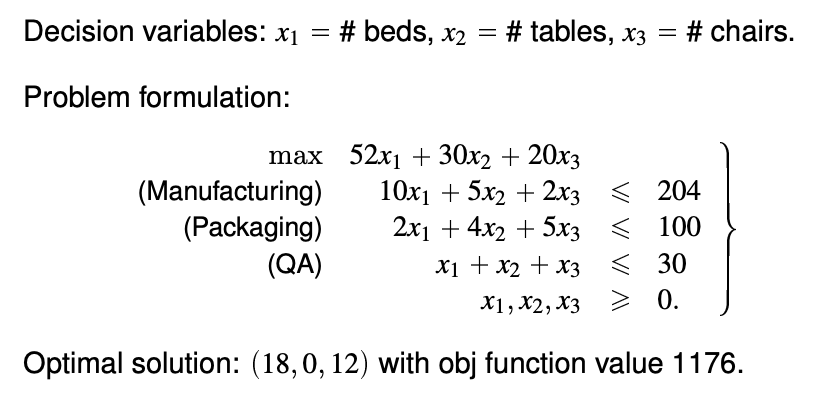

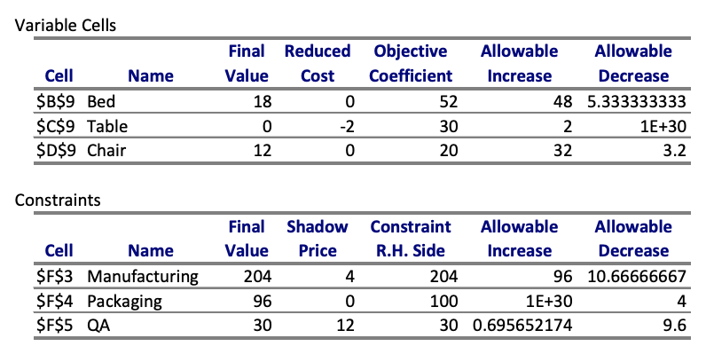

### Elements in the sensitivity analysis

The final values are the optimal solutions. Reduced cost is reduced cost. We explain the following examples and how to obtain the values later.

**Allowable increase and allowable decrese**

- When the **one of the** "objective coefficient" or "RHS constraint" is between this range, the solution will not be changed.

You can now learn whether the solution is still optimal when **multiple elements** of `c` of **multiple elements** `b` change.

As long as the optimal basis does not change, sensitivity analysis can be carried out without further simplex iterations. A basis will stay optimal after modifications of the parameters `c`, `b`, and `A` as long as

- [Feasibility condition] the RHS values are nonnegative, i.e., $A_B^{-1} b \geq 0$, and
- [Optimality condition] the reduced costs of nonbasic variables are nonpositive (for a maximization problem), i.e., $\bar{c}_j = c_j - y_B A_j \leq 0$ 

The **shadow price** of a constraint indicates the change in objective function per unit increase of the RHS value. 
- Concept here - the solution does not change as long as the set of basis variables does not change.
- Shadow price takes the same role as simplex multipliers.
- Shadow prices are valid only as long as the optimal basis does not change.

With the information above, we can calcuate the value of the objective function when multiple objective coefficient or multiple RHS constraint changes, assuming the solution still feasible and the set of basis variables does not change.

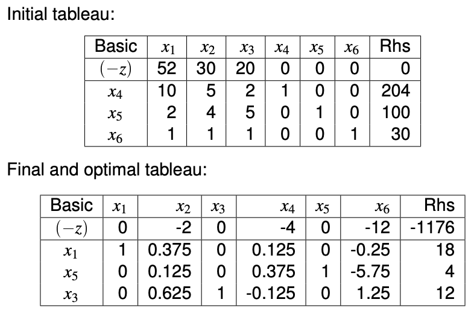

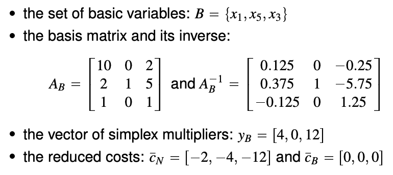

The columns of $A_B$ and $A_B^{-1}$ is different.

#### Computing RHS ranges

You can check your answer against the LP report. "No need to check the feasibility condition".

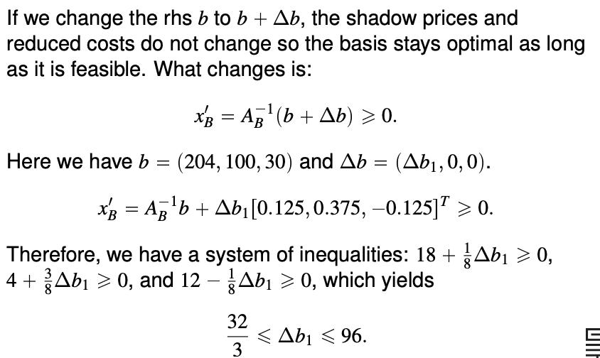

(should be -32/3 instead of 32/3, $\Delta b$ should include 0)

#### Computing objective coefficient range for <u>nonbasic</u> variables

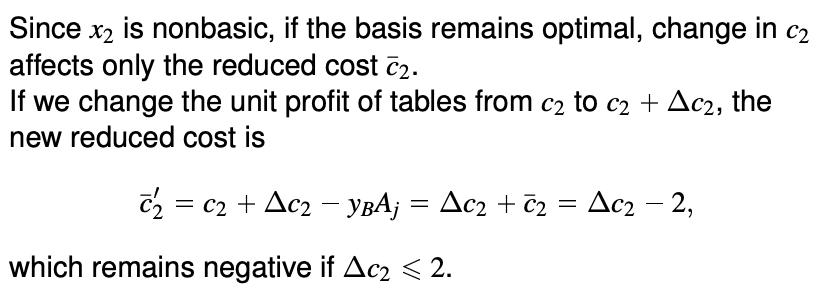

Less than the absolute of the reduced cost. 

#### Computing objective coefficient range for <u>basic</u> variables

I don't understand the math, but it seems like you can read off the table.

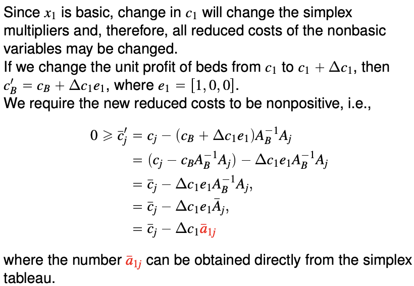

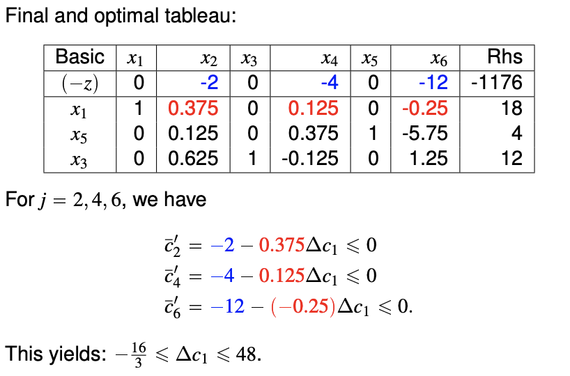

#### Computing new opportunities

We have the opportunity of producing stools. Each stool requires 2 hours in Manufacturing, 1 hour in Packaging, 1 hour in QA, and yields a profit of $12. Should we pursue this opportunity?

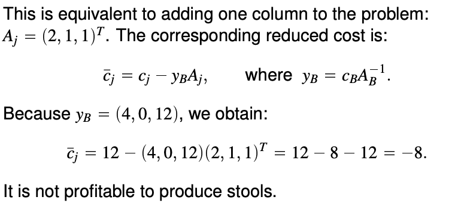