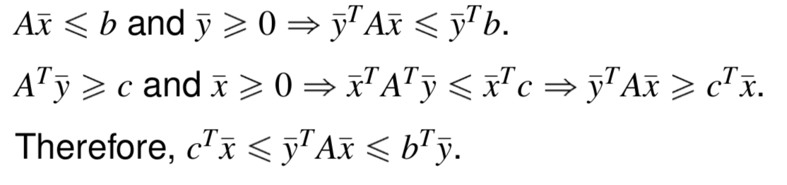
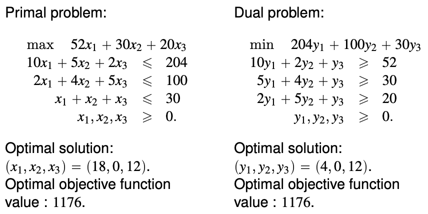
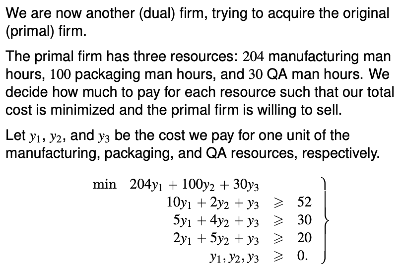

# Duality

Usually, you do not need the optimal solution, but somewhere close to it. 

A very important topic in optimization is being able to tell the distance from the optimum: if we have a feasible but not optimal solution of an LP, how does the value of this (suboptimal) solution compare to the optimum?

**Definitions**

Given an LP (expressed in the primal form in this convention), we can form another LP called the dual.

Primal LP

$$
\begin{align}
max \enspace c^T x& \\
Ax& \leqslant b \\
x& \geqslant 0
\end{align}
$$

Dual LP

$$
\begin{align}
min \enspace b^T y& \\
A^{T} y& \geqslant c \\
y& \geqslant 0
\end{align}
$$

The dual of the dual is the primal. (You need to express the dual form into a primal before you can calculate the dual of the dual.)

**Rules for forming the dual of a general LP**

**Weak Duality Theorem**
Condition

- $\bar{x}$ is a feasible solution to the primal 
- $\bar{y}$ is a feasible solution to the dual

Result
- $c^{T} \bar{x} \leq b^{T} \bar{y}$.

**Proof**

One of the intuitions - Suppose that $x^{*}$ is optimal to the primal, then $x^{*}$ is feasible to the relaxation.

**Strong Duality Theoerm**

Condition

- If a primal problem has an optimal solution.

Result

- The dual problem has an optimal solution.
- The respective objective function values are equal.

**Fundamental Theorem of Linear Programming**

For a pair of primal problem P and dual problem D, exactly one of the following is true

- P and D have optimal solutions and their objective function values are equal
- P is unbounded and D is infesaible
- D is unbounded and P is infeasible
- Both problems are infeasible.

**Complementary Slackness property**

Let $\bar{x}$ and $\bar{y}$ be feasible solutions to the primal and dual problem, respectively. $\bar{x}$ and $\bar{y}$ are optimal solutions for the two respective problems if and only if:

$$
\begin{align}
\bar{y}_i (b_i - a_i^T \bar{x}) &= 0, 
\enspace \forall i, \quad \text{and} \\
(A_j^T \bar{y}_i - c_j) \bar{x}_j &= 0, 
\enspace \forall i
\end{align}
$$

[QUESTION] Do they imply one another?

In an optimal solution

- either $10x_1 + 5x_2 + 2x_3 = b_1$ (which is 204) or $y_1 = 0$ (which is 4)
- either $5y_1 + 4y_2 + y_3 = c_j$ (which is 30) or $x_2 = 0$ (which is zero)

This applies for all constraint-solution pair, and solution-constraint pair.

**Economic interpretation**

Please try to understand this.

Please also understand the optional component in W4L2 on restoring feasibility after adding a constraint.