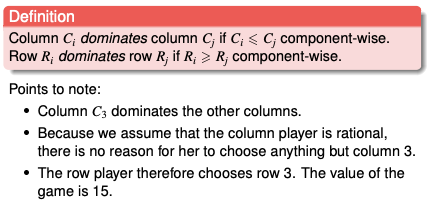
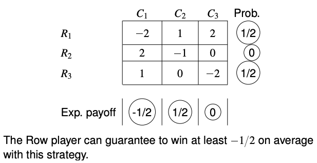
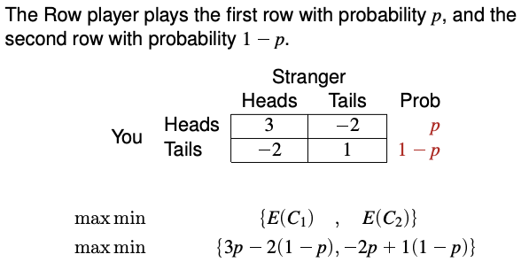

# Strategy Games

**Two-player zero-sum game**


**Guaranteed payoff**

To maximise guaranteed payoff, row player would play row 3.


**Dominating strategies**




**Saddle point**

When the game only have one outcome each player would not choose any other outcome.


**Mixed strategy** 

Instead of always choosing an option, choose a set of options randomly at a specified probability. As we consider the long-term payoff of the game, any strategy is assumed to known by the opponent who will play optimally.




**The linear programming problem for row player**

Objective: maximise guaranteed payoff of the row player

$$
\begin{align}
\max \min\{E(C_1), E(C_2), E(C_3)\}&  \\
p_1 + p_2 + p_3 &= 1 \\
p_1, p_2, p_3 &\geq 0
\end{align}
$$

where
$$
\begin{align}
E(C_1) &= -2p_1 + 2p_2 +  p_3& \\
E(C_2) &=  2p_1 -  p_2       & \\
E(C_3) &=   p_1        - 2p_3&
\end{align}
$$

Formulating as a linear programming problem
$$
\begin{align}
\max z& \\
E(C_1) &\geq z\\
E(C_2) &\geq z\\
E(C_2) &\geq z\\
p_1 + p_2 + p_3 &= 1 \\
p_1, p_2, p_3 &\geq 0 
\end{align}
$$

(This is a relaxation because they are not exactly equivalent, because $z$ could be any value besides $E(C_1), E(C_2), E(C_3)$)

Solution: $$
p_1 = 7/18, \enspace 
p_2 = 5/8, \enspace 
p_3 = 1/3, \enspace
z = 1/9$$


**The linear programming problem for column player**

Objective: minimise the guaranteed payoff of column player
$$
\begin{align}
\min \max\{E(R_1),E(R_2),E(R_3)\} \\ 
q_1 + q_2 + q_3 &= 1 \\
q_1, q_2, q_3 &\geq 0
\end{align}
$$

where
$$
\begin{align}
E(C_1) &= -2q_1 + q_2 +  2q_3& \\
E(C_2) &=  2q_1 - q_2       & \\
E(C_3) &=  2q_1        - 2q_3&
\end{align}
$$


Formulating as a linear programming problem
$$
\begin{align}\min v& \\
E(R_1) &\leq v\\
E(R_2) &\leq v\\
E(R_2) &\leq v\\
q_1 + q_2 + q_3 &= 1 \\
q_1, q_2, q_3 &\geq 0 \end{align}
$$

This is a primal-dual pair. 

$$
\begin{align}
\max z& \\
-2p_1 + 2p_2 + p_3 -z &\geq 0\\
2p_1 - p_2 -z  &\geq 0\\
p_1 - 2p_3 -z &\geq 0\\
p_1 + p_2 + p_3 &= 1 \\
p_1, p_2, p_3 &\geq 0 
\end{align}
$$

```
min 0 0 0 1 (q_1, q_2, q_3, z)

-2  1  2  1 geq 0
 2 -1  0  1 geq 0
 1  0 -2  1 geq 0
-1 -1 -1  0  eq 1

leq leq leq free
```

Subsitute $q'$ with $-q$ to show that the other problem is a dual.


**Graphical solution to small games**

If there are only two strategies available, you can use one variable $\{p, 1-p\}$ and you do not need to use an LP to solve the problem.



You can use a graphical solution. The maximum is a piecewise function with a maxima at (0.375, -0.125).


**Graphical solution to small games - column player**
$$
\begin{align}
\min \max &\qquad \{E(R_1), E(R_2)\}\\
\min \max &\qquad \{3p - 2(1-p), 2p + 1(1-p)\}
\end{align}
$$

(please add?)


**Formulating games as LP problems**

Each player can decide on a combination of decisions before the games commence. (Example from cohort - combinations of decisions of whether to pass or bet on head and tails). The strategy is to assign a probability to each combination.