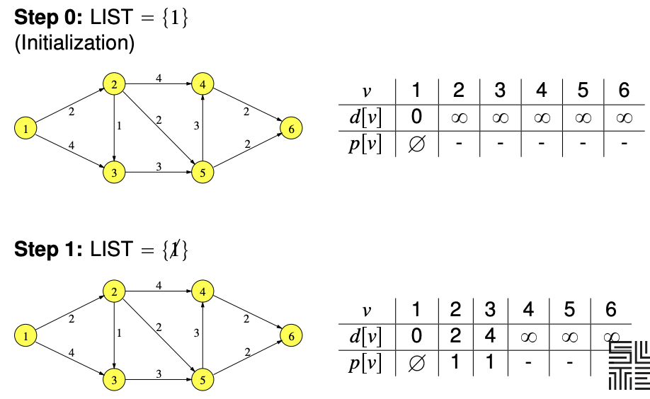
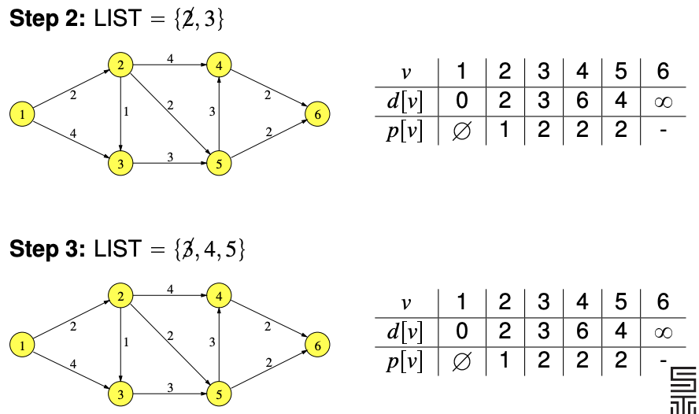
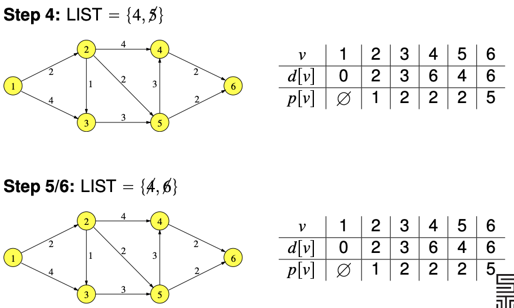

# Graphs

**Directed graph and undirected graph**

Differences between directed graph and undirected graph

 Property         | Undirected Graph   | Directed Graph            
 ---------------- | ------------------ | ------------------------- 
 Edges of nodes   | Degree             | Indegree, Outdegree       
 Adjacency Matrix | Symmetric          | Not necessarily symmetric 
 Incident Matrix  | Columns sum to two | Columns sum to zero       

**Terminologies**

- Path - a sequence of arcs that connect a sequence of vertices with no repetitions
- Circuit/cycle - a path but the first and last node that is the same
- Walk - a sequence of arcs that connect a sequence of vertices, possibly with repetitions
- Eulerian path - a walk that passes through each arc exactly once
- Eulerian cycle - a walk that passes through each arc exactly once and ends at the starting node

**Special graphs**

- connected graph - at least one back between every pair of nodes
- tree - all nodes have exactly one indegree, except one

**Theorems**

- A graph has a Eulerian path if and only if it is connected and it has exactly two nodes of odd degree
- A graph has a Eulerian cycle if and only if it is connected and all nodes have even degree

**Shortest path problem**

The shortest path tree stores all shortest path from the starting node.

Three set of variables 
- Heap of nodes to visit next
- For each node - distance from starting
- For each node - the previous node 

**Key steps of Dijkstra's algorithm**

- Initialise infinite distance for all nodes except the starting one
- Consider the node from the heap with minimum distance from starting (this is the "considered node")
- For each "adajcent node" to the considered node (visited or not), calculate the distance
- If the distance is smaller (the new path is shorter)
  - If the distance had been infinite (the adjcaente never visited before)
     - Add the node to the heap
  - Update distance and previous node of the adajcent node
- Remove the considered node from the list.

**Workings of Dijkstra's algorithm**

