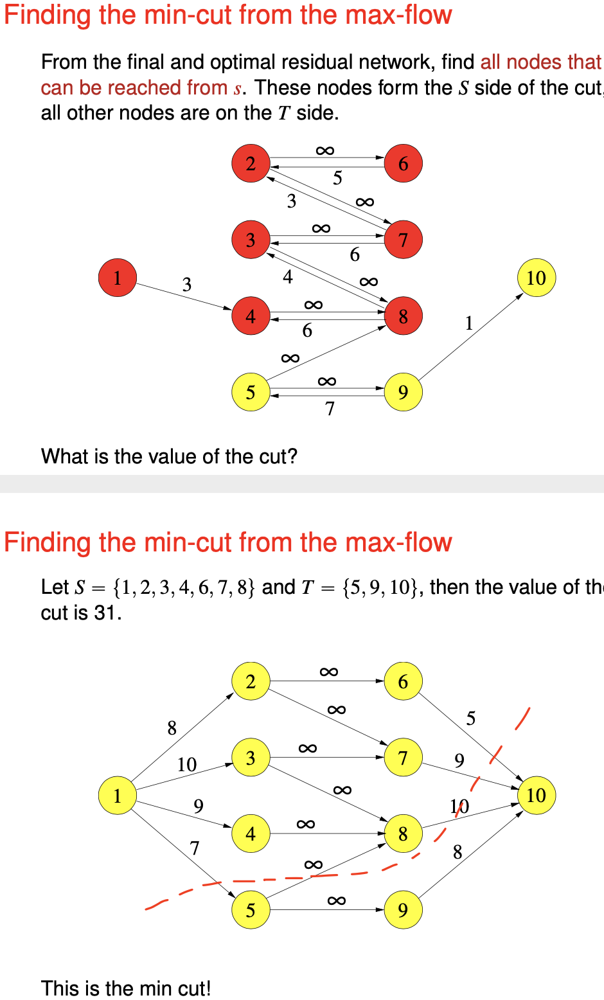
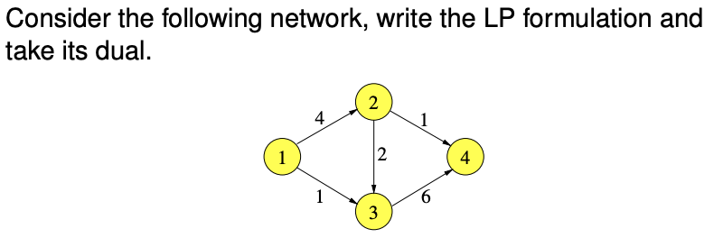
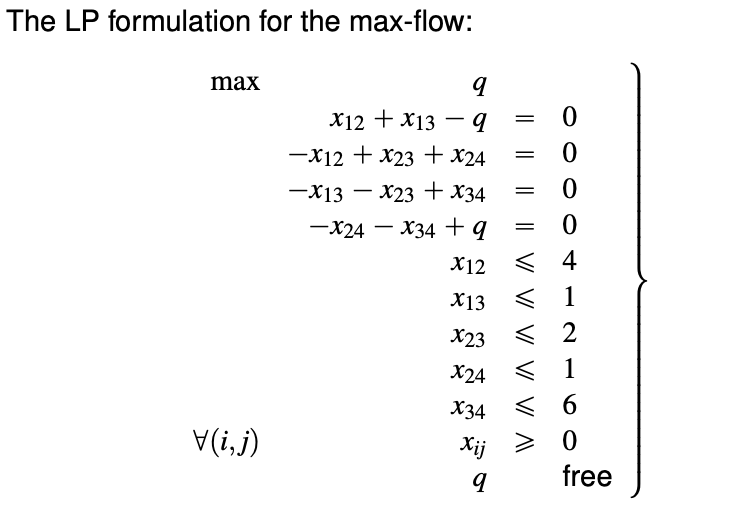
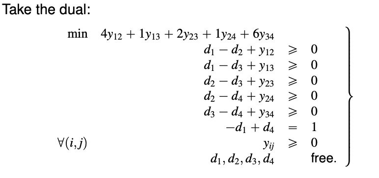
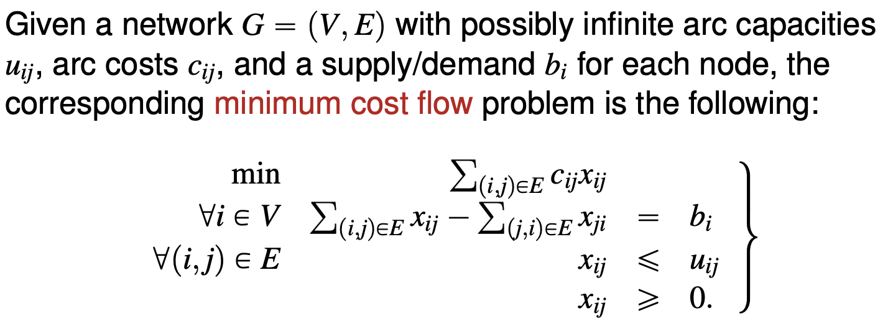
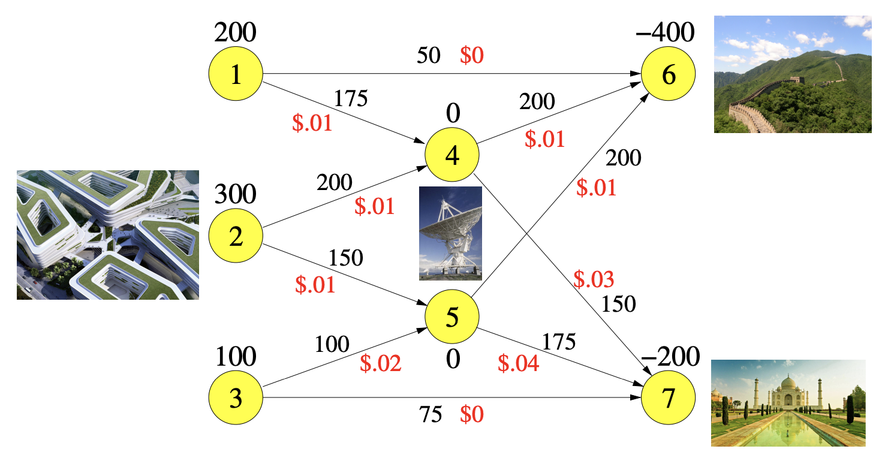
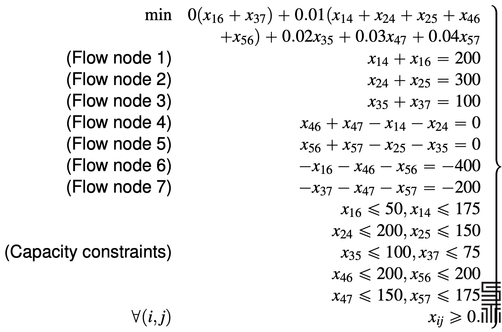
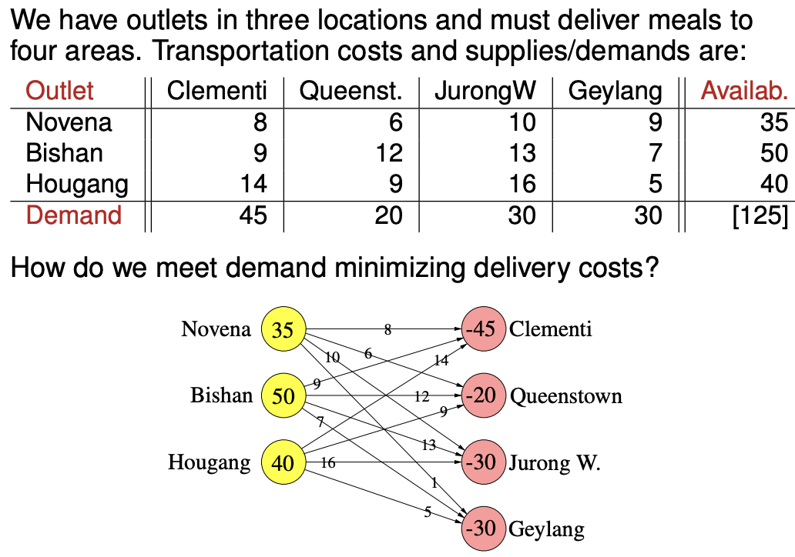
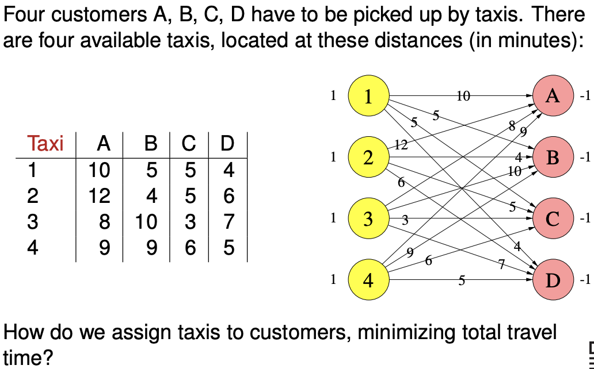
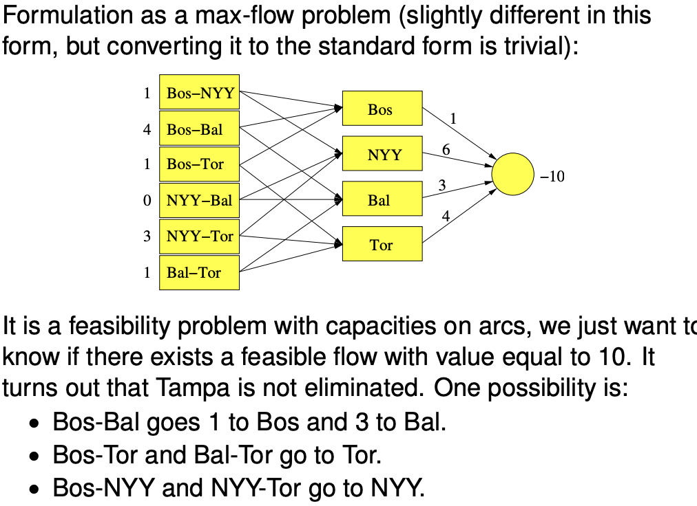

# Network flow

### **Taxonomy of network problems**

- Linear programming 

  - Min-cost problem

    - Max-flow problem

      - Baseball elimination

        Has a particular team been eliminated from winning the season finale, given the current points and number of games left between each team? The particular team can win all the remaining game, but has no control over matches between other teams which either team will get points. We just want to know if there exists a feasible flow with value equal to 10 **(DONT UNDERSTAND)**.

    - Maximum cardinality matching

    - Transhipment problem

      How to meet the demand minimising delivery costs?

      - Transportation problem
        (Transhipment problem without intermediate nodes)
        - Assignment problem
          (The total demand is equal to total supply)

    - Shortest path problem
      (You are transferring a unit supply from the source to the tap at minimum cost)

### The max-flow problem

Given a directed network $G = (V,E)$ and a source node $s$, a sink node $t$, and a possibly infinite capacity $u_{ij}$ for each arc $(i,j)$

The max-flow problem is the problem of finding a value of flow for every arc in such a way that

- Flows are nonnegative and arc capacities are satisified
- For every node that is not $s$ or $t$, the incoming flow is equal to the outgoing flow
- The flow entering the sink $t$ is maximum

Formulation of the Linear Program
$$
\begin{align}

\text{Objective function}\\

\max& \ q \\

\text{The inflow of the source}\\

  & \qquad \sum_{(s,j) \in E} x_{sj} &=& \ q\\

\text{The outflow of the tap}\\

  & \qquad \sum_{(i,t) \in E} x_{it} &=& \ q\\

\text{For all other nodes, inflow equals outflow}\\

\forall v \in V, v \neq s, t &
  \qquad \sum_{(v,j) \in E} x_{vj} 
       - \sum_{(i,v) \in E} x_{iv} &=& \ 0\\

\text{Capacity constraint}\\

\forall (i,j) \in E&
  \qquad x_{ij} &\leq& \ u_{ij}\\

\text{Nonnegativity constraint}\\

\forall (i,j) \in E&
  \qquad x_{ij} &\geq& \ 0
\end{align}
$$

**Transforming into a max-flow problem**

- Edge with infinite flow - use a very large number as capacity for computation.
- Multiple source - create a single dummy source that has a directed edge to each of the original source. The capacity of the edge is the capacity of the original source. The original source is now like any other node.
- Multiple taps - create a single dummy tap that has a directed node from each of the original tap. The capacity of the edge is the capacity of the original tap. The original tap is now like any other node.

**Ford-Fulkerson algorithm**

Initialise the current flow value as zero.

- Find any directed path $P$ from the source to the tap. 
- Send the maximum possible flow $f$ along $P$.
- Add $f$ to the current flow value.
- Update the path $P$.
  - Decrease the forward capacity by $f$.
  - Increase the backward capacity by $f$
    - You may need to create an (augmenting) path.
  - If a directed edge from the source is zero, remove.
  - If a directed edge to the tap is zero, remove.

Terminate the algorithm when there are no more directed paths from the source to the tap. The complexity of the algorithm depends on the choice of augmenting paths.

The backflow capacity needs to be decreased if used (from 10 to 9 in the example below). 

My understanding of the intuition
- when you assign the flow you also assign flexibility with the backflow values
- progress is made when the edges from the source and tap is removed, eventually leaving no directed node from the source to the tap

### **Primal and dual pair for max-flow problem**

Each of $d_k$ and $y_{ij}$ is should be binary value (why?). Assigning the d-values provides a partition.

The backflow is ignored in the min-cut. Each feasible solution of the dual problem provides upper bound of the primal problem. The objective value of optimal solution of the dual problem and the primal problem is the same.

Natuaral bounds - if you partition right outside the source and the tap, you get trivial upper bounds - it is not possible to send any more than the source can send, or any more than the sink can take.

**The min-cost flow problem**

This is a more general form of a max-flow problem, but still a specific class of linear programming problem.

For each node the outflow minus inflow equal $b_i$. If $b_i > 0$, node $i$ is a supply node, if $b_i$ is a demand node, node $i$ is a demand node.

Properties
- Feasible solution is not guaranteed - it is possible that the supply do not reach the demand.
- Redundancy - the last flow node is a linear combination of rest of the flow nodes.

**Transforming into a min-cost problem**
In the min-cost problem total demand should be equal to the total supply $\sum_i b_i = 0$, or else there this is not a min-cost problem (or no feasible solution). Therefore

- If the supply exceeds the demand, create a dummy sink connected to each source, each with **zero cost**.
- If the demand exceeds the supply, create a dummy source connected to each source, each with **very high cost**.

**Converting a max-flow problem into a min-cost problem**

Every max-flow problem can be converted into a min-cost problem (refer to taxonomy of linear programming problems).

Add an arc from the sink to the source with infinite capacity. The objective function is to minimise the negative of the flow of the new sink-source arc. The cost of the rest of the arcs are zero.

**Assignment problem**

**Transportation problem**

**Baseball elimination problem**

