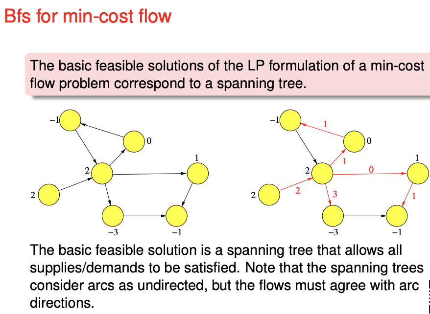
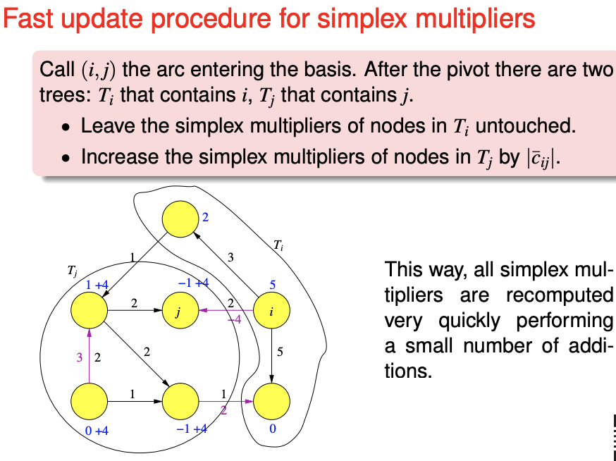
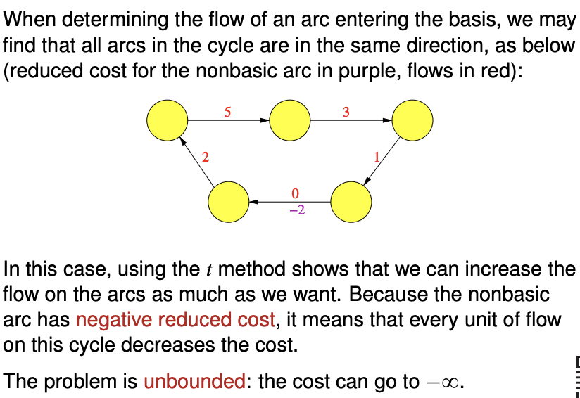
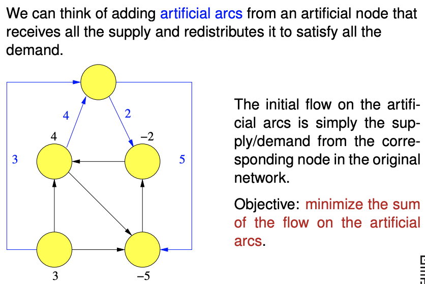
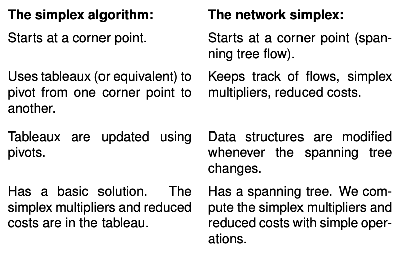
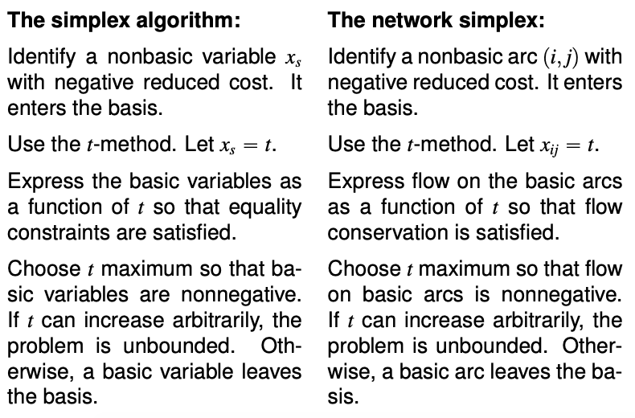

#Min-cost flow problem

This is a more general form of a max-flow problem, but still a specific class of linear programming problem (refer to taxonomy)

For each node the outflow minus inflow equal $b_i$. If $b_i > 0$, node $i$ is a supply node, if $b_i$ is a demand node, node $i$ is a demand node.

**Properties**

- Feasible solution is not guaranteed - it is possible that the supply do not reach the demand.
- Redundancy - the last flow node is a linear combination of rest of the flow nodes.

**Transforming into a min-cost problem**
In the min-cost problem total demand should be equal to the total supply $\sum_i b_i = 0$, or else there this is not a min-cost problem (or no feasible solution). Therefore

- If the supply exceeds the demand, create a dummy sink connected to each source, each with **zero cost**.
- If the demand exceeds the supply, create a dummy source connected to each source, each with **very high cost**.

**Converting a max-flow problem into a min-cost problem**

Every max-flow problem can be converted into a min-cost problem (refer to taxonomy of linear programming problems).

Add an arc from the sink to the source with infinite capacity. The objective function is to minimise the negative of the flow of the new sink-source arc. The cost of the rest of the arcs are zero.

## Network simplex algorithm

A tree is a graph **with no cycles**. It can be directed or undirected, but we consider undirected trees.

A spanning tree of a connected graph is a subset of its arcs that forms an undirected tree touching every node. (Directions does not matter here)

The basic feasible solution of the LP formulation of a min-cost flow problem correspond to a spanning tree.

The **basic feasible solution** is a spanning tree that allows all supplies or demands to be satisfied.

The capacity limits $u_{ij}$ will not be considered in this course.

## The algorithm

**Problem parameters**

These are the numbers that you need to keep track of

- **Nodes**
  - Provided by the problem
    - **Label**. This is how the node is referred to. If this is also a number it can be quite confusing.
    - **Supply** (positive) or **demand** (negative)
      - The total demand must be equal to the total supply.
  - Calcuated for each BFS
    - **Simplex multiplier** $y_i$
      - Down the directed edge of the basic arc, the simplex multiplier decreases by the initial cost of the edge.
- **Edges** (directed)
  - Provided by the problem
    - Capacity (ignored, this course assumes infinite capacity)
    - **Initial cost** $c_{ij}$
  - Calculated for each BFS
    - **Assigned flow**
      - If the current flow is zero, it is a nonbasic arc
      - If the current flow is **positive**, it is a **basic** arc
      - Flow cannot be negative
    - **Reduced cost** $\bar{c}_{ij}$
      - The reduced cost of every nonbasic arc is calculated
        - (The reduced cost of every basic arc is zero)
      - $\bar{c}_{ij} = c_{ij}- y_i + y_j$
      - Initial cost minus decrease in simplex multiplier down the direction of the edge

**Initialising the network simplex**

You start with a **basic feasible solution** a minimum spanning tree that allows all supplies and demands to be satisfied.

Compute the **simplex multipliers** starting from a leaf (chosen at random or instructed). The leaf (which is a node) is set to zero. 

**Recurse until solution is optimal**

Compute the **reduced costs**. If all reduced cost are **nonnegative**, the solution is optimal.

**Pivot** to improve the BFS. "We try to send as much flow as possible along that arc, while staying feasible". In other words, you **redirect** the flow to the nonbasic arc, from the (series of) basic arcs, until one of the flow of the basic arc is zero.

**Update the simplex multipliers.** You can repeat the same process, or use the following faster procedure. Then, repeat the cycle.

**Assumptions**

- No capacity constraints for the edges
  (the exam will not have constrains for edge capacity)
  How it is modified - set the nonbasic variables to either the upper or lower bound. Pivot on this edge only if the reduced cost is negative and if the nonbasic variable is at the lower bound, or the reduced cost is positive if the nonbasic variable is at the upper bound.
- The problem is feasible - it is already if you can find a basic feasible solution.
- The problem is not unbounded. If you find a cycle that has a negative total cost along the path, the cost can be minimised indefinitely.

**Phase I of network simplex**

Do this to obtain a basic feasible solution for the network simplex.

**Comparison between simplex and network simplex**

**Miscellaneous**

Simplex stops when it reaches dual feasibility.

Meaning of basic and nonbasic variables - set the nonbasic variables to zero and you get a solution.

The reduced cost is the rate at which the objective value changes with respect to the value.

Why do it this way instead of tableau? The tree structure is more computationally efficient.

