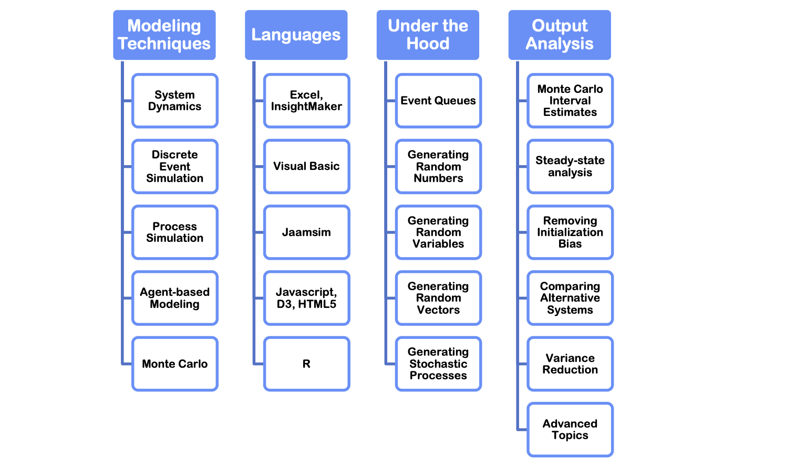
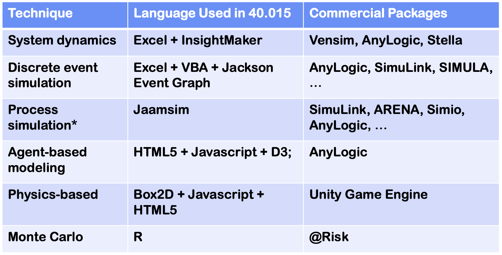

# Simulation Modelling and Analysis

In other words, model and analyse a simulated model

Objectives
- Understand how the components interact with one another
- Reduce bottlenecks

Example
- Sheet Metal Production
- Airport Terminal Simulation

## Technique and Software

