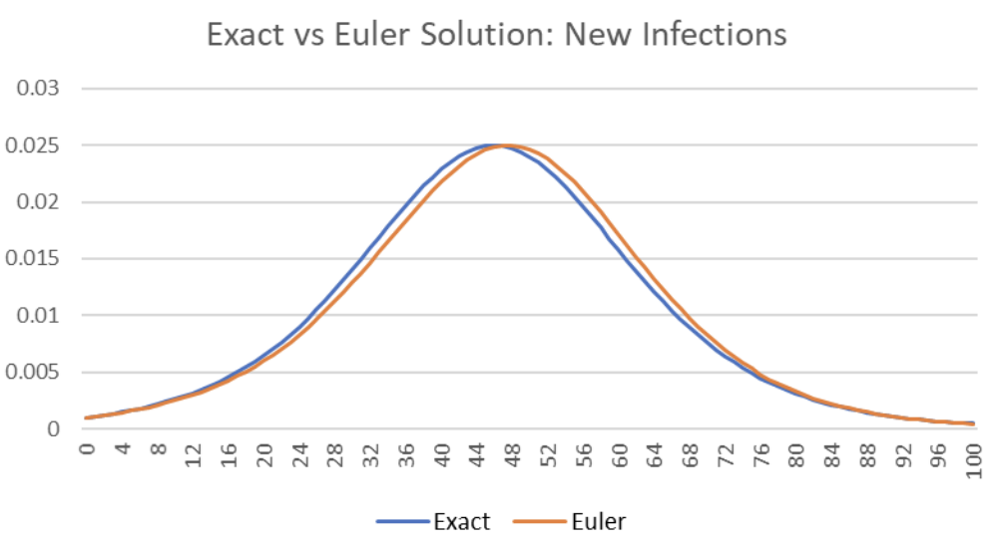

# Simulation Modelling and Analysis

In other words, model and analyse a simulated model

Objectives
- Understand how the components interact with one another
- Reduce bottlenecks

Example
- Sheet Metal Production
- Airport Terminal Simulation

## Technique and Software

### System Dynamics Tools

Process of building system dynamics tools
- start with an influence diagram
- mkae it more specific with stock and flow diagrams
- convert into mathematical equations
- implement in software
- simulate with chosen parameters

Two types introducted - causal loop diagrams and 

#### Causal Loop Diagrams
Nodes - factors or variables
Arcs - causation or influence
Loops can be reinforcing (+) or balancing (-).

Usefulness of causal loop diagrams
- sketching the initial concept of the model
  - for discussion with the client
  - for identifying and naming variables
  - identify feedback loops
- not useful for detailed modeling
- not useful when too large which overwhelms the client

### Stocks and flows

- Stocks: variables which persist over time
- Flows: transient variables which directly increase or decrease a stock variable
- Auxiliary: transient variables which influcence a flow

Arrows with valves: flows
Rectangles: stocks
Cloud: unspecified source or sink

**Concept.** Stocks needs to flow somewhere, it is either initialised, create at source or destroyed at the sink. **Circles are variables.** If nothing influence the circle (arrow pointing to it), it is constant.

Specify parameters and intial stocks.

Example given - company financial and staffing information.
Stock is income statement or cash flow statement or hiring/firing/retiring numbers.
Flow is balance sheet or staffing information.

### SIER Models

Total population N is divided into four groups
- susceptible
- exposed
- infectious
- recovered/removed

**General comments.** The time taken of individuals to recover is a variance - this is considered in the model somehow. Probably already considered if the distribution is exponential.

Interpreting population charts 

- horizontal slices (average time a patient stays infected)
- vertical slices (part of the population at a point in time)

#### Basic Infection Model

Eventually all the suspectible population will income infected.

Euler Method - to solve for the next time step. 

$$
ds/dt = -\beta is \\
di/dt = \beta is \\
s(0) = 1 - i_0 \\
i(0) = i_0
$$

Euler Method is a good approximating of the analytic solution. A more exact numerical method is Runge-Kutta Method.

#### Basic Recovery Model

Those infected are removed from the population at some removal rate (they die or recover).

$$
TODO
$$

#### Susceptible - Infected - Recovery (SIR) Model

$$
TODO
$$

Those infected are removed from the population at some rate (they die or recover) 

Individuals removed from the population can no longer infect others (lifelong immunity)

Three factor model (applies to SIR)

$$
R_0 = \tau \bar{c} T_1
$$

where 
$\tau$ = transmissibility of pathogen
$\bar{c}$ = mean frequency of contact
$T_1$ = mean infection duration

$R_0$ can change, as people respond to the disease.

#### Susceptible - Exposed - Infected - Recovery (SEIR) Model

This is account that susceptible population do not become infectious immediately. Therefore we have a new stock - exposed population.

$$
TODO
$$

TODO

X | SI | IR | SIR | SEIR
- | - | - | - | -
$\frac{dS}{dt}$ | - | - | - | -
$\frac{dI}{dt}$ | - | - | - | -
$\frac{dR}{dt}$ | - | - | - | -
$\frac{dE}{dt}$ | - | - | - | -

Use solver to find the best parameters compared to the real world data.

