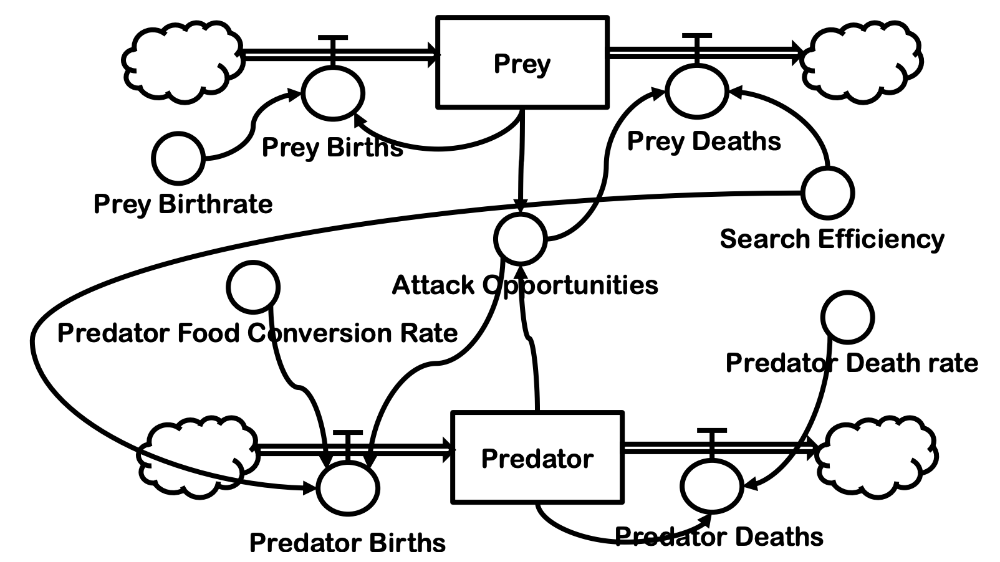
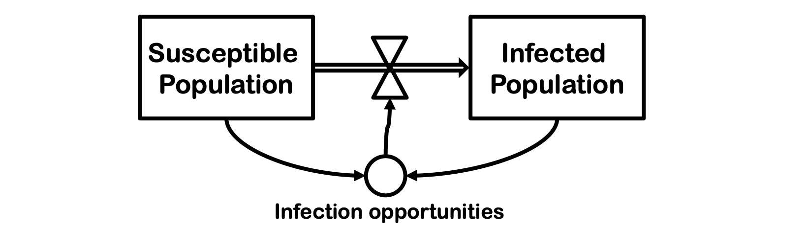
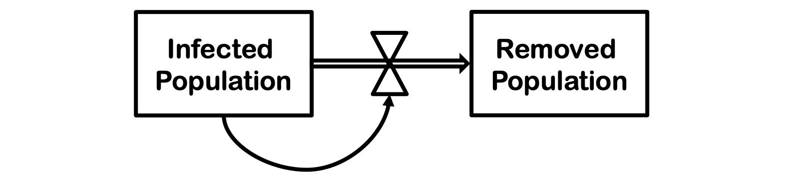
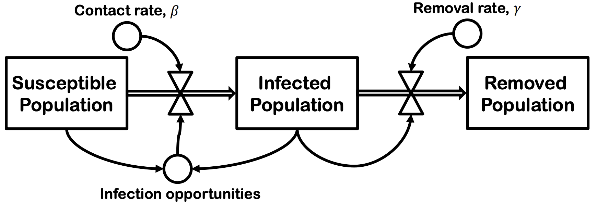
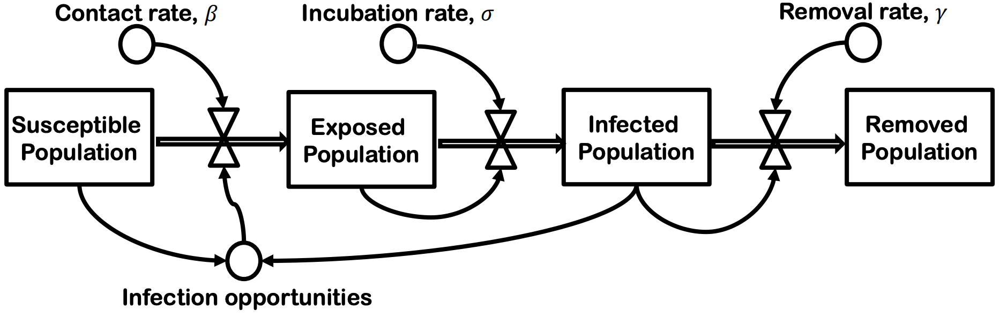
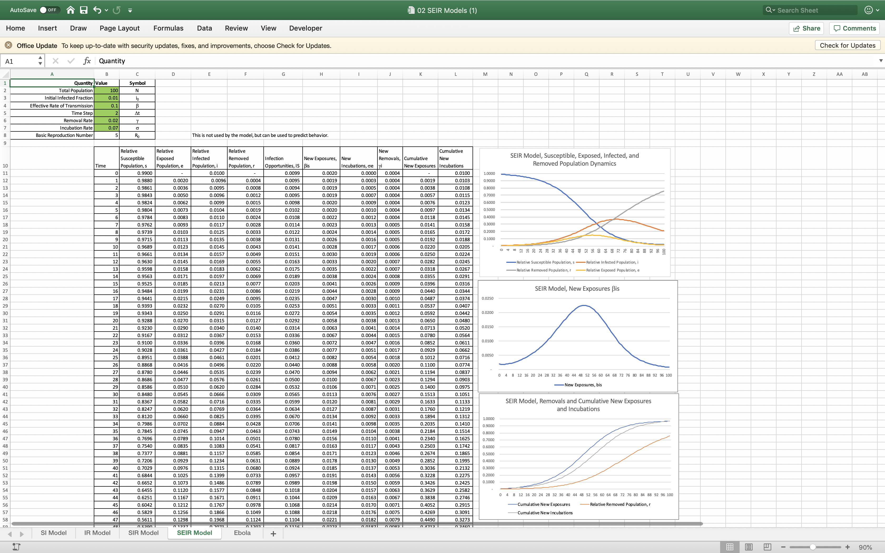

# Simulation Modelling and Analysis

In other words, model and analyse a simulated model

Objectives
- Understand how the components interact with one another
- Reduce bottlenecks

Example
- Sheet Metal Production
- Airport Terminal Simulation

## Technique and Software

### System Dynamics Tools

Process of building system dynamics tools
- start with an influence diagram
- mkae it more specific with stock and flow diagrams
- convert into mathematical equations
- implement in software
- simulate with chosen parameters

Two types introducted - causal loop diagrams and stock-and-flows

#### Causal Loop Diagrams
Nodes - factors or variables
Arcs - causation or influence
Loops can be reinforcing (+) or balancing (-).

Usefulness of causal loop diagrams
- sketching the initial concept of the model
  - for discussion with the client
  - for identifying and naming variables
  - identify feedback loops
- not useful for detailed modeling - does not convey mechanisms of change
- not useful when too large which overwhelms the client

### Stocks and flows

- Stocks: variables which persist over time
- Flows: transient variables which directly increase or decrease a stock variable
- Auxiliary: transient variables which influcence a flow

Arrows with valves: Flows (of stocks?). Auxiliary variables control the flows.
Rectangles: Stocks (or something that holds the stock?)
Cloud: Unspecified source or sink. Allows stocks to be created or destroy.
Circles: Auxiliary variables. If nothing influence the circle (arrow pointing to it), it is constant.

**Concept.** **Stocks needs to flow somewhere**, it is either initialised, create at source or destroyed at the sink. 

To simulate - specify parameters and intial stocks.

Example given - company financial and staffing information.
Stocks are items on an income statement or cash flow statement or hiring/firing/retiring numbers.
Flow are items on a balance sheet or staffing information.

### SIER Models

Total population N is divided into four groups
- susceptible
- exposed
- infectious
- recovered/removed

**General comments.** The time taken of individuals to recover is a variance - this is considered in the model somehow. Probably already considered if the distribution is exponential.

Interpreting population charts 

- horizontal slices (average time a patient stays infected)
- vertical slices (part of the population at a point in time)

Euler method is to solve for the next time step. It is a good approximation of the analytic solution. A more exact numerical method is Runge-Kutta Method.

Make sure you are able to visualise the derivative and culumative. 

The changes in populations:

X | SI | IR | SIR | SEIR
- | - | - | - | -
$\frac{dS}{dt}$ | $-\beta i s$ |  | $-\beta i s$ | $-\beta i s$ 
$\frac{dE}{dt}$ | - | - | - | $\beta i s - \sigma e$ 
$\frac{dI}{dt}$ | $\beta i s$ | $-\gamma i$ | $\beta i s - \gamma i$ | $\sigma e - \gamma i$ 
$\frac{dR}{dt}$ | - | $\gamma i$ | $\gamma i$ | $\gamma i$ 

#### Basic Infection Model

Eventually all the suspectible population will income infected.

#### Basic Recovery Model

Those infected are removed from the population at some removal rate (they die or recover).

#### Susceptible - Infected - Recovery (SIR) Model

Those infected are removed from the population at some rate (they die or recover). Individuals removed from the population can no longer infect others (lifelong immunity)

Eventually everybody will become infected, and then removed.

Three factor model (applies to **SIR** - only?)

$$
R_0 = \tau \bar{c} T_1
$$

where 
$\tau$ = transmissibility of pathogen
$\bar{c}$ = mean frequency of contact
$T_1$ = mean infection duration

$R_0$ can change, as people respond to the disease.

#### Susceptible - Exposed - Infected - Recovery (SEIR) Model

This is account that susceptible population do not become infectious immediately. Therefore we have a new stock - exposed population.

Use solver to find the best parameters compared to the real world data.

Question 1
$$
\begin{align}
\frac{di}{dt} &= -\gamma i \\
\frac{dr}{dt} &= \gamma i \\
\\
i(0) &= i_0 \\
r(0) &= 1 - i_0\\
\\
\\
\text{From the first equation:}\\
\int \frac{di}{i(t)} &= \int -\gamma \enspace dt \\
log(i(t)) &= -\gamma t + C \\
i(t) &= exp(-\gamma t + C) \\
i(t) &= D \cdot exp(-\gamma t) \\
\\
\text{Since } i(0) = i_0, \text{ when } t=0:& \\
D &= i_0  \\
\therefore i(t) &= i_0 e^{-\gamma t}\\
\\
\\
\text{Since } r(t) = 1 - i(t):&\\
\therefore r(t) &= 1 - i_0 e^{-\gamma t}

\end{align}
$$
Question 2

