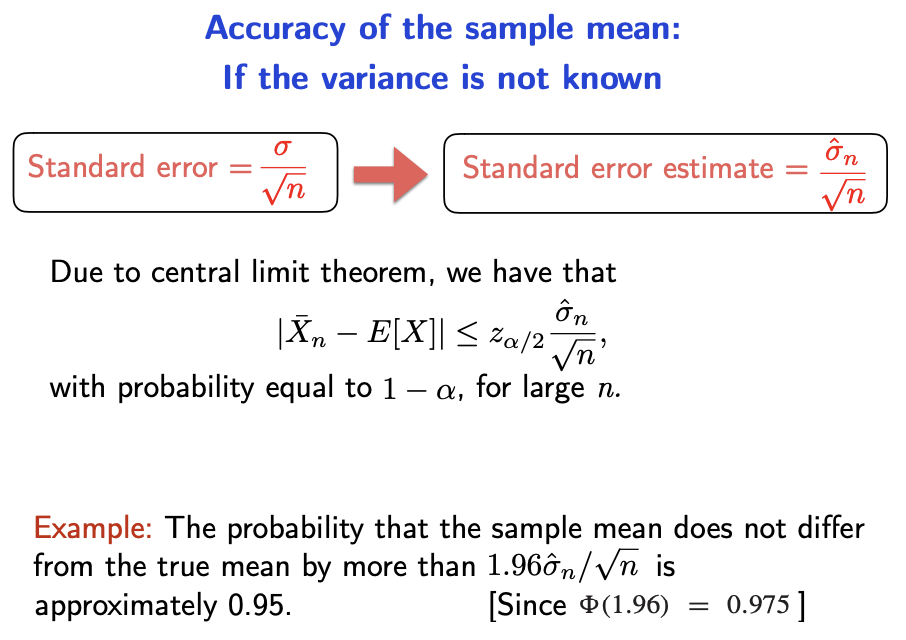
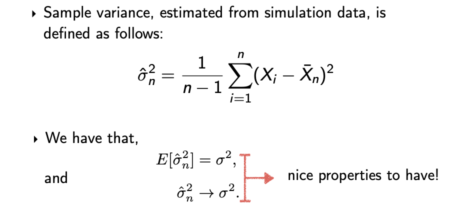
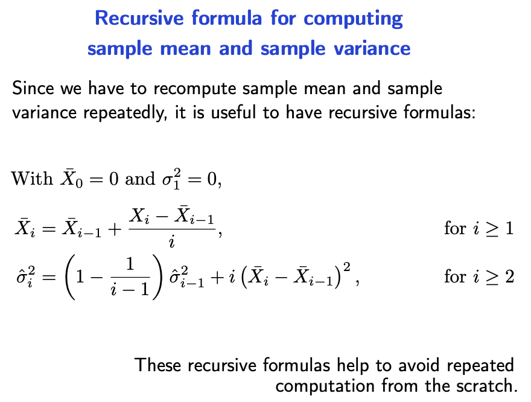
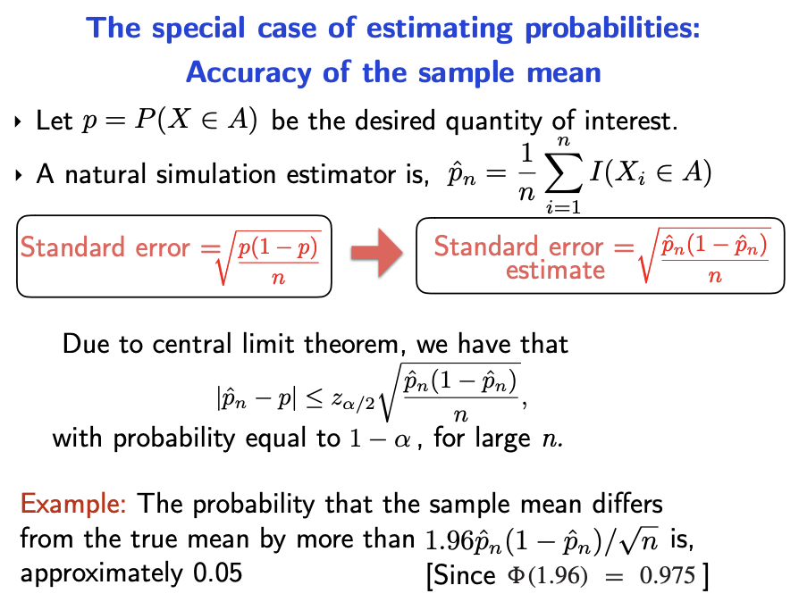
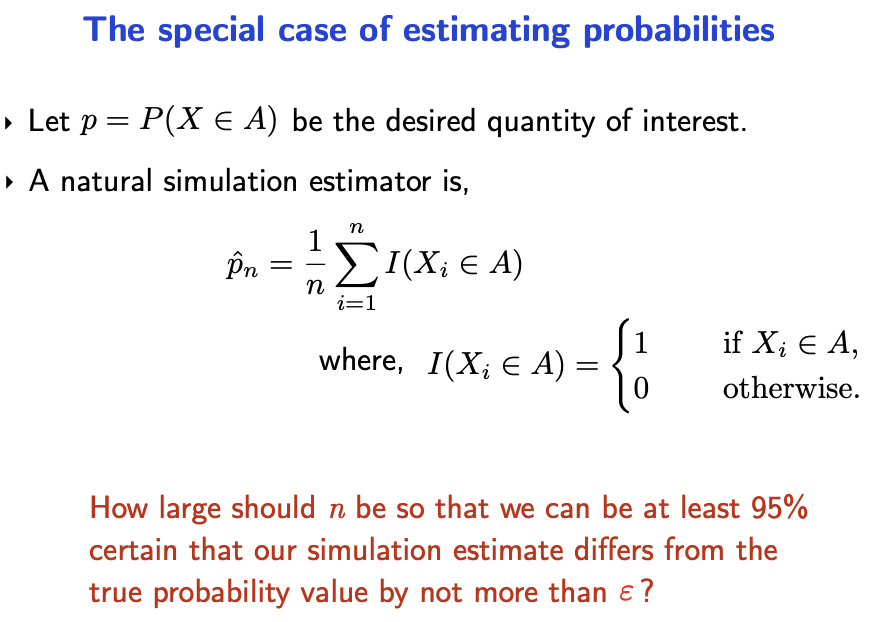
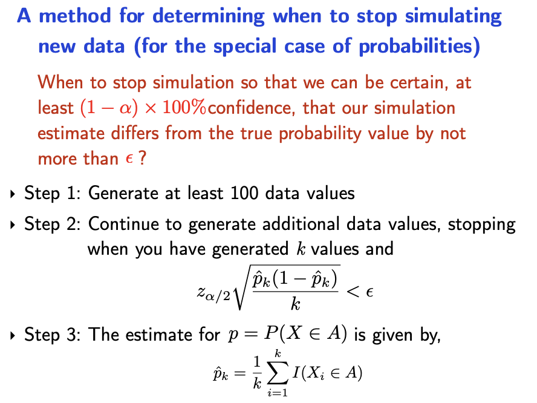
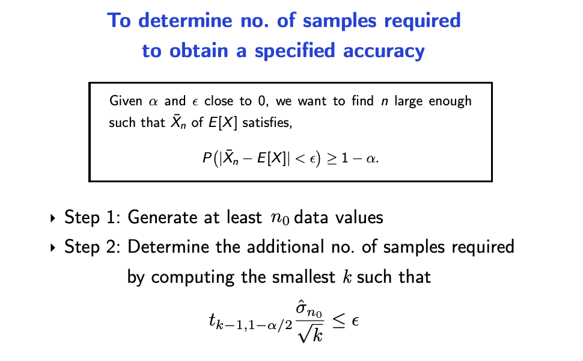

# Terminating a simulation

**Law of large numbers**

Sample mean tends to true mean as sample size increase. This is why we do simulations.

**Principles**

Please understand for each variable, whether its properties
- is it known or unknown
- is it assumed or not assumed
- is it (assumed) true or estimated

The variables here are assumed to be independent and identically distributed.

**Central limit theorem**

The probability distribution of the standardised sample mean tend the standard normal.

## Terminating the process for estimating a true mean

**Objective** You are estimating a true mean. You need to know when to **stop** the simulation.

You can stop when the are confident that the true mean is within $\epsilon$ of sample mean. However, you do not know the true variance, and you cannot simply calculate the required samples.

$\hat{\sigma}_n^2$ is the sample variance, and it can be calculated that way. Remember to **take the square root**.

Why do you need to generate at least 100 data values? Because you do not want to stop the simulation after merely two samples (possible).

You may be given a set of current sample mean and sample variance, and new samples and you are tasked to calculate the new sample mean and sample variance. 

## Terminating the process for estimating a probability

## Output statistical analysis for small samples

You need to use t-distribution instead of the normal distribution.

# MIscellaneous

**Output statistical analysis** - Central limit theorem (next topic)

Quiz - problem set

Cheatsheet allowed

proposal density

constant

three steps

inverse tf

 what is inverses, etc process.

Given him the algorithm the exam is done

The quiz will have two questions - one problem is based on acceptance/rejection, the other problem is based on inverse transform. Some subquestions is based on concepts covered in week 10.

