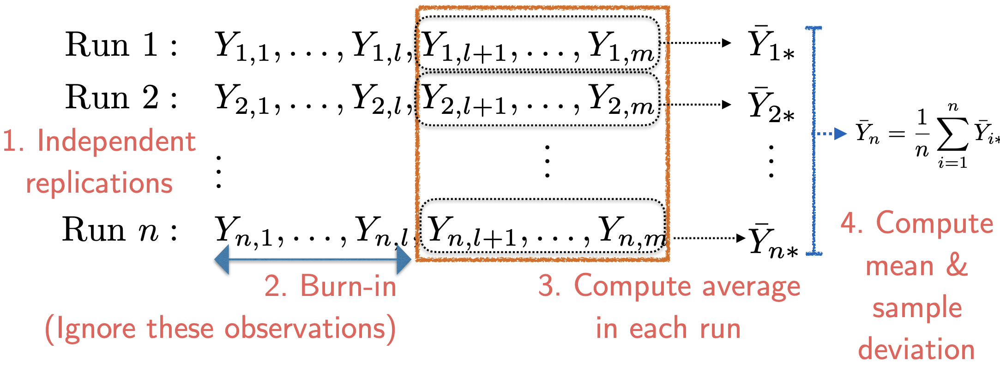
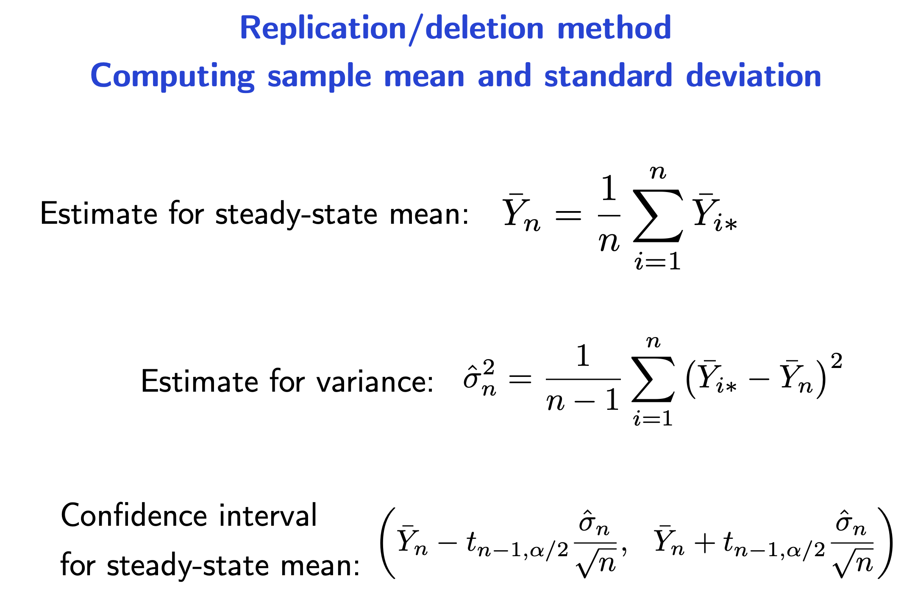

# Steady state analysis

To estimate long-run or steady-state average.

Following method do not need to be applied if you are not seeking a long-run behvaiour - a **terminating** behaviour. (example: The queue time of first 100 customers, you should be simulating the initial queue behaviour many times, instead of simulating a queue to infinity)

**Strategy**

- Run the system simulation for a long time

- Observe the output
- Stop when the estimate of the population mean is within confidence limits

- Return the sample average of the output of the simulation

**Intialisation bias.** Consider a queue. At the start there are no people in the queue, which is usually different from the steady state.

**Correlelated output.** Consider a random walk. The average differs greatly in different runs.

For most systems, steady-state average = long run average.

**Welch’s method of removing initialisation bias**

1) Run $k$ independent simulations
2) Average the matching observations
3) Compute and plot moving averages for different window sizes
    (because the average of observation is highly fluctuating)
    (too large the window size it is more difficult to identify the bias)
    (too small the window size the fluctuation is not )   

4) Determine **burn-in** period $l$ by inspection
    (err on the same side and a choose a safer number)

**Replication/deletion method**

1) Run $n$ additional independent simulations (or use previous $n$ runs) 
2) Discard the first $l$ observations in each run 
3) Compute average of each simulation run 
4) Compute mean and sample deviation of simulation averages 
5) Compute confidence interval

