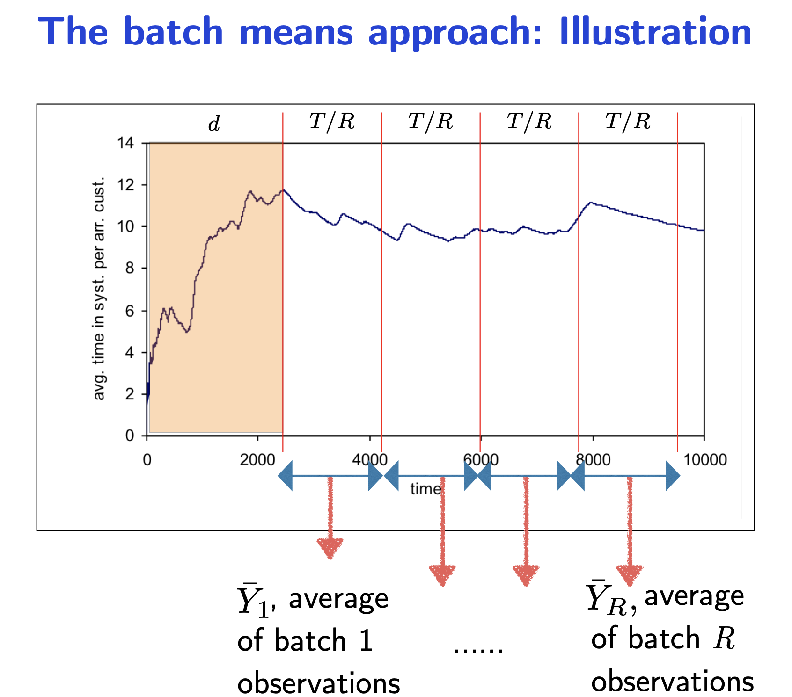
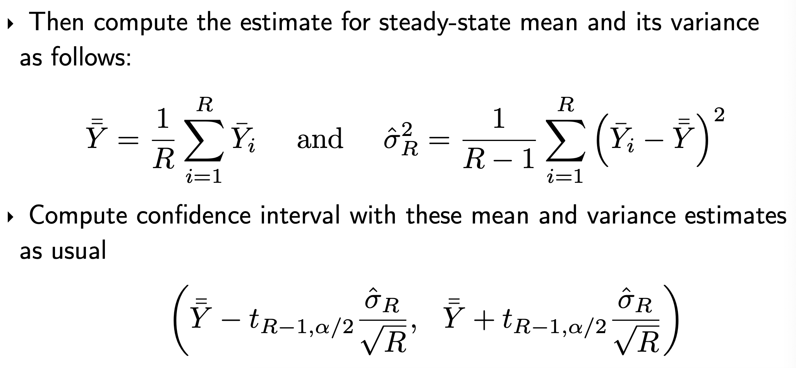
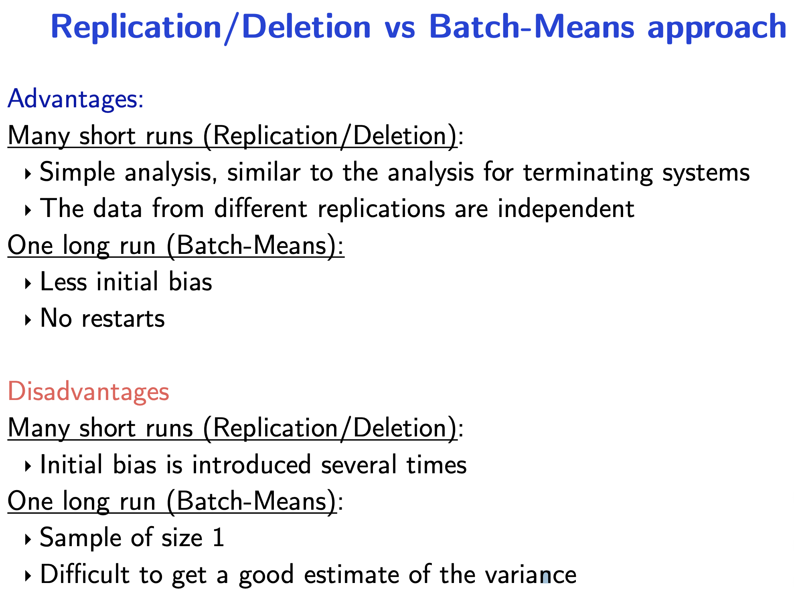

# Steady state analysis

To estimate long-run or steady-state average.

Following method do not need to be applied if you are not seeking a long-run behvaiour - a **terminating** behaviour. (example: The queue time of first 100 customers, you should be simulating the initial queue behaviour many times, instead of simulating a queue to infinity)

**Basic strategy**

- Run the system simulation for a long time

- Observe the output
- Stop when the estimate of the population mean is within confidence limits

- Return the sample average of the output of the simulation

**Problems with the strategy**

**Intialisation bias.** Consider a queue. At the start there are no people in the queue, which is usually different from the steady state. The sample mean obtained in biased.

**Correlelated output.** Consider a random walk. The average differs greatly in different runs. You might obtain a false positive for the confidence test.

For both problems, running both simulations for indefinitely will eventually get you the steady-state average. However this may not be efficient.

**Welch’s method for removing initialisation bias**

1) Run $k$ independent simulations

2) Average the matching observations

3) Compute and plot moving averages for different window sizes
    (because the average of observations is highly fluctuating)

- On the choice of **window size**
  Too large the window size it is more difficult to identify the bias.
  Too small the window size the fluctuation is not averaged out. 

4) Determine **burn-in** period $l$ by inspection

- On the choice of the burn-in period
  A larger number is safer as it is less affected by the burn in
  A number too large results in too little information to confidently calculate the long-run average

**Replication/deletion method for addressing correlation**

1) Run $n$ additional independent simulations (or use previous $n$ runs) 
2) Discard the first $l$ observations in each run 
3) Compute average of each simulation run 

4) Compute mean and sample deviation of simulation averages 
5) Compute confidence interval of the **average** $\bar{Y}_{1*}$

**Batch mean methods to address correlation**

1) Obtain one long simulation run of length $T$.
2) Determine burn-in
3) Divide observations after burn-in into $R$ batches
4) Compute the sample mean, $\overline{Y}_i$ for each of the $R$ batches.

On the choice of the batch size and number of batches

- The total number of samples after deleting burn-in is fixed
  - which is equal to the batch size times the number of batches
- Too small the batch size you get correlated samples
- Too small the number of batches you cannot get a confidence sample

**Comparison between methods to address correlation**

Given only an access to a fixed number of simulation sets - for independence between samples with replication/deletion, you have a smaller number amount of data to estimate the steady-state average.

Starting the simulation may be costly as well, consider physical simulations (e.g. LHC).