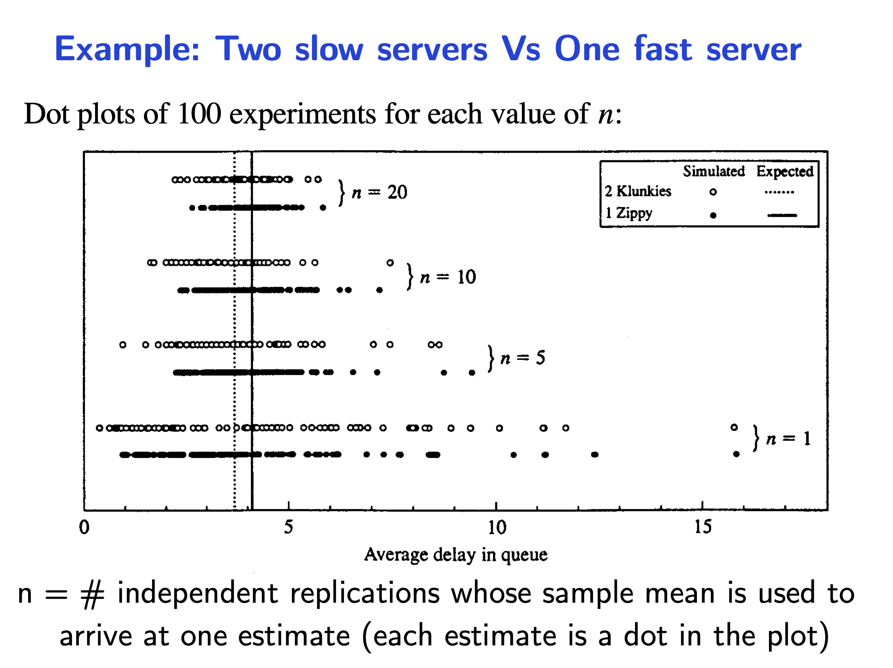
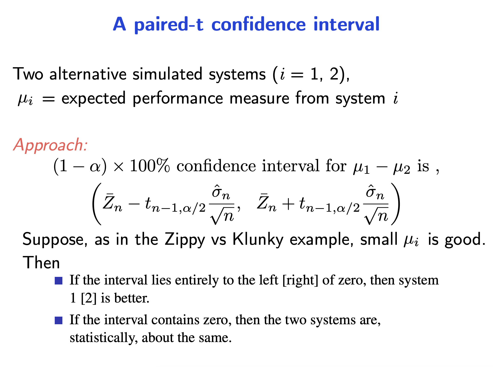
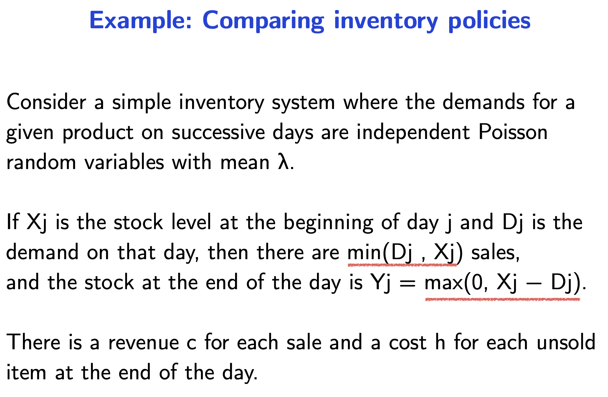
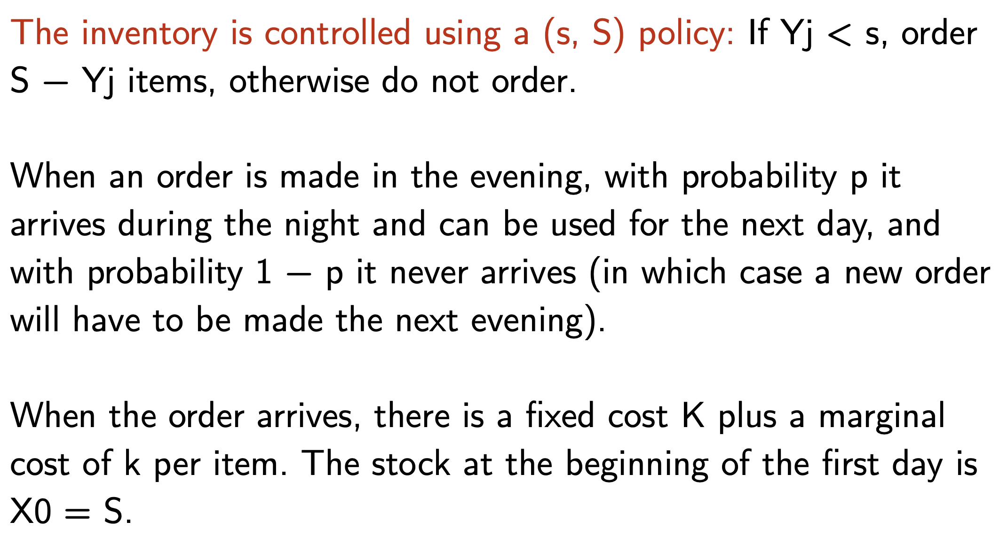
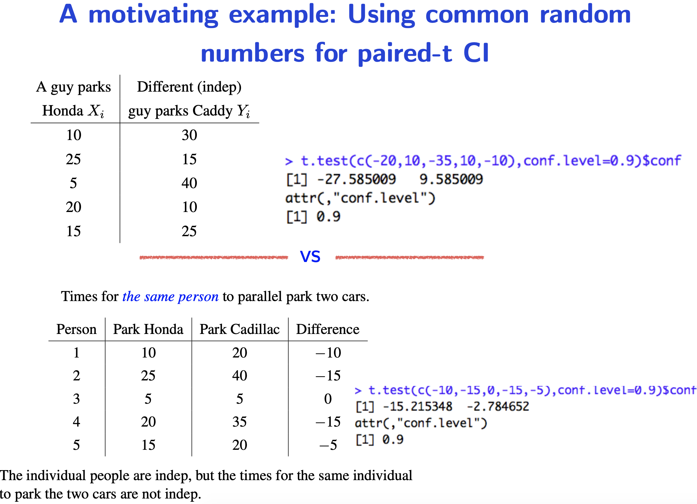
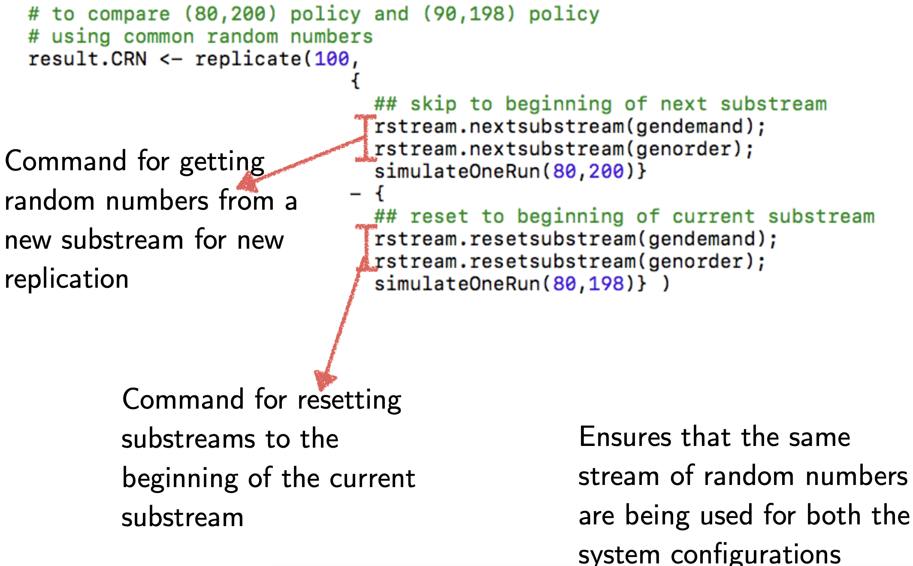

# Compaing System Configurations

Is it cost effective to get two slow photocopiers versus one good photocopier?

Example

- Illustration - Given two normal distribution with different but close means, two samples is not enough to determine which mean is higher.
- If 100 students do an experiment independently with one configuration each,  if we take the majority vote from each students will give an ambgiuous result
- We should take the average of 100 runs for each configuration. If the performance is too close to call, we should say that it is inconclusive.

Moral of the story

- Eyeballing one simulation only is not ok.
- Comparing the average of many independent replications is better.
- Say it is inconclusive if the average performance is too close.

Do **not** sort the output and take the difference.

# Course example

### (s, S) inventory policy

You will simulate and compute the standard deviation.

### Using common random numbers

For example, to determine if a two slow photocopier is better than one good photocopier, the queue that each configuration faces should be the same.

There is an rstream package for random numbers. The problem with setting a seed - you need to switch between seeds, and the tracking the seeds can be problematic.

**How to use rstream**

### Why and how using CRN is beneficial?

Understand what is better to be correlated, and what should be maintained as independent.
$$
\begin{align}
Z &= X_1 - X_2 \\
\\
Var(Z) &= Var(X_1 - X_2) \\
&= Var(X_1) + Var(X_2) - 2 \ Cov(X_1, X_2)
\end{align}
$$

If $X_1$ and $X_2$ are independent, $Cov(X_1, X_2) = 0$

If $X_1$ and $X_2$ are generated from common random numbers, $Cov(X_1, X_2)>0$

Length of confidence interval = $\dfrac{2\sigma}{\sqrt{n}}z_{\alpha/2}$

### How to maintain synchronisation

The generation $X_1$ and $X_2$ should be "**synchronised**" to decrease variance.

How to many the output of both systems to be highly correlated

- Use CRN on interarrival times (the interarrival times are the same for both systems)

- Use CRN on service times (the service times are correlated - not the same because they should have different distribution)

- Use CRN on interarrival and service times - better.

Both systems may require a different amount of random numbers. If the same stream is used across experiments, you need to make sure that the next experiment starts with a common set of random numbers.

$X_1$ and $X_2$ should be generated such that they are **positively correlated**. It is possible that $Cov(X_1, X_2)<0$ and it results in a larger variance for $Z$. 

The output between different experiments is still **independent**.

**Why use different substreams for different applications?**

The interarrival times and service times should not be sourced from the same stream. The interarrivial times and service times should be independent - how the customers arrive should not affect the service times.

**The advantage of inverse transform method**

You may provide the same interarrivial time for both systems. However this is not possible if the distribution (service time for example) is different for both systems.

To synchronise the simulations - use **common uniform random numbers** and **inverse transform** to generate random variable for different distributions. 

## Antithetic variables

The idea is to induce negative correlation between a pair of simulated output simulation.

**Rationale**

Counterbalance a large observation with a small one. The average of two observations (which means the result?) tend to be closer to the true expectation than if they were independent.'

**Setup**

The function should have **monotonic response** w.r.t. the random variables. WHY?

Use of antithetic variables can decrease the standard error by half.

**Procedure**

Simulate the system with random uniform variables $U$ and get observation $X^{(1)}$.

Simulate the system with random uniform variables $1-U$ and get observation $X^{(2)}$

Use $[X^{(1)} + X^{(2)}]/2$ as a sample. (It is as good as using $X^{(1)}$ and $X^{(2)}$. Do not use all three.)

"Better than doubling the samples"

