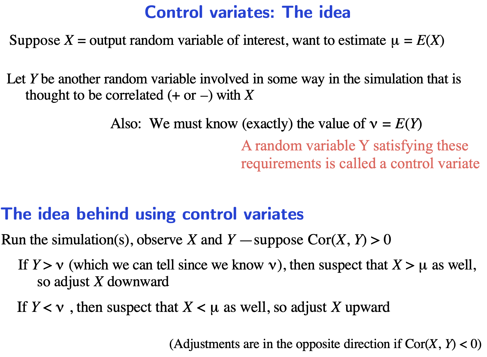
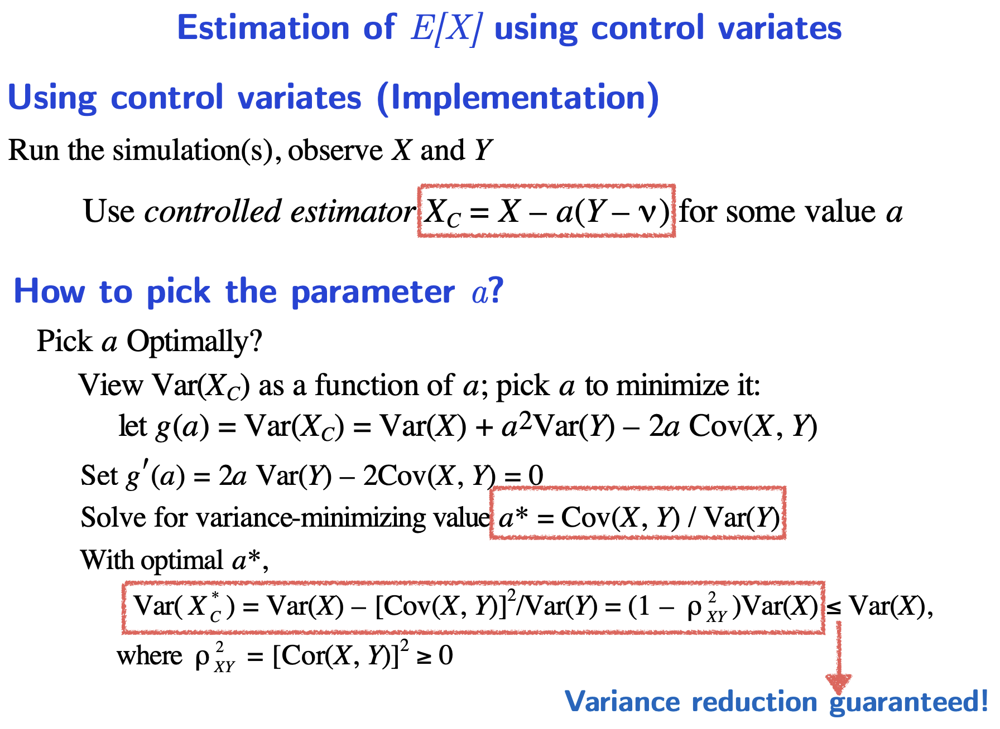
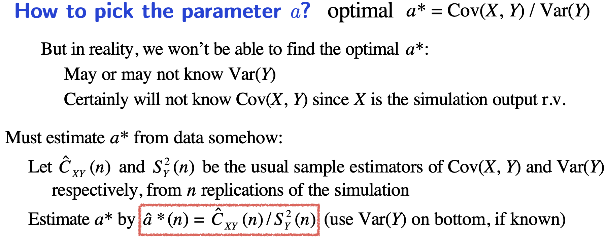

# Control variates

**You know the mean of Y.** You want to find the mean of X which is a function of Y.

You can use the true mean of Y to reduce the variance on X sampled.

**Questions**

Supposed X is a function of Y. Do they just need to be **correlated**, or **monotonic**?

There is only one Y?

**Procedure**

Estimation of the variance $a$.

**Goal** - To estimate the $\mu = E[x]$ 

**Approach**

$z$ is an estimator for $\mu$ if $E[z] = \mu$

1) Obtain independent samples $z_1, z_2, z_3$ etc.

2) Return $\bar{z}$ and its confidence interval.

**1) Usual method**

$Z=X$

**2) Antithetic**

Works only if $h(U_i)$ is monotonic (???)

$$
Z = \frac{X^{(1)} + X^{(2)}}{2}
$$

where $X^{(1)}$ is seeded by $U$ and $X^{(2)}$ is seeded by $(1-U)$

**3) Control Variates**

Works only if 

- you know $E[y] = v$
- $y$ is correlated with $x$

$Z = X_c$ where $X_c = x - a(Y-v)$

Pick $a$ such that the variance of $(x - a(y-v))$ is minimum.

Essentially we want deduct the error from the sampled $X$ to get the mean. Idea $(X-\mu)$ is correlated with $(Y-v)$. $a$ is chosen with linear regression.

