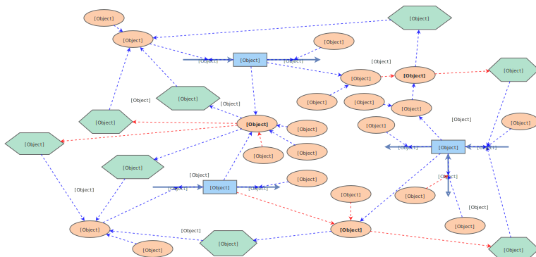

# Urban dynamics

Elements of InsightMaker

- Stocks are the blue rectangles. You need to define an intial value.
- Flows are variables that affect changes in the stock.
- Variables are orange circles. They defined with a constant or a variable (does not have intial value).
- Converter is considered a variable. It takes one input and goes through a map defined with interpolated data points. Elements taking the converter as input will use the output value.
- Then you can add images to for decoration (for example to illustrate a reinforcing or balancing loop).

This was how Forrester show counterintitive results to city planners of the time.

> Our simulation reproduces the observations made by Forrester in 1969. 
> In the early years construction in the city is booming, so employment is on the increase and population increases exponentially. 
> As growth continues, availability of land grows scarce. The city’s attractiveness decreases and construction slows down. Unemployment rises. 
> As businesses disappear, building maintenance declines, which leads to abandoned buildings and decrease in the population

Some important indicators should ideally be equal to **one**. For example
- Labor Force to Job Ratio
- Land Fraction Occupied
- Households to housing Ratio

Use the indicators to illustrate and predict problems like
- lack of jobs
- almost all land is occupied
- too many houses

Then policies could be implemented. For example
- Increase birth rate through birth incentives
- Provide low cost housing to increase population
- Give incentives to the construction of more business structures
- Control Immigration (build a wall)
- Encourage urban regeneration

A controversial conclusion in Urban Dynamics was that the most commonly-accepted plans for improving an urban area could actually be inefficient and potentially harmful for the city.

- Financial aid, low-cost housing and government jobs programs
They could lead to other problems such as overpopulation and unemployment.

Urban renewal policies were found to be very effective as they shift the bias away from non-job-generating structures (e.g., housing) to job-generating structures.

### Question 4

We are tasked to 

- maximise population 
- minimise unemployment 
- minimise abandoned houses.

Some tradeoffs need to be considered when we want the best combination when there are multiple objectives? (In other words, which objective is more important than the others?) 

However, we were tasked to find the best combination of "parameters".
What are the constraints that we cannot change, what are the variables that we can change?

The following constraints the total potential population that the city can hold. Increasing these variables can increase the population indefinitely (however, the variables need to be realistic)
- greater land area, increasing the capacity for people
- greater jobs per business structure increase the business land-use more efficient, increasing the capacity for people
- greater people per household makes housing land-use more efficient, increasing the capacity for people

To minimise unemployment and minimising abandoned houses. 
- bring housing demolition rate to be equal to the housing construction rate
This way abandoned houses can be demolished which reduces housing construction rate
This also provides businesses with the opportunity to construct houses, which provide jobs
- reduce immigration rate and outmigration rate and make them equal
When immigration rate is higher than outmigration rate, there is unemployment. When outmigration rate is higher than the immigration rate, there are abandoned houses. Bringing these two numbers down will reduce both rates of unemployment and the rate of abandoned houses to 1, which is the ideal.

In addition, we might want to reach the ideal state faster. This means that the city planner should modify the parameters in response to the state of the city - for example, encourage immigration when the city has not reached capacity.

**The value of developing system dynamics model**

- You can get whatever you want. You might been coercing the result from trial and error.
- However, it is good to organise your ideas and understand the relationship between the different.
- It is a powerful way to sell our ideas to the public.

**General Motors Case Study**

They thought there were two separate markets
- the new car market
- the used car market

There is a rise of used car 'superstores' - does this affect their profits? 

Actually, the cars with 2-year lease is substituable with new cars, they might well be in the same market. In addition, the supply of 2-year-old cars is scheduled and cannot be stopped. During financial crisis, the influx of 2-year-old cars will decrease the price of new cars. But we need to show that this impact is significant enough to forgo the opportunity of making revenue from 2-year-leases.

The conclusion is 2-year-leases are bad for profit, 4-year-leases are good for profits.

They used of a bathtub to illustrate the concept of stock and flow. There was no need for the executives to understand the mathematics.

Results - 1997 financial crisis, Ford was more affected from GM, and car companies now move away from two-year leases.