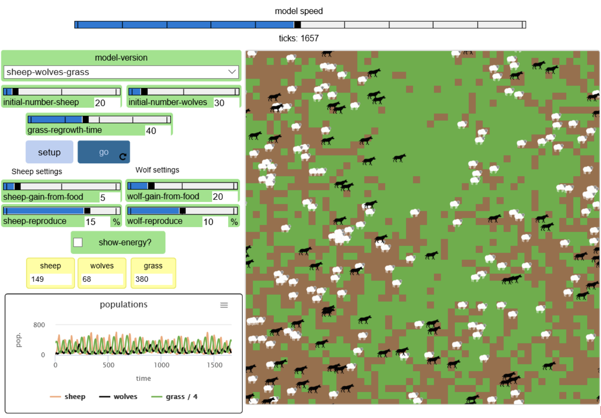
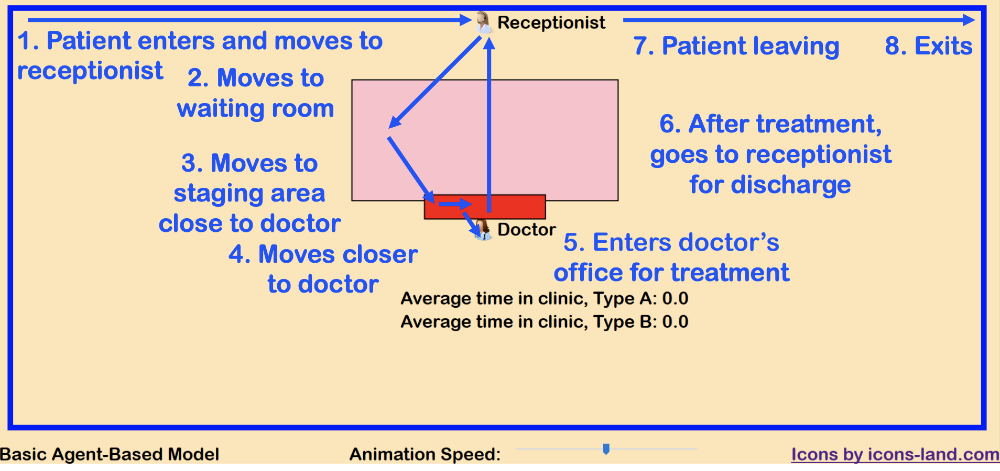
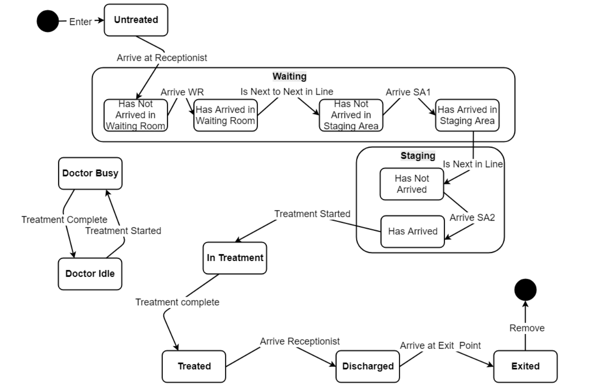

# Agent based modelling

**Used to simulate complex systems** 

-  The elements of a system are called agents
- The agents has individual behavior
- Agents can be influenced by other agents
- Agents can change the conditions of the environment where they are located
- Agents can be influenced by the conditions of the environment where they are located

**Advantages** 

- Enables to capture more complex structures and dynamics
- Can simulate problems modeled by System Dynamics and Discrete-Event Simulation
- The modeler defines behavior at individual level, and the global behavior emerges as a result – bottom up approach
- Allow better visualisation of the system

**Drawbacks** 

- Computationally Intensive 
- Time consuming 
- Harder to develop

**Sample [predator-prey](http://netlogoweb.org/launch#http://netlogoweb.org/assets/modelslib/Sample Models/Biology/Wolf Sheep Predation.nlogo) with agent based modelling**

- Environment Rules - Grass turns to mud if eaten, Grass grows back after a certain amount of time 
- Wolf Rules - Needs to eat sheep for energy - Can Reproduce - Will die without energy 
- Prey Rules - Needs grass for energy - Can Reproduce - Will die without energy

**Sample patient-waiting room with agent based modelling**

Since we do not give different treatment to Type A patient and Type B patient, in the long run the average time for both patients should be the same.

Modal Analysis

Each patient has a state - untreated, waiting, staging, intreatment, treated, discharged.

Then the rest of the lecture is an introduction to the Javascript code.
- `filter()`, `map()` and `reduce()`with a 'lambda' function.
- `switch` and `case` to manage different states
- You need to initialise the data as well

Homework  - Priority Agent Model
- Change the scheduling rules so that A-type patients get priority
- But be careful: too much priority can lead to an exploding queue of B-type patients 

