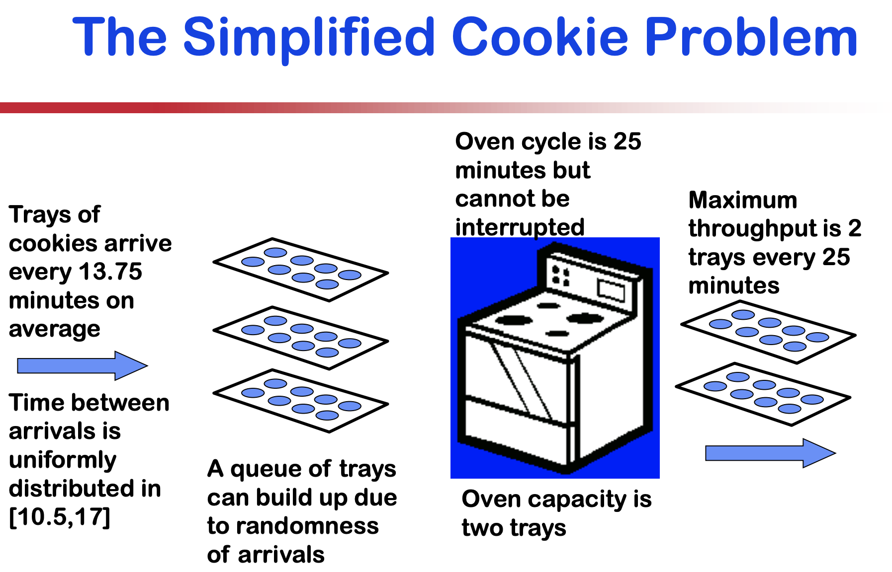
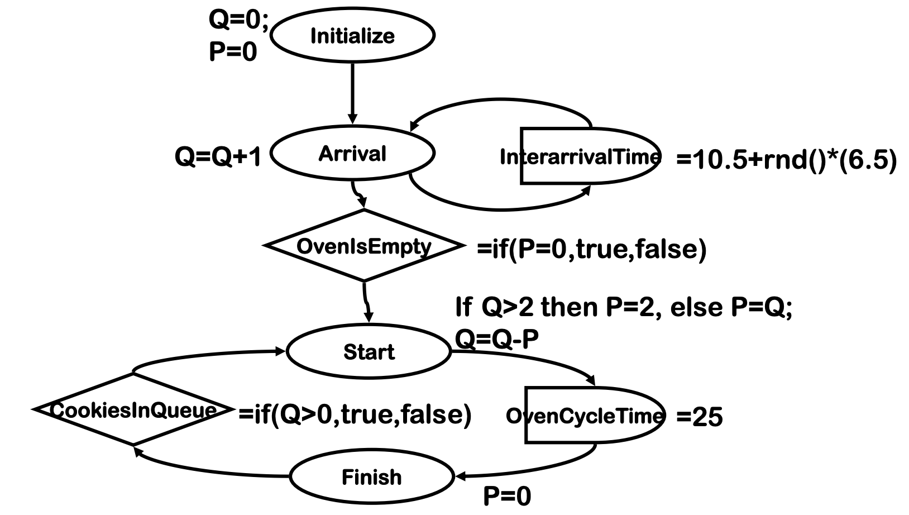

## Discrete Event Simulation

"Discrete event simulation is a flexible way to describe a system’s behavior. The structure of a simulation model can be described with an event graph."


- The system is described by a **state**.
- The state changes only at discrete points in time, called **events**.
- The interval between events is called a **delay**, or duration. The delay could be random.
- Events can **trigger** other events depending on **conditions** that depend on the state.


The **advantage** of modelling a problem with discrete event simulation

- It models complex behavior with simple language of "states", "events", "delays", "conditions", and "triggers"

- It can jump in time from one event to another. 
  - Nothing ‘interesting’ happens between events: no change in state. 
  - This allows it to rapidly simulate days/weeks/years of real-time activity.

-  If the state is simple (e.g. inventory counts) then processing time and memory required are very small.

In my language, one event is one line in the excel file. You do not need to simulate for every point in time which is computationally intensive and deviates from the simulated mathematical solution.


These are some questions that are asked in the **exam**.

- What is the state of the system?
- At what points in time (events) does the state change?
- What are the delays?
- What events could trigger other events?
- What are the conditions under which events are triggered?


**Schruben’s Event Graph language**

Shape | Function| Rules 
- | - | - 
Circle | Event| Events can be triggered only by other events, through condition nodes and delay nodes.<br />There must be one event node that has no incoming arcs (triggers): this is the first event.<br />The state could only change at events. 
Diamonds | Condition | One condition for one diamond (i.e. yes/no condition in one diamond is NOT allowed, one input only)<br />Condition nodes trigger all outgoing arcs, if condition is true.<br />You cannot change any variables inside the condition nodes.<br />(What is the dot arc for?) 
Delay | ServiceTime| 




The model



My solution for homework problem with two types of cookies. This requires an additional rule to understand which cookie is being processed.


**How to use Excel Discrete Event Model**

You are only expected to edit the code in Model User


Name manager to debug solution.


Homework requirement - show all variables on the cell.


## Jaamsim installation guide


Download Jaamsim https://jaamsim.com/downloads.html


Install Java 8
```bash
brew cask install homebrew/cask-versions/adoptopenjdk8
```

Open Jaamsim
```bash
/Library/Java/JavaVirtualMachines/adoptopenjdk-8.jdk/Contents/Home/bin/java -jar JaamSim2019-10.jar
```

Open Jaamsim with loaded file 
```bash
/Library/Java/JavaVirtualMachines/adoptopenjdk-8.jdk/Contents/Home/bin/java -jar JaamSim2019-10.jar Cafe_Model_Example.cfg -tag
```


