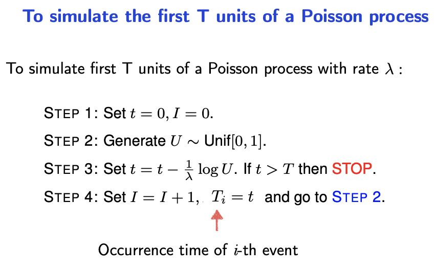
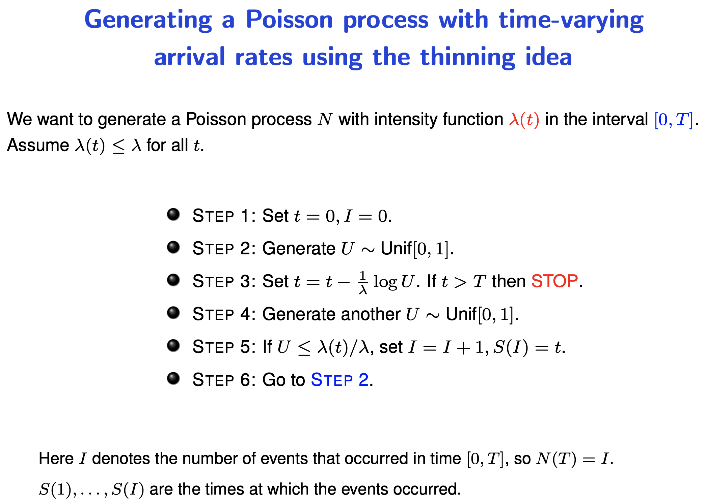

## Possion and exponential distribution

The interarrival time between samples of an Possion distribution is modelled with the **exponential distribution**

pdf $f(x) = \lambda e^{-\lambda x} \text{ for } x \geq 0$

cdf $F(x) = 1-e^{-\lambda x} \text{ for } x \geq 0$

cdf_inv $F^{-1}(x) = -\frac{1}{\lambda}\log(1-x)$

**Simulating the possion distribution with constant rates**

Given inputs - time $T$ and rate of possion distribution of lambda $\lambda$

($U$ and $1-U$ have the same distribution)

**Simulating the possion distribution is varying rates**

The value of lambda is now a function.

> Suppose events occur according to a homogeneous Poisson process with rate  and independent of what occurred before, an event is counted at time $t$ with probability $p(t)$. Then the process of counted events is a Poisson process with intensity function $\lambda(t) = p(t)$.

One reason why this is possible is because the arrival with a Possion process is independent. You cannot merely change the value of lambda over time in the original process because your time delay may "overflow" into a high rate period.