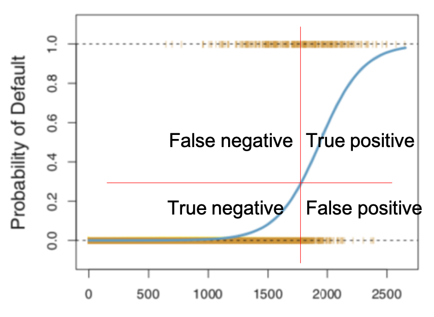
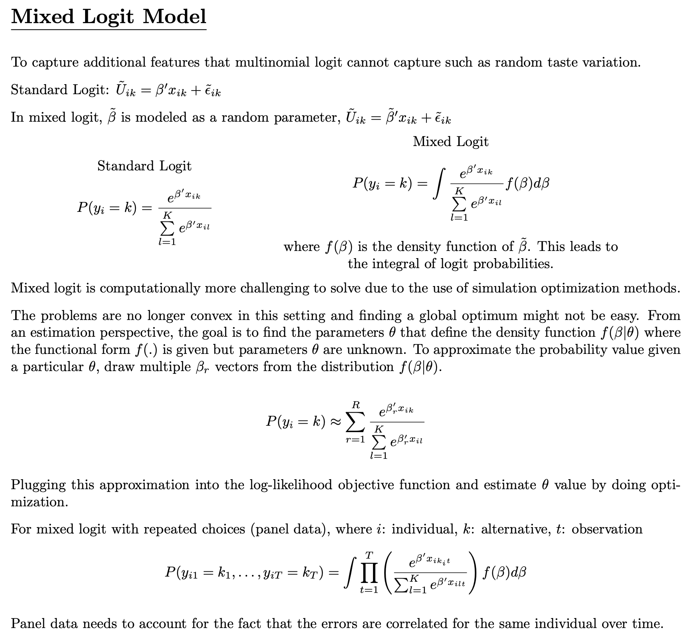

# R cheatsheet

(Please refer to DBA on the reasons to use R)

This is a one-document reference of the use of R commands.

## Pre-flight checklist
Make sure you can import these libraries in R notebook. 

```r
library("ggplot2")
library("psych")
library("ggfortify")
library("leaps")
library("caTools")
library("mlogit")
library("zoo")
library("conflicted")
library("glmnet")
```

If you cannot, please panic.

## Helper functions

To understand a function, use `?` to read the offline documentation.
To understand an object, use `attributes(x)` to see the attributes.

**For MacOS**
Refer to the the 'Run' option on the top right of this window to see the shortcut related to running and restarting the cell.

- Run line `Cmd + Enter`
- Run chunk `Shift + Cmd + Enter`
- Run all `Opt + Cmd + R`
- New R Cell `Cmd + Opt + I`

<div style="page-break-after: always;"></div> 
## Basics

Please refer to [R-basics](./R-basics.pdf) for the very basic operations on R. 

These are some commands not covered in the document
```r
sum(arr)
prod(arr)
exp(arr)
var(arr)
sd(arr)
summary(arr)
which.max(arr)
pmax(arr,arz)  # take maximum element-wise
arr > 1  # element-wise logical check
```

**Type casting**
```r
z <- c(0:9)
class(z)  # prints class
as.numeric(z)  # casts into float?

z1 <- c("a","b","d")
w <- as.character(z1)
as.integer(w)  # returns array of NA
```

<div style="page-break-after: always;"></div> 
**Matrices**
The matrix operations may require some explanation.

- definition `x<-matrix(c(3,-1,2,-1),nrow=2, ncol=2)`
- e-wise multiplication `x*x`, `x*2`
- matrix multiplication `x%*%x`
- transpose `t(x)`
- read element `r[2,2]`, `r[3]`, starts counting from one
- inverse of a matrix (?) `solve(x)`
- solving system of linear equations `a%*%solve(a)`
- get eigenvectors `eigen(a)$vectors`

**Dataframe**
You are unlikely to do this, you are likely to load csv files.
```r
CELG <- data.frame(names=c("barack","serena"),
                   ages=c(58,38),
                   children=c(2,1))
# append to dataframe
CELG$spouse <- c("michelle","alexis")
```

**Miscellaneous**

```r
# date configuration
base::as.Date(32768, origin = "1900-01-01")

# to remove intercept, fit to -1
MPP2 <- mlogit(Ch~Nom+Dir+GG+PGA-1, data=D1)
```

<div style="page-break-after: always;"></div> 
## Data management basics

Obtained from R-basics.

**Data preliminary analysis**
```r
poll <- read.csv("AnonymityPoll.csv")
summary(poll)  # 7-figure summary of every column
str(poll)  # see some data

table(poll$Smartphone)  # freqency in a column
summary(poll$Smartphone)  # 7-figure summary of a column

# freqency matrix of two columns
table(poll$Internet.Use, poll$Smartphone)

# find the mean of the first value depending on second
tapply(limited$Info.On.Internet, 
       limited$Smartphone, 
       mean)

# count number of NA in a column
sum(is.na(poll$Internet.Use))
```

<div style="page-break-after: always;"></div> 
**Data manipulation**
```r
# remove rows with any (?) NA variables
hitters = na.omit(hitters)


# obtain a subset
limited <- subset(poll, poll$Internet.Use == 1)

# obtain a subset without a column
eg1 <- subset(eg,select=-c(Country))

# obtain a subset with 'or' logic operator
limited <- subset(poll, poll$Internet.Use == 1|
                        poll$Smartphone == 1)

# train-test split, stratified
split <- sample.split(framing1$TENCHD,SplitRatio=0.65)
training <- subset(framing1,split==TRUE)
test <- subset(framing1,split==FALSE)
```

**Data plotting**
```r
# plot a histogram
hist(limited$Age)

# scatter plot
plot(limited$Age, limited$Info.On.Internet)

# scatter plot with jitter
plot(jitter(limited$Age),
     jitter(limited$Info.On.Internet))

# star plot
stars(swiss, key.loc = c(18,2))

# star scatter plot
stars(as.matrix(swiss[,c(2,3,5,6)]), 
      location = as.matrix(swiss[,c(4,1)]), 
      axes = T)
```

<div style="page-break-after: always;"></div> 
**Plotting with ggplot**
```r
library(ggplot2)

# plot histogram
ggplot(data = Parole, aes(x = Age)) + 
  geom_histogram()
  
# plot histogram with specified bin width and start point
# closed refer to whether the interval is closed
ggplot(data = Parole, aes(x = Age)) +
  geom_histogram(binwidth=5,
                 closed=c("left"),
                 center=17.5)
                 
# bar plot
bar <- ggplot(WHO) + 
  geom_bar(mapping = aes(x = Region, fill = Region), 
           show.legend = FALSE, width = 1) + 
  theme(aspect.ratio = 1) + 
  labs(x = NULL, y = NULL)
bar  # to show plot

# plot with flipped coordinates, and polar plot
bar + coord_flip()
bar + coord_polar()

# many scatter plot
a <- ggplot(WHO, aes(x=GNI, y=FertilityRate))
a + geom_point(na.rm=T) + facet_wrap(.~Region)

# loess interpolation with confidence
a + geom_point(na.rm=T) + geom_smooth(na.rm=T)

# loess interpolation, continent represented with color
acol <- ggplot(WHO,
               aes(x=GNI, 
                   y=FertilityRate, 
                   color=Region))
acol + geom_point(na.rm=T)
acol + geom_point(na.rm=T) + geom_smooth(na.rm=T)

# scatter plot with attributed represented with size
ggplot(mtcars,aes(x=wt, 
                  y=mpg, 
                  color=cyl, 
                  cex=disp))

# plot scatterplot matrix
ggplot(wine, aes(VINT,LPRICE)) + 
  pairs.panels(wine, 
               ellipses=F, 
               lm =T, 
               breaks=10, 
               hist.col="blue")


# scatterplot with hvlines demarcating means
br<-mean(winetrain$LPRICE)
ggplot(winetrain,
       aes(DEGREES,
           HRAIN,
           color=cut(LPRICE,c(-Inf,-1.42,Inf)))) + 
  geom_point(na.rm=T) + 
  scale_color_discrete(name = "LPRICE",
                       labels = c("< mean(LPRICE)",
                                  "> mean(LPRICE)")) +
  geom_vline(xintercept=mean(winetrain$DEGREES),
             color="blue",lwd=1) +
  geom_hline(yintercept=mean(winetrain$HRAIN),
             color="blue",lwd=1)

# scatterplot with jitter
ggplot(orings[orings$Field>=0,],aes(Temp,Field)) + 
  geom_point(na.rm=T) +
  geom_jitter(na.rm=T,width=1,height=0.1) 
```

**Statisitical testing**
```r
t.test(oscars$Nom[oscars$PP==1 & oscars$Ch==1],
       oscars$Nom[oscars$PP==1 & oscars$Ch==0],
       alternative = c("greater"))
```

<div style="page-break-after: always;"></div> 
# Linear regression

**Week 2**

| Method         | Linear Regression                                            |
| -------------- | ------------------------------------------------------------ |
| Target         | Number                                                       |
| Predicts       | Number                                                       |
| Model          | $$y_i = \beta_0 + \beta_1 x_1 + \beta_2 x_2 + ... + \epsilon_i $$ |
| Loss           | Mean square error                                            |
| Quality of fit | R-square<br />Adjusted R-square<br />AIC                     |
| Prediction     | Wine prices and quality<br />Baseball batting average        |
| Comments       | Choose only the statistically significant variables<br />This cannot predict binary objectives. |

```r
# fitting linear model
model1  <- lm(LPRICE~VINT+HRAIN,
              data=winetrain)
summary(model1)w
confint(model7, level=0.99)  # see confidence interval

# predicting values with model
pred <- predict(model1,
                newdata=winetest,
                type="response")  # not sure if correct
```

<div style="page-break-after: always;"></div> 
**Week 3**

| Method         | Logistic Regression                                          |
| -------------- | ------------------------------------------------------------ |
| Target         | Binary                                                       |
| Predicts       | Probability                                                  |
| Model          | $$P(y_i = 1) = \dfrac{1}{1+e^{-(\beta_0 + \beta_1 x_1 + \beta_2 x_2 + ...+ \epsilon_i )}}$$ |
| Loss           | $$LL(\beta) \\ = \displaystyle \sum_{i=1}^n \sum_{k=1}^2 y_{ik} \log \left( P(y_{ik} = 1) \right)\\= \displaystyle \sum_{i=1}^n \sum_{k=1}^2 y_{ik} \log \left( \dfrac{e^{\beta' x_{ik}}} {\sum_{l=1}^k e^{\beta' x_{il}}} \right) $$ |
| Explanation    | $x \log (x')$, sum over $x=1$ and $x=0$ (elaborate)          |
| Quality of fit | $$AIC = -2LL(\hat{\beta}) + 2(p+1)$$<br />Confusion matrix<br />AUC-ROC |
| Prediction     | Space shuttle failures<br />Risk of heart disease            |
| Comment        |                                                              |
<div style="page-break-after: always;"></div> 
**Confusion matrices**

Names  | Predict = 0 | Predict = 1 
--------------- | ------------------- | ------------------- 
**Actual = 1** | False Negative (FN) | True Positive (TP)  
**Actual = 0** | True Negative (TN)  | False Positive (FP) 




 Name                  | Alt Name             | Formula                           
 --------------------- | -------------------- | --------------------------------- 
 False Positive Rate   | Type I error         | $\frac{FP}{FP+TN}$                
 True Negative Rate    | Specificity          | $\frac{TN}{FP+TN}$                
 True Positive Rate    | Sensitivity, Recall  | $\frac{TP}{TP+FN}$                
 False Negative Rate   | Type II error        | $\frac{FN}{TP+FN}$                
 Precision             |                      | $\frac{TP}{TP + FP}$              
 **Compiled measures** |                      |                                   
 Overall Accuracy      |                      | $\frac{TP+TN}{FP + FN + TP + TN}$ 
 ROC Curve             | Plot TPR against FPR |                                    

<div style="page-break-after: always;"></div> 
```r
# fitting logisitic model (family = binomial)
model3 <- glm(Field~Temp+Pres,
              data=orings,
              family=binomial)
summary(model3)

# predicting probabilities with model
Pred <- predict(model4,
                newdata=orings,
                type="response")

library(ROCR)
# ROCR method to obtain predicted probs and actual labels
ROCRpred <- prediction(Pred[1:138],orings$Field[1:138])
# ROCR method to plot ROC curve
ROCRperf <- performance(ROCRpred,x.measure="fpr",measure="tpr")
plot(ROCRperf)  # simple plot
plot(ROCRperf,
     colorize=T,
     print.cutoffs.at=c(0,0.1,0.2,0.3,0.5,1),
     text.adj=c(-0.2,1.7))

# Calculate area under curve (AUC)
as.numeric(performance(ROCRpred,measure="auc")@y.values)
```

<div style="page-break-after: always;"></div> 
**Week 4a**

| Method         | Multinomial Logit                                            |
| -------------- | ------------------------------------------------------------ |
| Target         | n-choose-1, probabilities that sum to one                    |
| Model          | $$P(y_{ik} = 1 | \{ \text{options} \}) = \dfrac{e^{\beta' x_{ik}}} {\sum_{l=1}^k e^{\beta' x_{il}}}$$ |
| Loss           | $$LL(\beta) \\ = \displaystyle \sum_{i=1}^n \sum_{k=1}^K z_{ik} \log(P(y_{ik} = 1)) \\ = \displaystyle \sum_{i=1}^n \sum_{k=1}^K z_{ik} \log \dfrac{e^{\beta' x_{ik}}} {\sum_{l=1}^k e^{\beta' x_{il}}}$$ |
| Explanation    | $z_{ik}$ is the training option from the dataset which is binary.<br />$x_{ik}$ is the characteristic of one training option considered. ($x_{il}$ is similar, but it includes the rest of the training option included in the choice).<br />You are tasked to provide $\beta'$ that maximises the log-likelihood.<br />The probability that option $k$ is chosen from a set of choices is $P(y_{ik} = 1)$, and this is a real number. |
| Quality of fit | Log-likelihood<br />Confusion matrix<br />Likelihood ratio index $$=1-\frac{LL(\beta)}{LL(0)}$$<br />AIC $=-2LL(\beta) + 2p$ |
| Prediction     | Academy Award winners                                        |
| Comment        | **Independence of Irrelevant Alternatives** - adding in a third alternative does not change the ratio of probabilities of two existing choxwices. (Probably it still does affect the training process?) |

<div style="page-break-after: always;"></div> 
```r
# (on data with the multiple choices over different rows)
library("mlogit")
# extracting data
D1 <- mlogit.data(subset(oscarsPP, Year <=2006), 
                  choice="Ch", 
                  shape="long", 
                  alt.var = "Mode")

# fitting multinomial logistic model
MPP2 <- mlogit(Ch~Nom+Dir+GG+PGA-1, data=D1)

# predicting probabilities with model
D1_new <- mlogit.data(subset(oscarsPP, Year==2007), 
                      choice="Ch", 
                      shape="long", 
                      alt.var="Mode")
Predict2 <- predict(MPP2, newdata=D1_new)
```

<div style="page-break-after: always;"></div> 
```r
# (on data with the multiple choices on one row)
library(mlogit)
# extracting data
S <- mlogit.data(subset(safety, Task<=12), 
                 shape="wide",  
                 # this is "wide"-form data, unlike Oscars
                 choice="Choice", 
                 varying=c(4:83), 
                 sep="", 
                 alt.levels=c("Ch1", "Ch2", "Ch3", "Ch4"),
                 id.var="Case")

# fitting multinomial logistic model
M <- mlogit(Choice~CC+GN+NS+BU+FA+LD+
            BZ+FC+FP+RP+PP+KA+SC+TS+NV+
            MA+LB+AF+HU+Price-1, 
            data=S)

# predicting probabilities with model 
# this is done on training data
# for test data, create a new mlogit.data with Task>12
P <- predict(M, newdata=S)

# constructing confusion matrix with predictions
ActualChoice <- subset(safety, Task<=12)[,"Choice"]
PredictedChoice <- apply(P,1,which.max)
Tabtrain=table(PredictedChoice, ActualChoice)
Tabtrain
```

The willingness to pay can be observed from the survey, even though we do not directly ask the customers' valuation. When the model is fitted, the price has a negative coefficient while the safety features usually have a positive coefficient. The ratio of the coefficients is the price that customers on the average is willing the pay. The deviation can be observed the from standard error.

<div style="page-break-after: always;"></div> 
**Week 4b**

| Method         | Mixed Logit                                                  |
| -------------- | ------------------------------------------------------------ |
| Target         | n-choose-1, probabilities that sum to one                    |
| Model          | $$P(y_{ik} = 1 | \{ \text{options} \}) = ???$$               |
| Loss           | `???`                                                        |
| Quality of fit | Log-likelihood<br />Confusion matrix<br />Likelihood ratio index $$=1-\frac{LL(\beta)}{LL(0)}$$<br />AIC $=-2LL(\beta) + 2p$ (number of paramters is now double) |
| Prediction     | Preference of safety features                                |
| Comment        | The data structure of safety feature options is different from the Academy Award. (elaborate)<br />You can also evaluate how much people will pay for a certain extra feature, without directly getting their evaluation. (explore) |



<div style="page-break-after: always;"></div> 
```r
#(please prepare S, the mlogit.data as per 4a second part)

# fitting mixed logistic model
M1 <- mlogit(Choice~CC+GN+NS+BU+FA+LD+
             BZ+FC+FP+RP+PP+KA+SC+TS+NV+
             MA+LB+AF+HU+Price-1, 
             data=S,
             rpar=c(CC='n',GN='n',NS='n',BU='n',FA='n',
                    LD='n',BZ='n',FC='n',FP='n',RP='n',
                    PP='n',KA='n',SC='n',TS='n',NV='n',
                    MA='n',LB='n',AF='n',HU='n',Price='n'),
             panel = TRUE, 
             print.level=TRUE)
summary(M1)

# predicting probabilities with model (with training data)
P1 <- predict(M1, newdata=S)

# constructing confusion matrix with predictions
PredictedChoice1 <- apply(P1, 1, which.max)
ActualChoice <- subset(safety, Task<=12)[,"Choice"]
Tabtrainmixed = table(PredictedChoice1, ActualChoice)
Tabtrainmixed
```

"The mixed logit model does a better job of predicting customers who are not interested in choosing any of the offered options compared to MNL."

<div style="page-break-after: always;"></div> 
**Week 5a**

Feature selection, based on the adjusted R-value from linear regression.

```r
# fitting linear model, exhaustive feature selection
model2 <- regsubsets(Salary~.,
                     hitters,
                     nvmax=19)

# fitting linear model, exhaustive feature selection
model3 <- regsubsets(Salary~.,
                     data=hitters,
                     nvmax=19,
                     method="forward")

# fitting linear model, exhaustive feature selection
model4 <- regsubsets(Salary~.,
                     data=hitters,
                     nvmax=19,
                     method="backward")

# getting the coefficient of the best model with n params 
which.max(summary(model3)$adjr2)
coef(model3,3)

# heat map showing the best-n selected variables
plot(model1,scale=c("adjr2"))
```

<div style="page-break-after: always;"></div> 
**Week 5b**

Simpler models often tend to work better for out-of-sample predictions and so we will penalize models for excessive model complexity. 

With the increase in computational power, we can partition the data set into training, validation and test sets and conduct model assessment and selection. 

- The training set is used to estimate the model parameters. 
- The validation set is used to do model selection. 
- The test set is the evaluation set on which we will simply evaluate or check how the model performs.


**Cross validation**

- Simple validation set approach
- Leave out one cross validation (LOOCV)
- k-fold cross validation

<div style="page-break-after: always;"></div> 
**LASSO**

Balance data fit (first term) with model complexity (second term)
$$
\underset{\beta}{min} 
  \sum_{i=1}^{n} (y_i - \beta_0 - \beta_1 x_{î} - ... - 
                  \beta_p + x_{ip})^2 +
                  \lambda \sum_{j=1}^p |\beta_j|
$$
The objective coefficient in LASSO is convex and tries to roughly promote sparsity.

Advantage of LASSO is that since it is convex, the local optimum is the global optimum.

Unfortunately, objective function is not differentiable unlike standard linear regression. But there are efficient ways to solve the problem to optimality.


Following is ridge regression. The issue with ridge regression is that it does not promote sparsity (i.e. reduce the number of variables in the model).

$$
\underset{\beta}{min} 
  \sum_{i=1}^{n} (y_i - \beta_0 - \beta_1 x_{î} - ... - 
                  \beta_p + x_{ip})^2 +
                  \lambda \sum_{j=1}^p \beta_j^2
$$

Elastic Net combines both penalities.

| Method         | LASSO                                                        |
| -------------- | ------------------------------------------------------------ |
| Target         | Number                                                       |
| Model          | $$y_i = \beta_0 + \beta_1 x_1 + \beta_2 x_2 + ... + \epsilon_i $$ |
| Loss           | $$ \underset{\beta}{min} \sum_{i=1}^{n} (y_i - \beta_0 - \beta_1 x_{î} - ... - \beta_p + x_{ip})^2 + \lambda \sum_{j=1}^p$$ |
| Quality of fit | According to loss                                            |
| Prediction     | Hitters                                                      |
| Comments       | Choose only the statistically significant variables<br />This cannot predict binary objectives. |

<div style="page-break-after: always;"></div> 
```r
# loading the dataset
library(glmnet)
X <- model.matrix(Salary~.,hitters)
y <- hitters$Salary

# train-test split
train <- sample(1:nrow(X),nrow(X)/2)
test <- -train

# fitting the lasso model with a specified schedule
modellasso <- glmnet(X[train,],y[train],lambda=grid)

# fitting the lasso model with a automatic grid
modellasso <- glmnet(X[train,],y[train],lambda=grid)

# show the plot of model lasso (please interpret)
# shows the value of the coefficient against L1 norm
plot(modellasso)           # plot against L1 Norm
plot(model4,xvar="lambda") # plot against lambda
model4$beta !=0            # plot with characters

# prediction (what is the difference?)
predictlasso1 <- predict(modellasso,
                         newx=X[test,],
                         s=100) 
predictlasso1a <- predict(modellasso,
                          newx=X[test,],
                          s=100,
                          exact=T,
                          x=X[train,],
                          y=y[train])

# calculation of mean square error
mean((predictlasso1-y[test])^2)

# does k-fold cross-validation for glmnet, 
# produces a plot
# returns a value for lambda
cvlasso <- cv.glmnet(X[train,],y[train])
```

<div style="page-break-after: always;"></div> 
**Week 8**

| Method         | CART |
| -------------- | ---- |
| Target         | ?    |
| Model          | ?    |
| Loss           | ?    |
| Quality of fit | ?    |
| Prediction     | ?    |
| Comments       | ?    |

<div style="page-break-after: always;"></div> 
**Week 9**

| Method         | Random Forests    |
| -------------- | ---- |
| Target         | ?    |
| Model          | ?    |
| Loss           | ?    |
| Quality of fit | ?    |
| Prediction     | ?    |
| Comments       | ?    |

<div style="page-break-after: always;"></div> 
**Week 10**

| Method         | Clustering    |
| -------------- | ---- |
| Target         | ?    |
| Model          | ?    |
| Loss           | ?    |
| Quality of fit | ?    |
| Prediction     | ?    |
| Comments       | ?    |

<div style="page-break-after: always;"></div> 
**Week 11**

| Method         | Filtering    |
| -------------- | ---- |
| Target         | ?    |
| Model          | ?    |
| Loss           | ?    |
| Quality of fit | ?    |
| Prediction     | ?    |
| Comments       | ?    |

<div style="page-break-after: always;"></div> 
**Week 11**

| Method         | SVD    |
| -------------- | ---- |
| Target         | ?    |
| Model          | ?    |
| Loss           | ?    |
| Quality of fit | ?    |
| Prediction     | ?    |
| Comments       | ?    |

<div style="page-break-after: always;"></div> 
Week 12. Optimisiation with Julia. Prescriptive analysis rather than descriptive.

For competition in week 13, please form your groups.