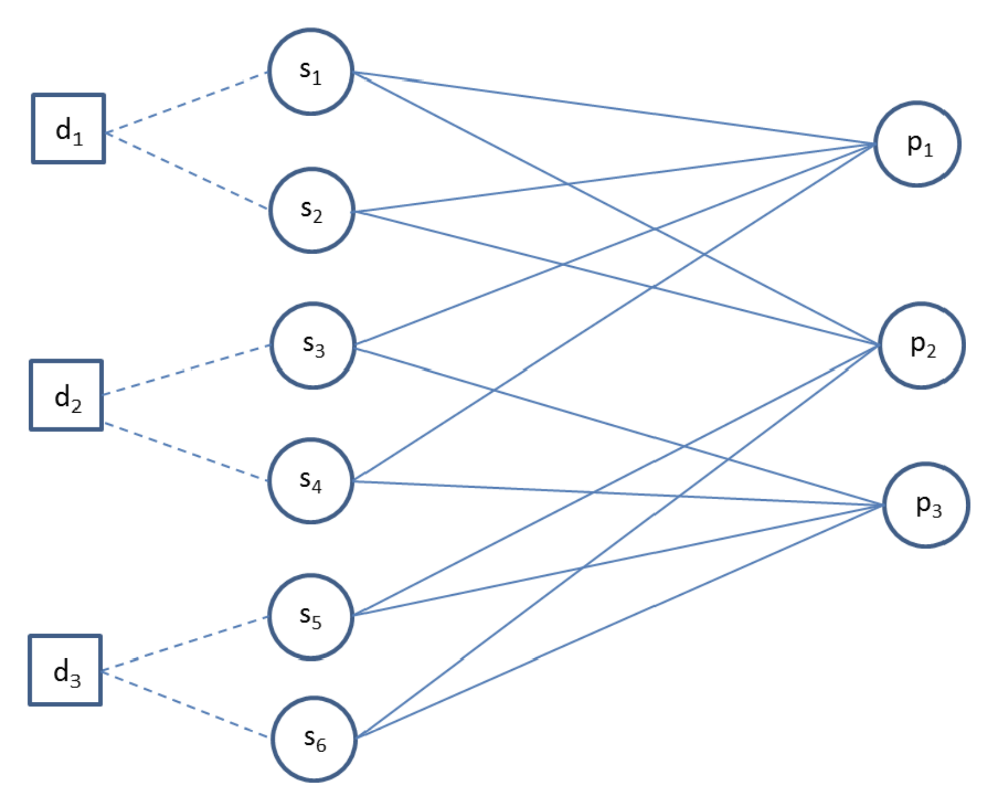

# Capstone allocation problem

https://pubsonline.informs.org/doi/10.1287/inte.2017.0940

**What to optimise**

- fairness - all students have the same chance of being allocated to their favourite project
- efficiency - students are given their preferred projects
- multidisciplinary - each project have some constraints
- modelling flexibility - you might want to add additional parameters
- computation efficiency - how quick is the problem solved

**Decision variables**

- Binary variable of whether the student is allocated the project
- Binary variable of whether the project is launched

**Objective function**

- maximise the objective utility

**Constraints**

- Each student is allocated to one project
- You cannot allocate a student to a project that is not launched
- Make sure that the minimum number of project is met
  - Minimum number of students
  - Maximum number of students

